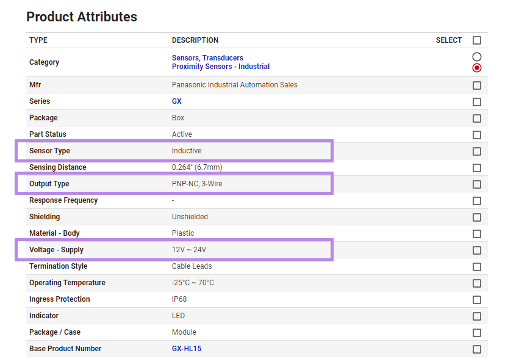
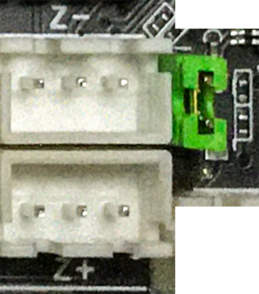
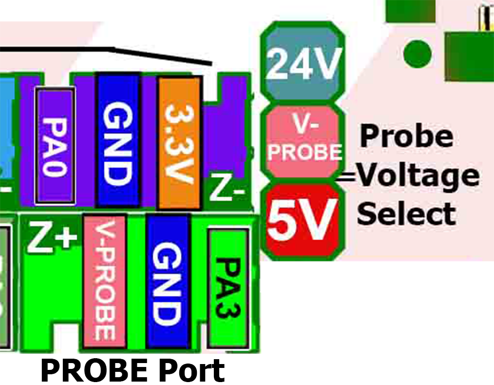
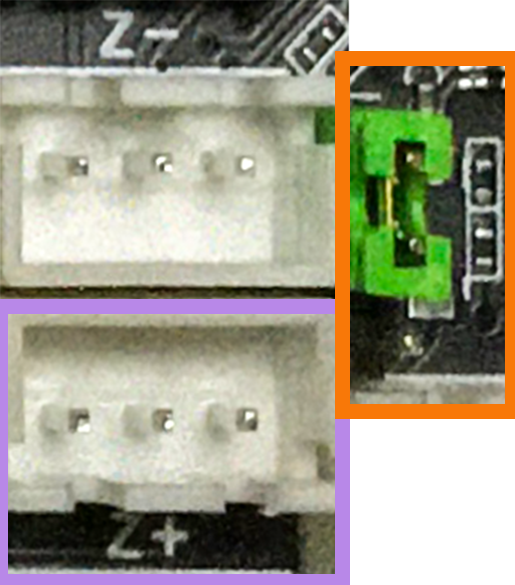

## Fysetc Spider Probe Port

* For reference, here is a small discussion on Reddit about how to determine your style of inductive probe, [click here](https://www.reddit.com/r/AskElectronics/comments/5zdlmm/help_me_identify_which_inductive_sensor_i_need/){:target="_blank" rel="noopener"}

## The Voron BOM recommends the following Inductive Probe Sensors

1.  Omron TL-Q5MC2 from [Digikey](https://www.digikey.com/en/products/detail/omron-automation-and-safety/tl-q5mc2/2669828){:target="_blank" rel="noopener"}
2.  Omron "TL-Q5MC2-Z NPN NC" from [Aliexpress](https://www.aliexpress.com/item/32442790824.html){:target="_blank" rel="noopener"}
3.  Panasonic GX-HL15BI-P from [Digikey](https://www.digikey.com/en/products/detail/panasonic-industrial-automation-sales/GX-HL15BI-P/3896953){:target="_blank" rel="noopener"}

* If you want more information about the "differences between a NPN and PNP style of probe", [here is a Google search](https://www.google.com/search?q=NPN+PNP+inductive+sensor&rlz=1C1SQJL_enUS837US837&sxsrf=APq-WBsU3fGY-63GDmolIVZSPNcraR7A_g:1649436226813&source=lnms&tbm=isch&sa=X&ved=2ahUKEwjVx4Pj9IT3AhXlomoFHU94AnYQ_AUoAXoECAEQAw&biw=1305&bih=749&dpr=1.1){:target="_blank" rel="noopener"} that will help you.

* What is necessary to know?

    * What type of Probe did I buy?

    * The seller's website will tell you that information.
    Below are the three recommended Inductive probes, write down the information displayed in the **PURPLE boxes**:

From Digikey website for Omron TL-Q5MC2:
######  {#Dikey_OmronTLQ5MC2_probeinfo}

From Aliexpress website for Omron TL-Q5MC2-Z:
######  {#Aliexpress_OmronTL-Q5MC2-Z_probeinfo}

Form Digikey website for Panasonic GX-HL15BI-P:
######  {#Digikey_PanasonicGX-HL15BI-P_probeinfo}

* Now, you have the information on the style of probe you own (i.e. NPN or PNP) and its default state (NO-normally open or NC-normally closed).
* Also, the operating voltage (supply voltage) of the inductive probe is now known.

## Understanding the Fysetc PROBE PORT:

* Here is a picture of the Fysetc probe port:
######  {#Acutal_FysetcSpiderv1.0_2.2probeport}

* From the Color PIN Diagram of the Fysetc Spider, here is a representation of the Fysetc probe port from above:
######  {#FysetcSpider_closeup_Pindiagram}

## What is the PIN Diagram telling me?

* If you look at the picture of the Color PIN diagram from above, there are two portions of the PROBE port that need to be addressed.  The item labeled as "Z+" or "PROBE Port" and another item labeled as "Probe Voltage Select".

* The item labeled "Z+/PROBE Port", shown in the **PURPLE box** in the diagram below, is the connector that is used when wiring up the inductive probe sensor.

* The "Probe Voltage Select", shown in the **ORANGE box** in the diagram below, sets the voltage level that will appear on the V-PROBE pin of the "PROBE port (which is labeled "V-PROBE").  The jumper can set the voltage to be 5VDC, or 24VDC.  From the picture of the Fysetc PROBE port above, the Voron design team recommends setting the voltage to 24VDC.

* From the data obtained from the seller's website, ensure the inductive probe can run at 24VDC (supply voltage).  If it can not, then the jumper "Probe Voltage Select" will need to be changed to match the probe's voltage supply.

* Just for your information, both Digikey's Omron TLQ5MC2 and the Aliexpress' Omron TL-Q5MC2-Z are a NPN style probes.  While Digikey's Panasonic GX-HL15BI-P is a PNP style probe.

**The Voron wiring diagram for the Fysetc Spider board recommends wiring the PROBE in to the Z+ connector.**  Connect the probe V+, probe GND, and probe signal pin in to the Z+ connector of the Fysetc spider board.

* Here is a picture of the Fystec Spider probe port with colored boxes:
######  {#Colored_FysetcSpiderv10_22probeport}

## Why does the Voron Team recommend the use of an endstop pin?

*  The Voron Design Team has been dealing with inductive probes for a long time and has learned the following over the years from their test data and experience with helping Voron users setup probe devices (the Fysetc Spider uses an endstop connector, already):

1. test data shows, an optocoupler, which some MCU boards incorporate in to the PROBE circuit, adds a noticeable signal delay;
2. the probe port is significantly less likely to work (across different MCU boards) than just using the normal endstop port;
3. if the inductive probe fails, people will exchange the inductive probe for a probe that utilizes a mechanical switch which requires an endstop port. By wiring the inductive probe up to the endstop port in the first place, this interchangeability can now occur easily.