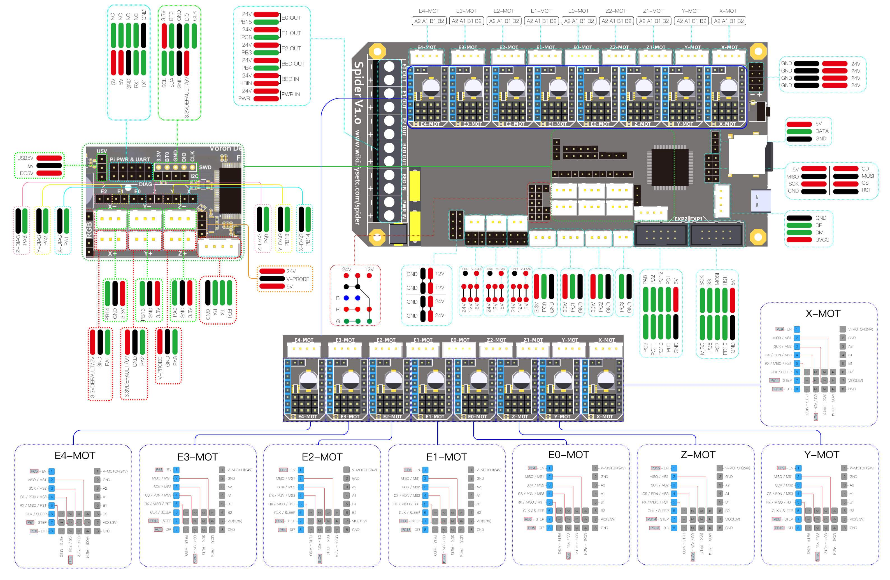

## Color PIN Diagram for Fysetc Spider V1.0

For reference, here is the Color PIN diagram for the Fysetc Spider V1.0

######  {#FYSETC_Spider_V10-color-PIN_1}

* The above image is compressed. For a better quality image use the next two hyperlinks below. The above image is just a placeholder.

* If you want to open the above diagram, in a new tab of your web browser, and have the ability to zoom and download the diagram in PDF format then [click here](./images/FYSETC_Spider_V1.0_V1.1_V2.0_Color_PIN_diagram_300.pdf){:target="_blank" rel="noopener"}

* If you want to open the above diagram, in a new tab of your web browser, and have the ability to zoom and download the diagram in JPG format then [click here](./images/FYSETC_Spider_V1.0_V1.1_V2.0_Color_PIN_diagram_300.jpg){:target="_blank" rel="noopener"}

## Original Fysetc Spider V1.0 Pinout

For reference, here is the original pinout of the Fysetc Spider V1.0

* Note: the original Fysetc Spider V1.0 Pinout is known to have errors. If you see a conflict between the original pinout and any other source, please refer back to the [Fysetc Spider V1.0 schematic diagram](<./images/Spider V1.0C SCH.pdf>){:target="_blank" rel="noopener"}

######  {#Spider_V10_Pinout_1}

* If you want to open the above diagram, in a new tab of your web browser, and have the ability to zoom and download the diagram in PDF format then [click here](<./images/Spider_V1.0_Pinout.pdf>){:target="_blank" rel="noopener"}

## The Fysetc's GitHub Repo for the Spider V1.0-V2.2 board

* Fysetc's documentation for Spider V1.0-V2.2 board is [located here](https://github.com/FYSETC/FYSETC-SPIDER){:target="_blank" rel="noopener"}