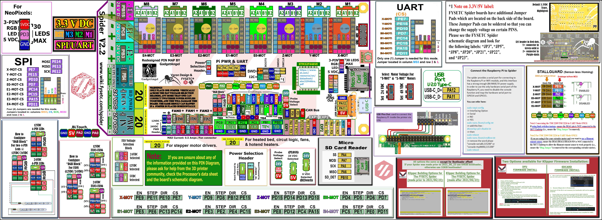

### The Klipper Configuration file for Fysetc Spider V2.2 Board

The Klipper Configuration file from VoronDesign/Voron-2 GitHub Repo for Fysetc Spider V2.2 board is [located here; Select "V2 Spider"](../../build/software/configuration#initial-voron-printer-configuration){:target="_blank" rel="noopener"}

[Go Back to the Table of Contents](./v2_spiderv22_wiring#table-of-contents)

## Color PIN Diagram for Fysetc Spider V2.2

For reference, here is the Color PIN diagram for the Fysetc Spider V2.2

######  {#FYSETC_Spider_V22-color-PIN_1}

* If you want to open the above diagram, in a new tab of your web browser, and have the ability to zoom and download the diagram in PDF format then [click here](./images/FYSETC_Spider_V2.2_Color_PIN_diagram_300.pdf){:target="_blank" rel="noopener"}

* If you want to open the above diagram, in a new tab of your web browser, and have the ability to zoom and download the diagram in JPG format then [click here](./images/FYSETC_Spider_V2.2_Color_PIN_diagram_300.jpg){:target="_blank" rel="noopener"}

[Go Back to the Table of Contents](./v2_spiderv22_wiring#table-of-contents)

## Original Fysetc Spider V2.2 Pinout

For reference, here is the original pinout of the Fysetc Spider V2.2

* Note: the original Fysetc Spider V2.2 Pinout is known to have errors. If you see a conflict between the original pinout and any other source, please refer back to the [Fysetc Spider V2.2 schematic diagram](<./images/Spider V2.2 SCH.pdf>){:target="_blank" rel="noopener"}

######  {#Spider_V22_Pinout_1}

* If you want to open the above diagram, in a new tab of your web browser, and have the ability to zoom and download the diagram in PDF format then [click here](<./images/Spider_V2.2_Pinout.pdf>){:target="_blank" rel="noopener"}

### The Fysetc's GitHub Repo for the Spider V2.2 board

* Fysetc's documentation for Spider V1.0-V2.2 board is [located here](https://github.com/FYSETC/FYSETC-SPIDER){:target="_blank" rel="noopener"}

[Go Back to the Table of Contents](./v2_spiderv22_wiring#table-of-contents)

## After I have Wired up the MCU Board, What Comes Next?

1. Once the MCU board is wired up and wire management has been performed, the next step is to install Mainsail/Fluidd or Octoprint, please see [The Build ═► Software Installation](../../build/software/index#software-installation){:target="_blank" rel="noopener"}

2. Once Mainsail/Fluidd or Octoprint has been installed, the next step is to **compile and install** the Klipper Firmware, please see [The Build ═► Software Installation -> Firmware Flashing(Header) -> Fysetc Spider](../../build/software/spider_klipper#spider-klipper-firmware){:target="_blank" rel="noopener"}

3. Once the MCU board has the Klipper Firmware Installed, the next step is to **create/edit** the Klipper Config file (Voron2_Spider_Config.cfg rename it to printer.cfg) to ensure your Voron build matches your Klipper Config file, please see [the file located here; Select "V2 Spider"](../../build/software/configuration#initial-voron-printer-configuration){:target="_blank" rel="noopener"};

    * Please use the Color PIN Diagrams, [displayed above](#FYSETC_Spider_V22-color-PIN_1), as a source of information;

    * Please consult [The Build ═► Software Configuration](../../build/software/configuration#software-configuration){:target="_blank" rel="noopener"} on how to edit the Klipper Config file.

4. After **creating/editing** the Klipper Config file (Voron2_Spider_Config.cfg renamed to printer.cfg), the next step is to check all the Motors and the mechanics of the Voron printer, please see [The Build ═► Initial Startup Checks](../../build/startup/index#initial-startup-checks){:target="_blank" rel="noopener"}

[Go Back to the Table of Contents](./v2_spiderv22_wiring#table-of-contents)