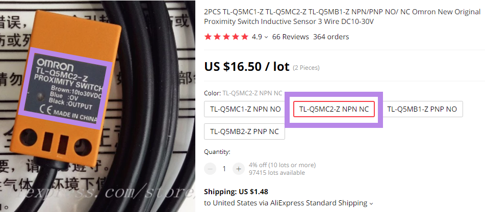

## BTT Octopus V1.0/V1.1 Probe Port

For reference, here is a small discussion on Reddit about how to determine your style of inductive probe, [click here](https://www.reddit.com/r/AskElectronics/comments/5zdlmm/help_me_identify_which_inductive_sensor_i_need/){:target="_blank" rel="noopener"}

## The Voron BOM recommends the following Inductive Probe Sensors

1.  Omron TL-Q5MC2 from [Digikey](https://www.digikey.com/en/products/detail/omron-automation-and-safety/tl-q5mc2/2669828){:target="_blank" rel="noopener"}
2.  Omron "TL-Q5MC2-Z NPN NC" from [Aliexpress](https://www.aliexpress.com/item/32442790824.html){:target="_blank" rel="noopener"}
3.  Panasonic GX-HL15BI-P from [Digikey](https://www.digikey.ca/en/products/detail/panasonic-industrial-automation-sales/GX-HL15BI-P/3896953){:target="_blank" rel="noopener"}

* If you want more information about the "differences between a NPN and PNP style of probe", [here is a Google search](https://www.google.com/search?q=NPN+PNP+inductive+sensor&rlz=1C1SQJL_enUS837US837&sxsrf=APq-WBsU3fGY-63GDmolIVZSPNcraR7A_g:1649436226813&source=lnms&tbm=isch&sa=X&ved=2ahUKEwjVx4Pj9IT3AhXlomoFHU94AnYQ_AUoAXoECAEQAw&biw=1305&bih=749&dpr=1.1){:target="_blank" rel="noopener"} that will help you.

* What is necessary to know?

    * What type of Probe did I buy?

    * The seller's website will tell you that information.
    Below are the three recommended Inductive probes, write down the information displayed in the **PURPLE boxes**:

From Digikey website for Omron TL-Q5MC2:
######  {#Dikey_OmronTLQ5MC2_probeinfo}

From Aliexpress website for Omron TL-Q5MC2-Z:
######  {#Aliexpress_OmronTL-Q5MC2-Z_probeinfo}

Form Digikey website for Panasonic GX-HL15BI-P:
######  {#Digikey_PanasonicGX-HL15BI-P_probeinfo}

* Now, you have the information on the style of probe you own (i.e. NPN or PNP) and its default state (NO-normally open or NC-normally closed).
* Also, the operating voltage (supply voltage) of the inductive probe is now known.

## Understanding the Octopus V1.0/V1.1 PROBE PORT:

* Here is a picture of the Octopus V1.0/V1.1 probe port:
######  {#Acutal_Octpusv11_probeport}

* From the Color PIN Diagram of the Octopus V1.0/V1.1, here is a representation of the Octopus V1.0/V1.1 probe port from above:
######  {#CloseUp_Octopusv11Probeprot}

## What is the PIN Diagram telling me?

If you look at the picture of the Color PIN diagram from above, there are two portions of the PROBE port that need to be addressed.  The item labeled as "PROBE" and the other item labeled as "PROBE Voltage Select (DC)".

* The "PROBE Voltage Select (DC)" sets the voltage level that will appear on the DC pin of the "PROBE" port (which is labeled "PROBE Voltage Select (DC)").  The Jumper can set the voltage to be 5VDC, 12VDC or 24VDC.  From the picture of the Octopus PROBE port above, the Voron printer setup sets the voltage to 24VDC.

* From the data obtained from the seller's website, ensure the inductive probe can run at 24VDC (supply voltage).  If it does not, then the jumper "PROBE Voltage Select (DC)" will need to be changed to match the Probe's voltage supply.

* The Color PIN diagram picture from above, has two footnotes: 2 & 4

    1. Footnote #4 states that the signal pin on the PROBE port is shared with the BLTouch port.  This means the following: only ONE of the two ports can use the signal pin.  So if you have something like a NeoPixel hooked up to the BLTouch port, then the PROBE port can not be used. If you have something like an Inductive probe hooked up to the PROBE port, then the BLTouch port can not be used.

    2. Footnote #2 states, that within Klipper, you will need to enable the internal pull-down resistor on PB7 in order for the probe to generate an output signal. [From the Klipper documentaion](https://www.klipper3d.org/Config_Reference.html#micro-controller-configuration){:target="_blank" rel="noopener"}:

    >"Input pins may be preceded by ^ to indicate that a hardware pull-up resistor should be enabled for the pin. If the micro-controller supports pull-down resistors then an input pin may alternatively be preceded by ~."

    * So when editing the printer.cfg file for the Probe sections, You may need to change ``pin: PB7`` to ``pin: ~PB7``

    * The second piece of information from footnote #2:

    > "If using a "NPN" style probe add an external 4.7K Ohm resistor between the DC pin and the signal pin on the PROBE port."

   * Both Digikey's Omron TLQ5MC2 and the Aliexpress' Omron TL-Q5MC2-Z are a NPN style probes.  So this will apply to these probe, if you use the PROBE port of the Octopus to hook up the inductive probe.  **The wiring diagram recommends the use of the endstop STOP_7 (PG15) connector.**

## Why does the Voron Team recommend the use of an endstop pin instead of the dedicated probe port?

*  The Voron Design Team has been dealing with Inductive probes for a long time and has learned the following over the years from their test data and experience with helping Voron users setup probe devices:

1. test data shows, an optocoupler, which some MCU boards incorporate in to the PROBE circuit, adds a noticeable signal delay;
2. the probe port is significantly less likely to work (across different MCU boards) than just using the normal endstop port;
3. if the inductive probe fails, people will exchange the inductive probe for a probe that utilizes a mechanical switch which requires an endstop port. By wiring the inductive probe up to the endstop port in the first place, this interchangeability can now occur easily.