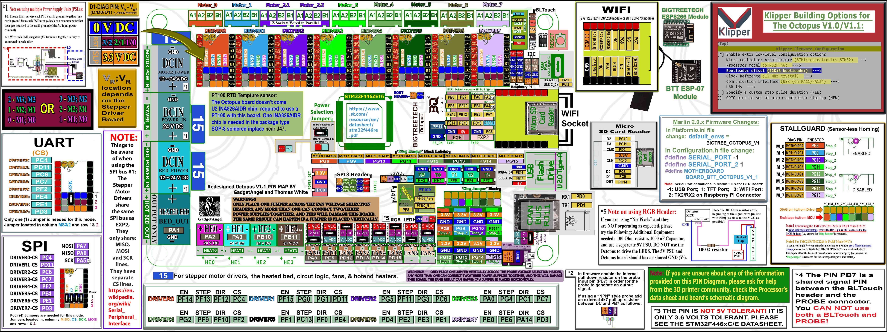
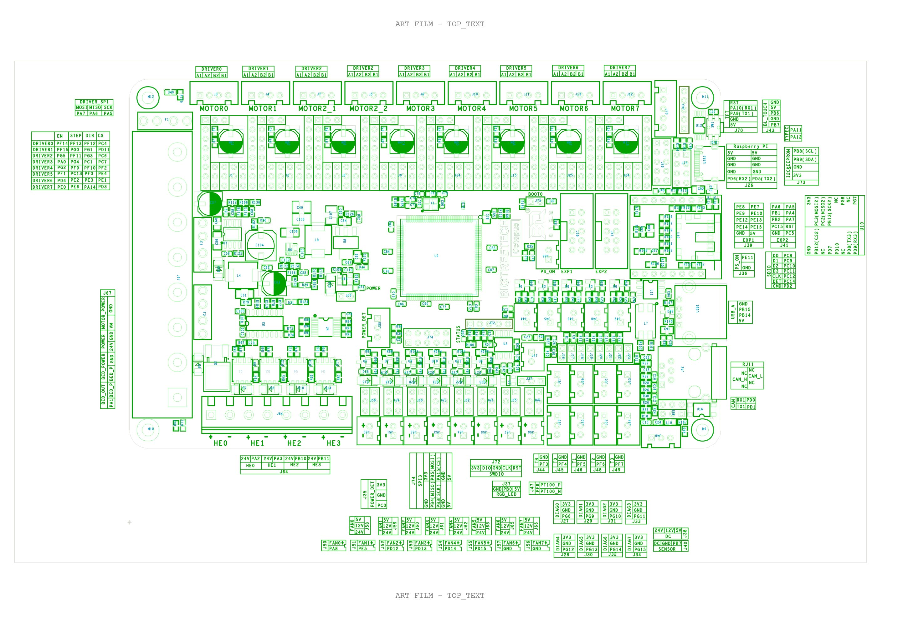

## Color PIN Diagram for BTT Octopus V1.0/V1.1

For reference, here is the Color PIN diagram for the BTT Octopus V1.0/V1.1

######  {#BIGTREETECH-Octopus-1.1-color-PIN_compress_1}

* The above image is compressed. For a better quality image use the next two hyperlinks below. The above image is just a placeholder.

* If you want to open the above diagram, in a new tab of your web browser, and have the ability to zoom and download the diagram in PDF format then [click here](./images/BIGTREETECH-Octopus-1.1-color-PIN.pdf){:target="_blank" rel="noopener"}

* If you want to open the above diagram, in a new tab of your web browser, and have the ability to zoom and download the diagram in JPG format then [click here](./images/BIGTREETECH-Octopus-1.1-color-PIN.jpg){:target="_blank" rel="noopener"}

## Original BTT Octopus V1.0/V1.1 Pinout

For reference, here is the original pinout of the BTT Octopus V1.0/V1.1

* Note: If you see a conflict between the original pinout and any other source, please refer back to the [BTT Octopus V1.0/V1.1 schematic diagram](<./images/BIGTREETECH Octopus.pdf>){:target="_blank" rel="noopener"}

######  {#BIGTREETECH_Octopus-PIN-original_1}

* If you want to open the above diagram, in a new tab of your web browser, and have the ability to zoom and download the diagram in PDF format then [click here](<./images/BIGTREETECH Octopus - PIN.pdf>){:target="_blank" rel="noopener"}

## The BTT's GitHub Repo for the Octopus V1.0/V1.1 board

* BTT's documentation for Octopus V1.0/V1.1 board is [located here](https://github.com/bigtreetech/BIGTREETECH-OCTOPUS-V1.0){:target="_blank" rel="noopener"}