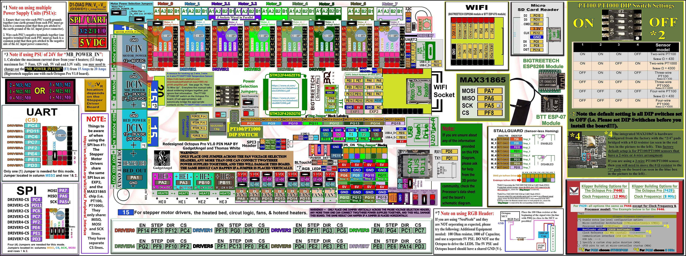
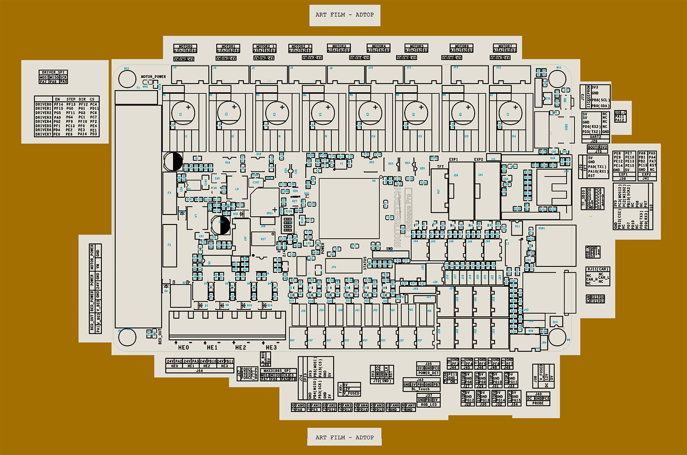

## The Klipper Configuration file for BTT Octopus Pro V1.0 Board

* The Klipper Configuration file from VoronDesign/Voron-2 GitHub Repo for BTT Octopus Pro 1.0 board is [located here; Select "V2 Octopus"](../../build/software/configuration#initial-voron-printer-configuration){:target="_blank" rel="noopener"}

[Go Back to the Table of Contents](v2_octopus_pro_uartspi_wiring.html#table-of-contents)

## Color PIN Diagram for BTT Octopus Pro V1.0

For reference, here is the Color PIN diagram for the BTT Octopus Pro V1.0

######  {#BTT-Octopus-Pro-V1.0-color-PIN_1}
{:.no_toc}

* If you want to open the above diagram, in a new tab of your web browser, and have the ability to zoom and download the diagram in PDF format then [click here](./images/BTT-Octopus-Pro-V1.0-Color-PIN-V4.0.pdf){:target="_blank" rel="noopener"}

* If you want to open the above diagram, in a new tab of your web browser, and have the ability to zoom and download the diagram in PNG format then [click here](./images/BTT-Octopus-Pro-V1.0-color-PIN.jpg){:target="_blank" rel="noopener"}

[Go Back to the Table of Contents](v2_octopus_pro_uartspi_wiring.html#table-of-contents)

## Original BTT Octopus Pro V1.0 Pinout

For reference, here is the original pinout of the BTT Octopus Pro V1.0

* Note: If you see a conflict between the original pinout and any other source, please refer back to the [BTT Octopus Pro V1.0 schematic diagram](<./images/BIGTREETECH Octopus Pro_SCH.pdf>){:target="_blank" rel="noopener"}

######  {#BIGTREETECH_Octopus_Pro-PIN-original_1}
{:.no_toc}

* If you want to open the above diagram, in a new tab of your web browser, and have the ability to zoom and download the diagram in PDF format then [click here](<./images/BIGTREETECH Octopus Pro - PIN.pdf>){:target="_blank" rel="noopener"}

[Go Back to the Table of Contents](v2_octopus_pro_uartspi_wiring.html#table-of-contents)

## The BTT's GitHub Repo for the Octopus Pro V1.0 board

* BTT's documentation for Octopus Pro V1.0 board is [located here](https://github.com/bigtreetech/BIGTREETECH-OCTOPUS-Pro){:target="_blank" rel="noopener"}

[Go Back to the Table of Contents](v2_octopus_pro_uartspi_wiring.html#table-of-contents)

## After I have Wired up the MCU Board, What Comes Next?   
   

1. Once the MCU board is wired up and wire management has been performed, the next step is to install Mainsail/Fluidd or Octoprint, please see [The Build ═► Software Installation](../../build/software/index#software-installation){:target="_blank" rel="noopener"}

2. Once Mainsail/Fluidd or Octoprint has been installed, the next step is to **compile and install** the Klipper Firmware, please see [The Build ═► Software  ═► Octopus Pro Klipper Firmware](../../build/software/octopus_klipper#octopuspro-klipper-firmware){:target="_blank" rel="noopener"}

3. Once the MCU board has the Klipper Firmware Installed, the next step is to edit the Klipper Config file (Voron2_Octopus_Config.cfg) to ensure your Voron build matches your Klipper Config file, please see [the file located here; Select "V2 Octopus."](../../build/software/configuration#initial-voron-printer-configuration){:target="_blank" rel="noopener"};

    * Please use the Color PIN Diagrams, [displayed above](#color-pin-diagram-for-btt-octopus-pro-v10), as a source of information;

    * Please consult [The Build ═► Software Configuration](../../build/software/configuration#software-configuration){:target="_blank" rel="noopener"} on how to edit the Klipper Config file.

4. After editing the Klipper Config file (Voron2_Octopus_Config.cfg), the next step is to check all the Motors and the mechanics of the Voron printer, please see [The Build ═► Initial Startup Checks](../../build/startup/index#initial-startup-checks)

[Go Back to the Table of Contents](v2_octopus_pro_uartspi_wiring.html#table-of-contents)