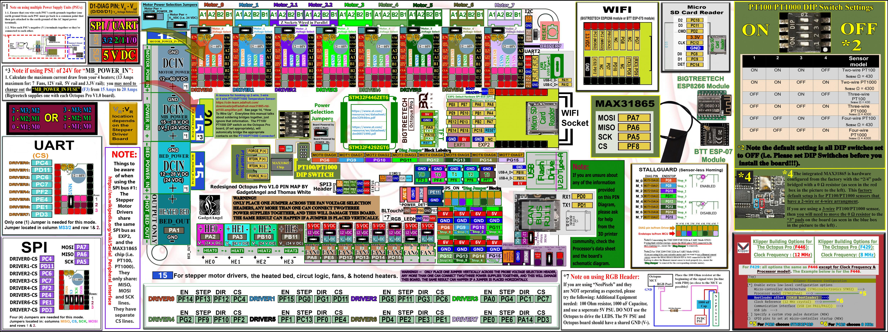

## Color PIN Diagram for BTT Octopus Pro V1.0

For reference, here is the Color PIN diagram for the BTT Octopus Pro V1.0

######  {#BTT-Octopus-Pro-V1.0-color-PIN_compress}

* The above image is compressed. For a better quality image use the next two hyperlinks below. The above image is just a placeholder.

* If you want to open the above diagram, in a new tab of your web browser, and have the ability to zoom and download the diagram in PDF format then [click here](./images/BTT-Octopus-Pro-V1.0-Color-PIN-V4.0.pdf){:target="_blank" rel="noopener"}

* If you want to open the above diagram, in a new tab of your web browser, and have the ability to zoom and download the diagram in JPG format then [click here](./images/BTT-Octopus-Pro-V1.0-color-PIN.jpg){:target="_blank" rel="noopener"}

## Original BTT Octopus Pro V1.0 Pinout

For reference, here is the original pinout of the BTT Octopus Pro V1.0

* Note: If you see a conflict between the original pinout and any other source, please refer back to the [BTT Octopus Pro V1.0 schematic diagram](<./images/BIGTREETECH Octopus Pro_SCH.pdf>){:target="_blank" rel="noopener"}

######  {#BIGTREETECH_Octopus_Pro-PIN-original_1}

* If you want to open the above diagram, in a new tab of your web browser, and have the ability to zoom and download the diagram in PDF format then [click here](<./images/BIGTREETECH Octopus Pro - PIN.pdf>){:target="_blank" rel="noopener"}

## The BTT's GitHub Repo for the Octopus Pro V1.0 board

* BTT's documentation for Octopus Pro V1.0 board is [located here](https://github.com/bigtreetech/BIGTREETECH-OCTOPUS-Pro){:target="_blank" rel="noopener"}