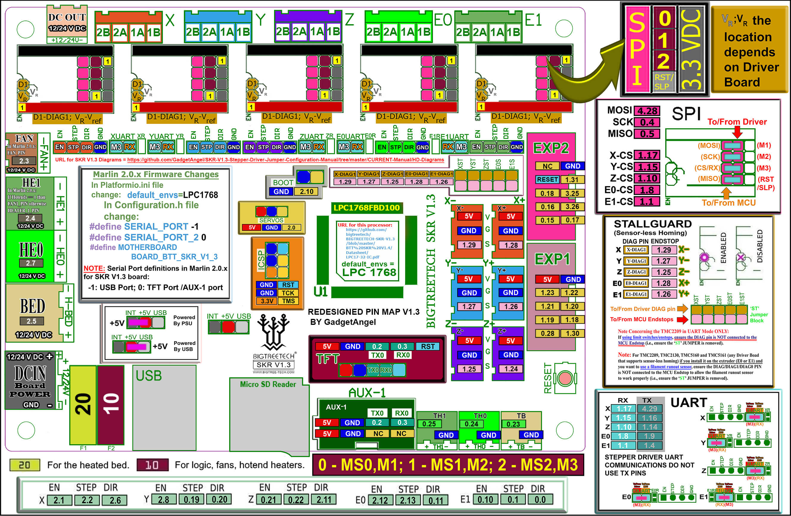

# Trident - SKR V1.3 in SPI Mode - Wiring

## Initial Removal of Jumpers

Remove **all** the YELLOW on-board jumpers, located at the positions as shown below.

## Initial Preparation - Set Jumpers

* Set the on-board jumpers, located at the positions as shown by the GREEN jumpers in the below diagram:

## MCU X/Y/E, Hot End in SPI Mode

* Place stepper drivers for X, Y, and E in positions X, Y, and E0
* Plug in stepper motors for X, Y, and E in positions X, Y, and E0
* Plug Hot End thermistor to thermistor TH0 (P0.24)
* Plug Hot End heater in to HE0 (P2.7)
* Plug Hot End Fan in to HE1 (P2.4)
* Plug Part Cooling Fan in to Fan (P2.3)
* Connect X end stop to X+ connector (P1.28)
* Connect Y end stop to Y+ connector (P1.26)
* Wire 24V and 0V from DC power supply to Power/DCIN
* Connect USB Cable to your SKR V1.3, but do not connect it yet to your Raspberry Pi

### MCU X/Y/E, Hot End in SPI Mode Diagram

* Downloadable BTT SKR 1.3's "MCU X/Y/E, Hot End" Wiring Diagram in .jpg format is [located here](./images/Trident_Wiring_Diagram_BTT_SKRV1.3_XYE_in_SPI_mode_150.jpg)

## MCU Z, Bed, Exhaust Fan in SPI Mode

* Place stepper drivers for Z2, Z1, and Z0 into positions X, Z, and E1
* Plug in stepper motors for Z2, Z1, and Z0 into positions X, Z, and E1
* Plug Bed Thermistor in to TB (P0.23)
* Plug in Exhaust Fan in to H-BED (P2.5)
* Plug in Controller Fans in to FAN (P2.3)
* Plug SSR Control for Heated Bed in to HE1 (P2.4)
* Plug Z Endstop Switch into Z- (P1.25)
* Plug Probe Signal (with BAT85 diode) in to Z+ (P1.24)
* Plug Probe GND and Probe Voltage in to "DC OUT" connector next to X motor connector
* Plug display wires in to EXP1 and EXP2
* Wire 24V and 0V from DC power supply to Power/DCIN
* Connect USB Cable to your SKR 1.3, but do not connect it yet to your Raspberry Pi

### MCU Z, Bed, Exhaust Fan in SPI Mode Diagram

* Downloadable BTT SKR 1.3's "Z, Bed, Exhaust Fan" Wiring Diagram in .jpg format is [located here](./images/Trident_Wiring_Diagram_BTT_SKRV1.3_Z_in_SPI_mode_150.jpg)

## Please Ensure the Heat Sinks are Installed Before Use

### MCU X/Y/E, Hot End with Heat Sinks Installed
   

### MCU Z, Bed, Exhaust Fan with Heat Sinks Installed
   

)

## SSR Wiring

* Wire colors will vary depending on your location.

* Downloadable SSR Wiring Diagram for the BTT SKR V1.3 board in SPI mode (.jpg format) is [located here](./images/btt-SKRV1.3inSPI-ssr-wiring.png)
   
## mini 12864 Display

* See [the mini12864 guide](./mini12864_klipper_guide.md)

 

<!--### The Klipper Configuration file for SKR V1.3 board 

The Klipper Configuration file from VoronDesign/Voron-2 GitHub Repo for SKR V1.3 board is [located here](https://github.com/VoronDesign/Voron-2/blob/Voron2.4/firmware/klipper_configurations/SKR_1.3/Voron2_SKR_13_Config.cfg)
--> 

## Color PIN Diagram for SKR V1.3
   
For reference, here is the Color PIN diagram for the SKR V1.3
   

* Downloadable BTT SKR V1.3 Color PIN diagram in .pdf format is [located here](./images/SKRV1.3_Colored_PIN_Diagram.pdf)

* Downloadable BTT SKR V1.3 Color PIN diagram in .jpg format is [located here](./images/SKRV1.3_Colored_PIN_Diagram_300.jpg)

 
    The .PDF file will not receive a public URL until web page is deployed.

    The public Jupyter Notebook's "nbviewer" process only accepts 

    "public URLs" for .pdf files as an input parameter.

    Only call the Jupyter Notebook's nbviewer process when you are not running this web page locally.









* Downloadable and LOCAL ZOOM capable web display for BTT SKR V1.3 Color PIN diagram is [located here]({{ "/build/electrical/images/SKRV1.3_Colored_PIN_Diagram.pdf" | prepend:site.url }}) 



* Downloadable and ZOOM capable web display for BTT SKR V1.3 Color PIN diagram is [located here]({{ nbviewer_url | append: "blob/main" | append: colorfilename }}) 



## Original SKR V1.3 Pinout
   
For reference, here is the original pinout of the SKR V1.3

* Note: If you see a conflict between the original pinout and any other source, please refer back to the [BigTreeTech SKR V1.3 schematic diagram](https://github.com/bigtreetech/BIGTREETECH-SKR-V1.3/blob/master/BTT%20SKR%20V1.3/hardware/SKR-V1.3-SCH.pdf)
   

### The BTT's GitHub Repo for the SKR V1.3 board

* BigTreeTech documentation for SKR V1.3 board is [located here](https://github.com/bigtreetech/BIGTREETECH-SKR-V1.3/tree/master/BTT%20SKR%20V1.3) 

* Downloadable and ZOOM capable web display for BTT's SKR V1.3 original pinout is [located here](http://nbviewer.jupyter.org/github/bigtreetech/BIGTREETECH-SKR-V1.3/blob/master/BTT%20SKR%20V1.3/hardware/SKR-V1.3-PIN.pdf)
