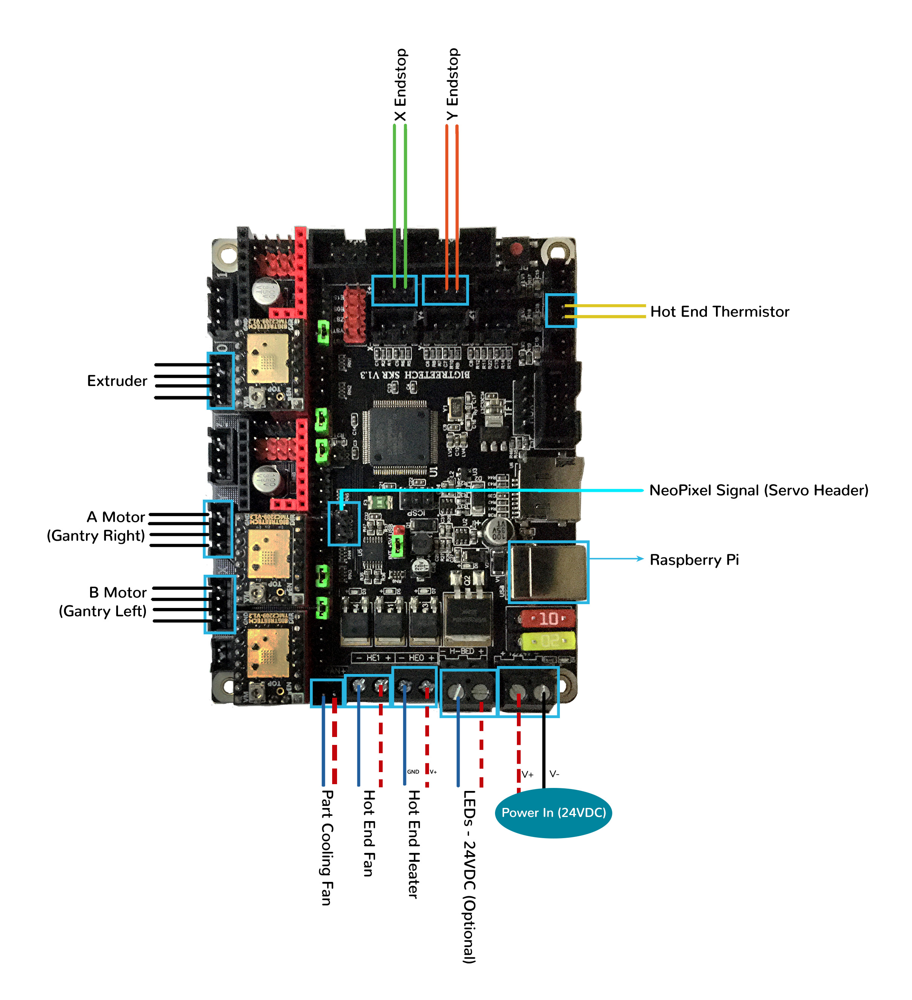
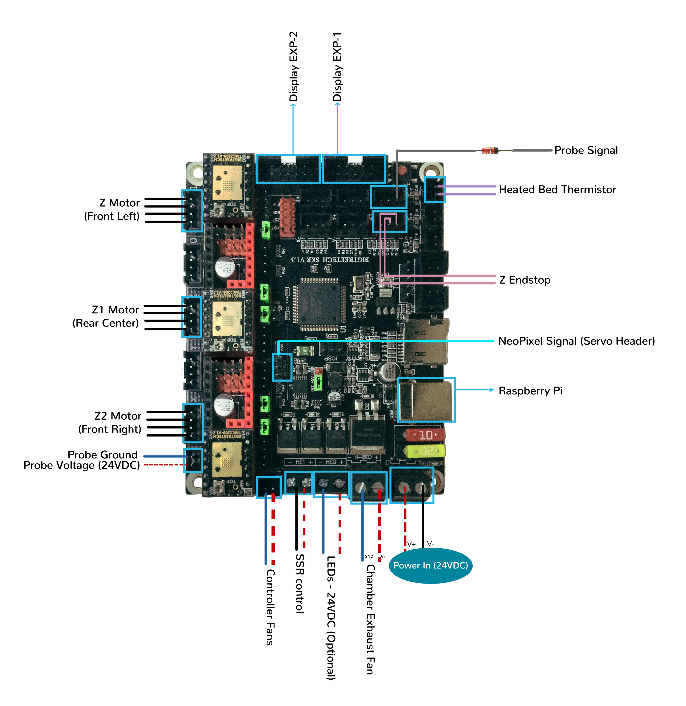
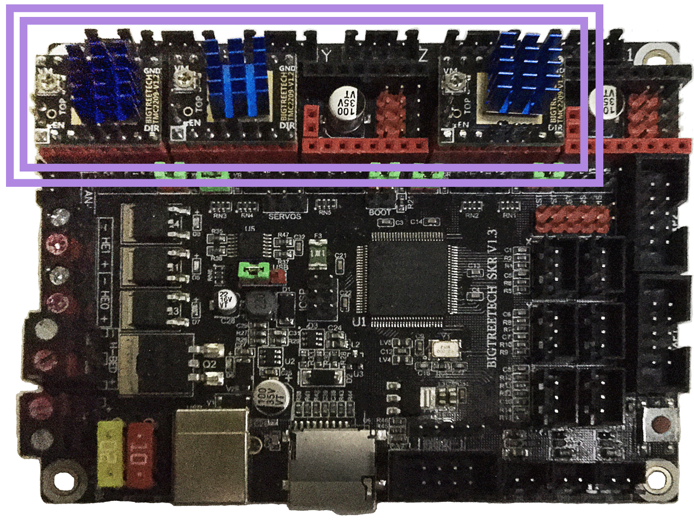
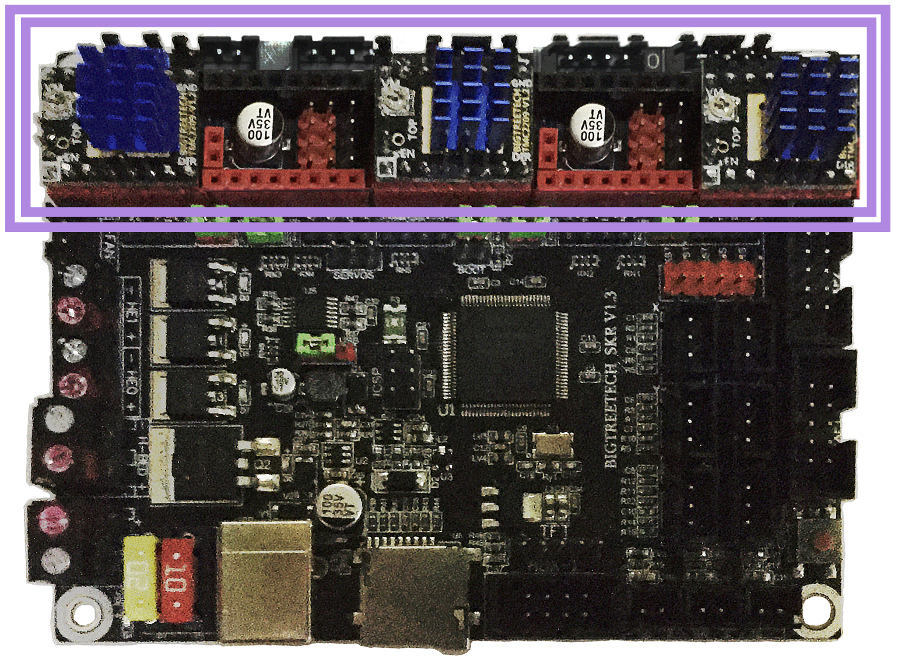

# Trident - SKR V1.3 in UART Mode - Wiring

## Initial Removal of Jumpers

Remove all the YELLOW on-board jumpers, located at the positions as shown below.

## Initial Preparation - Set Jumpers

* Set the on-board jumpers, located at the positions as shown by the GREEN jumpers in the below diagram:

## MCU X/Y/E, Hot End in UART Mode

* Place stepper drivers for X, Y, and E in positions X, Y, and E0
* Plug in stepper motors for X, Y, and E in positions X, Y, and E0
* Plug Hot End thermistor to thermistor TH0 (P0.24)
* Plug Hot End heater in to HE0 (P2.7)
* Plug Hot End Fan in to HE1 (P2.4)
* Plug Part Cooling Fan in to Fan (P2.3)
* Connect X end stop to X+ connector (P1.28)
* Connect Y end stop to Y+ connector (P1.26)
* Wire 24V and 0V from DC power supply to Power/DCIN
* Connect USB Cable to your SKR V1.3, but do not connect it yet to your Raspberry Pi

### MCU X/Y/E, Hot End in UART Mode Wiring Diagram

## MCU Z, Bed, Exhaust Fan in UART Mode

* Place stepper drivers for Z2, Z1, and Z0 into positions X, Z, and E1
* Plug in stepper motors for Z2, Z1, and Z0 into positions X, Z, and E1
* Plug Bed Thermistor in to TB (P0.23)
* Plug in Exhaust Fan in to H-BED (P2.5)
* Plug in Controller Fans in to FAN (P2.3)
* Plug SSR Control for Heated Bed in to HE1 (P2.4)
* Plug Z Endstop Switch into Z- (P1.25)
* Plug Probe Signal (with BAT85 diode) in to Z+ (P1.24)
* Plug Probe GND and Probe Voltage in to "DC OUT" connector next to X motor connector
* Plug display wires in to EXP1 and EXP2
* Wire 24V and 0V from DC power supply to Power/DCIN
* Connect USB Cable to your SKR 1.3, but do not connect it yet to your Raspberry Pi

### MCU Z, Bed, Exhaust Fan in UART Mode Wiring Diagram

## Please Ensure the Heat Sinks are Installed Before Use

### MCU X/Y/E, Hot End with Heat Sinks Installed

### MCU Z, Bed, Exhaust Fan with Heat Sinks Installed

## SSR Wiring

* Wire colors will vary depending on your location.

 
 
## mini 12864 Display
* See [the mini12864 guide](./mini12864_klipper_guide.md)

<!--### The Klipper Configuration file for SKR V1.3 board 

The Klipper Configuration file from VoronDesign/Voron-2 GitHub Repo for SKR V1.3 board is [located here](https://github.com/VoronDesign/Voron-2/blob/Voron2.4/firmware/klipper_configurations/SKR_1.3/Voron2_SKR_13_Config.cfg)-->

## Color PIN Diagram for SKR V1.3
For reference, here is the Color PIN diagram for the SKR V1.3

## Original SKR V1.3 Pinout

For reference, here is the original pinout of the SKR V1.3

### The BTT's GitHub Repo for the SKR V1.3 board
* BigTreeTech documentation for SKR V1.3 board is [located here](https://github.com/bigtreetech/BIGTREETECH-SKR-V1.3/tree/master/BTT%20SKR%20V1.3) 
* BTT's SKR V1.3 pinout is [located here](https://github.com/bigtreetech/BIGTREETECH-SKR-V1.3/blob/master/BTT%20SKR%20V1.3/hardware/SKR-V1.3-PIN.pdf)
