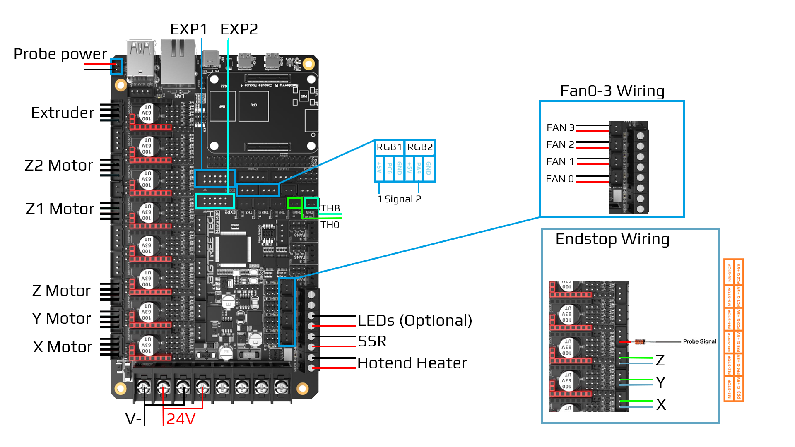
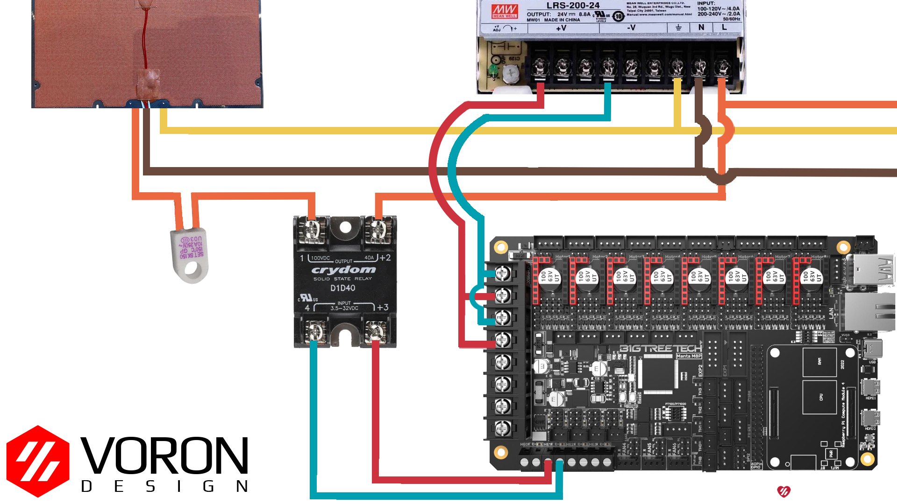

# Voron V1.8/Trident - Manta M8P Wiring

<b>WARNING:</b>  Do not leave HE0 or HE1 connected.
 
There have been reports of Octopus boards coming preloaded with a firmware that turns on all heaters and fans as soon as you power up the board.  As a result, we recommend leaving the heaters disconnected until after loading the klipper firmware

{: .warning }

## Initial Preparation 

Set jumpers as shown:

* Green – Add Jumper
* Red – Remove Jumper 
1. Insert only the jumper in the Green and remove the other three jumpers in the Red in order to use TMC2209 UART mode.
2. Remove the USB 5V power supply jumper.

## Wiring

* Connect 24V and GND (V+ and V-) from the PSU to PWR and MOTOR_POWER 
* Connect the B Motor (gantry left) to MOTOR1
* Connect the A Motor (gantry right) to MOTOR2
* Connect the Z (Front Left) motor to MOTOR3 
* Connect the Z1 (Rear) motor to MOTOR5
* Connect the Z2 (Front Right) motor to MOTOR6
* Connect the extruder motor to MOTOR8
* Connect the hot end heater to HE0  ( do not leave connected )
* Connect the bed SSR (DC Control Side) to HE1 ( do not leave connected )
* Connect the part cooling fan to FAN0
* Connect the hot end fan to FAN1
* Connect the controller fans to FAN2
* Connect the chamber exhaust fan to  FAN3
* Connect the hot end thermistor to TH0
* Connect the bed thermistor to THB
* Connect the X endstop to M1-STOP
* Connect the Y endstop to M2-STOP
* Connect the Z endstop to M3-STOP
* Connect the signal wire on the probe to M4-STOP
* Connect the V+ and V- wires on the probe to MOTOR_FAN (WARNING: USES BOARD INPUT VOLTAGE.) 

* if using a mini12864 display, connect to EXP1 & EXP2, only after completing the steps shown [below](#mini-12864-Display)

## SSR Wiring

* Wire colors will vary depending on your location.

 
 
## mini 12864 Display
* See [the mini12864 guide](./mini12864_klipper_guide.md)

## Other
* Full pinout, and other BigTreeTech documentation is located at [here](https://github.com/bigtreetech/Manta-M8P) 
* Manta M8P pinout is located [here](https://github.com/bigtreetech/Manta-M8P/blob/master/Hardware/BIGTREETECH%20MANTA%20M8P%20V1.0%20PinOut.png)
