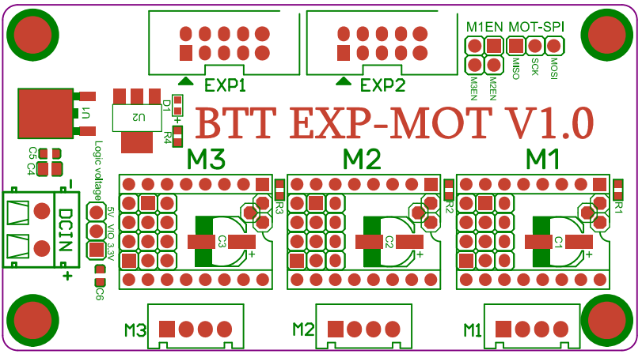

## Original Exp-Mot V1.0 Pinout

For reference, here is the original pinout of the EXP-MOT V1.0

* Note: If you see a conflict between the original pinout and any other source, please refer back to the [BigTreeTech EXP-MOT schematic diagram](<./images/BTT EXP-MOT V1.0-SCH.pdf>){:target="_blank" rel="noopener"}

######  {#Original-PIN-diagram-exp-mot}

* If you want to open the above diagram (found inside the EXP-MOT users guide), in a new tab of your web browser, and have the ability to zoom and download the diagram in PDF format then [click here](<./images/BTT EXP-MOT V1.0User Guide.pdf>){:target="_blank" rel="noopener"}

### The BTT's GitHub Repo for the EXP-MOT V1.0 board

* BTT's documentation for EXP-MOT V1.0 board is [located here](https://github.com/bigtreetech/BTT-Expansion-module/tree/master/BTT%20EXP-MOT){:target="_blank" rel="noopener"}