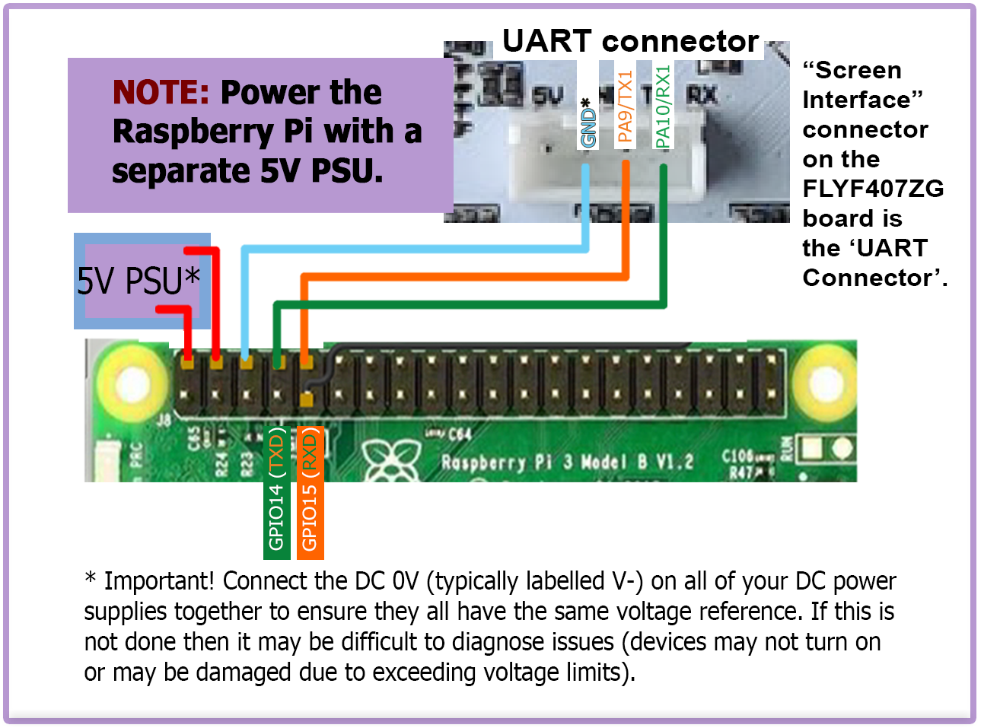

## Raspberry Pi

### Power
* The FLYF407ZG board is **NOT capable of providing 5V power** to run your Raspberry Pi.

### Connection Using Separate Power Supply
* Since the FLYF407ZG board does not produce enough amps to power the Raspberry Pi directly, the Raspberry Pi can be powered by an independent power supply.
* Use at least 24awg wire for V+ and GND connections to the Pi's power supply
* Tie all the DC 0V (typically labelled V-) lines for all the DC power supplies together to ensure that all power supplies have the same voltage reference.

######  {#FLYF407ZG_to_PI_UART_1}

### Control

* Voron Design recommends using USB to control the FLYF407ZG board, which simply requires connecting a USB-A to USB-A type B cable between the Octopus and Pi.
* The option also exists to use a UART connection from the Pi header, in place of the USB.  If you prefer this option, please see the wiring diagram located above in [Connection Using Separate Power Supply](#connection-using-separate-power-supply) and use the instructions below on the Raspberry Pi.  You will want to perform the instructions below **after Mailsail/Fluidd is installed on the Raspberry Pi.**
* If you decide to use the UART connection in place of the USB cable then you will lose capability to run NeoPixels from the TFT connector on the FLYF407ZG.  If you want the capability to run both UART communications and NeoPixels, you will need to 
find an **unused PIN that DOES NOT have a pull-up resistor on the FLYF407ZG** to act as the DATA pin for your NeoPixels.  This is beyond the scope of this document.  Ask for help on the [Voron Discord channel](https://discord.com/invite/voron){:target="_blank" rel="noopener"}

######  {#ConnectPitoOctopus-Instructions_1}