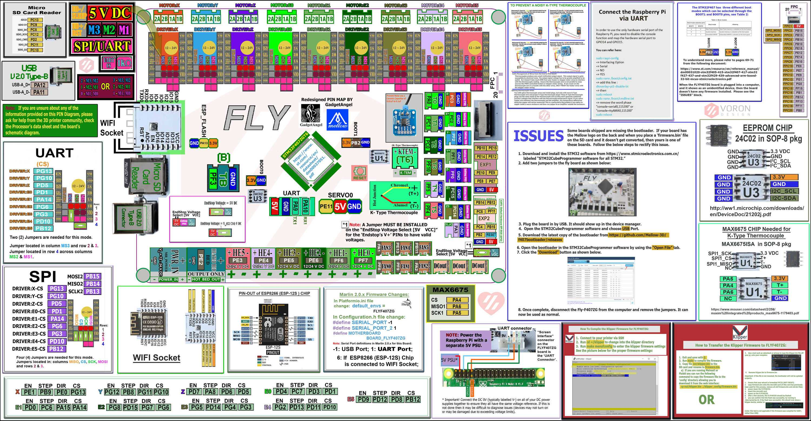

## Color PIN Diagram for Mellow FLYF407ZG

For reference, here is the Color PIN diagram for the Mellow FLYF407ZG

######  {#FLYF407ZG-color-PIN-compressed_1}

* If you want to open the above diagram, in a new tab of your web browser, and have the ability to zoom and download the diagram in PDF format then [click here](./images/FLYF407ZG-color-PIN.pdf){:target="_blank" rel="noopener"}

* If you want to open the above diagram, in a new tab of your web browser, and have the ability to zoom and download the diagram in JPG format then [click here](./images/FLYF407ZG-color-PIN.jpg){:target="_blank" rel="noopener"}

## Original Mellow FLYF407ZG Pinout Diagrams

For reference, here are the original diagrams for the Mellow FLYF407ZG

* Note: If you see a conflict between the original diagrams and any other source, please refer back to the [Mellow FLYF407ZG schematic diagram](./images/FLYF407ZG-Schematic.pdf){:target="_blank" rel="noopener"}

######  {#flyf407zg-PIN-original_1}

* If you want to open the above diagram, in a new tab of your web browser, and have the ability to zoom and download the diagram in PDF format then [click here](./images/FLYF407ZG-Pin-diagram.pdf){:target="_blank" rel="noopener"}

######  {#flyf407zg_port_illustration}

* If you want to open the above diagram, in a new tab of your web browser, and have the ability to zoom and download the diagram in PNG format then [click here](./images/flyf407zg_port_illustration.png){:target="_blank" rel="noopener"}

## The Mellow's GitHub Repo for the Mellow FLYF407ZG board

* Mellow's documentation for Mellow FLYF407ZG board is [located here](https://github.com/Mellow-3D/FLYF407ZG){:target="_blank" rel="noopener"}