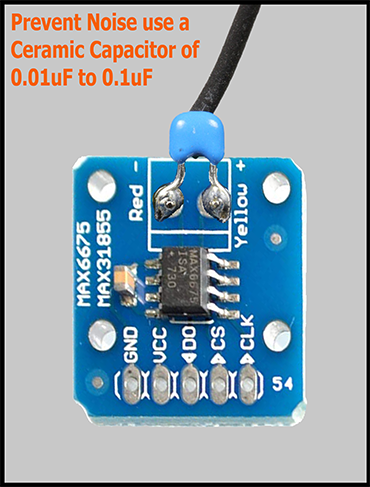

## Additional Information for the Mellow FLYF407ZG Board

### The Mellow FLYF407ZG Board Has Additional Mounting Points for Additional Equipment

### PIN-OUT of ESP-12S WIFI Chip

* The Mellow FLYF407ZG Board has a pre-soldered socket available for an ESP-12S WIFI Chip.

* For reference, here is the PIN diagram for the ESP-12S WIFI Chip

* For reference, here is the [data sheet on the ESP-12S WIFI Chip](https://docs.ai-thinker.com/_media/esp8266/docs/esp-12s_product_specification_en.pdf){:target="_blank" rel="noopener"}

######  {#ESP-12S_pinout}

* If you want to open the above diagram, in a new tab of your web browser, and have the ability to zoom and download the diagram in PNG format then [click here](./images/ESP-12S_pinout.png){:target="_blank" rel="noopener"}

---

### PIN-OUT of the EEPROM Chip

* The Mellow FLYF407ZG Board has a pre-soldered socket available for an EEPROM 24CO2 Chip.

* For reference, here is the PIN diagram for the EEPROM 24CO2 Chip.

* For reference, here is the [data sheet on the EEPROM Chip](http://ww1.microchip.com/downloads/en/DeviceDoc/21202j.pdf){:target="_blank" rel="noopener"}

######  {#24C02_EEPROM_Chip}

* If you want to open the above diagram, in a new tab of your web browser, and have the ability to zoom and download the diagram in JPG format then [click here](./images/24C02_EEPROM_Chip.jpg){:target="_blank" rel="noopener"}

---

### PIN-OUT of the MAX6675 Chip

* The Mellow FLYF407ZG Board has a pre-soldered socket available for a MAX6675 Chip.

* For reference, here is information on MAX6675 Chip that can be soldered onto the FLYF407ZG board so that you can use
a K-Type Thermocouple at the T6 connector

* For reference, here is the [data sheet on the MAX6675 Chip](https://www.mouser.com/datasheet/2/256/maxim%20integrated%20products_max6675-1179403.pdf){:target="_blank" rel="noopener"}

######  {#MAX56675_Chip}

* If you want to open the above diagram, in a new tab of your web browser, and have the ability to zoom and download the diagram in JPG format then [click here](./images/MAX56675_Chip.jpg){:target="_blank" rel="noopener"}

#### Information on Thermocouples

* Here is further information on how to prevent noisy K-Type Thermocouples

######  {#Prevent-Noisy-Thermocouple-1}

######  {#Prevent-Noisy-Thermocouple-1}

* If you want to open the above diagram, in a new tab of your web browser, and have the ability to zoom and download the diagram in JPG format then [click here](./images/Prevent_a_Noisy_Thermocouple_MAX6675.jpg){:target="_blank" rel="noopener"}

#### The Adafruit's URLs for Information on K-Type Thermocouples and MAX6675 board or MAX31855 board

* Adafruit's documentation for K-Type Thermocouples is [located here](https://learn.adafruit.com/thermocouple){:target="_blank" rel="noopener"}

* Adafruit's documentation for MAX6657 board is [located here](https://blog.adafruit.com/2010/07/26/new-product-thermocouple-amplifier-max6675-breakout-board/){:target="_blank" rel="noopener"}

* Adafruit's documentation for MAX31855 board is [located here](https://blog.adafruit.com/2012/11/23/new-product-thermocouple-amplifier-max31855-breakout-board-max6675-upgrade-v2-0/){:target="_blank" rel="noopener"}

---

### Information on ISSUES with the Mellow FLYF407ZG Board

* This information was obtained from [here](https://teamgloomy.github.io/fly_407zg_general.html#issues){:target="_blank" rel="noopener"}

* It is recommended that two components for the Mellow FLYF407ZG Board have heat sinks installed.  The board I received from Mellow did not have ones supplied, but you can buy some from [Amazon here](https://www.amazon.com/gp/product/B082RWXFR2){:target="_blank" rel="noopener"}

######  {#fly_407zg_heatsinks-1}

* Some boards shipped are missing the bootloader.  If your board has the Mellow logo on the back and when you place a firmware.bin file on the SD card and it doesn't get converted, then yours is one of these boards.

* Information on boot modes for a STM32F407 board:

######  {#BOOTmode-STM32F407}

* [Here is the link from the above picture](https://www.st.com/resource/en/reference_manual/dm00031020-stm32f405-415-stm32f407-417-stm32f427-437-and-stm32f429-439-advanced-arm-based-32-bit-mcus-stmicroelectronics.pdf#page=69){:target="_blank" rel="noopener"}

* Follow the below steps to rectify this issue (ISSUES Block):

######  {#BOOTmode-Issues-FLYF407ZG-1}

* [Get STM32CubeProgrammer here](https://www.st.com/en/development-tools/stm32cubeprog.html#get-software){:target="_blank" rel="noopener"}

* [Download the latest release of the bootloader for the FLYF407ZG board here](https://github.com/Mellow-3D/f407bootloader/releases){:target="_blank" rel="noopener"}

* Here is a closer look at the jumper settings for BOOT mode:

######  {#fly_407zg_fix.png-1}