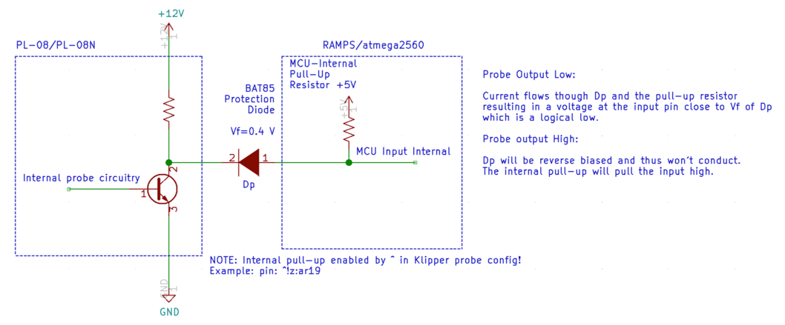

# Electrical Wiring

## Safety Note
When wiring your printer electronics, you will be working with line voltage wiring (120V / 220V AC). Always double check to make sure your printer is unplugged and the capacitors in the power supplies have discharged before touching any wire or terminal.

***The recommendations made in here are typically out of an abundance of caution to prevent fires.***

## Risk of Damage
**Never plug or unplug any device while the printer is powered.** In addition to being a safety hazard, it is very easy to damage electronic components.  In particular the stepper drivers can be easily damaged by connecting or disconnecting stepper motors while powered.

## Tips

* Depending on your level of expertise it may be useful to practice crimping and soldering before wiring everything up. Bad crimps are a major source of problems later on and sometimes hard to identify!

* AC wiring should be properly dimensioned. Use at least 18 AWG (0.75 mm²) for mains AC wiring, even better would be 16 AWG (1.25 mm²)
* Buy a quality SSR (see the official sourcing guide), cheap clones may overheat and fail closed causing a heater thermal runaway. Add a 115-125°C thermal fuse to your bed heater as an additional safety measure
* Dont run your bed above 110°C, this reduces the lifespan of the adhesive holding it onto the build plate
* If using an AC powered bed, be sure to ground the bed regardless of if the assembly manual specifies it or not.
* Grounding the frame is recommended.

## Connectors

The recommended MicroFit 3.0 connectors are specified for up to 5A and should be used for all connections to the stepper motors, hotend and limit switches The JST connectors are used for connections to the MCU board(s). JST connnectors are not available as mid-wire connectors so they must be mixed.  Adding Molex connectors to all stepper motors is useful. Use a 3pin MLX connector (see the official sourcing guide) to allow your bed to be removable without disconnecting from the SSR directly. The thermistor can use a 2pin Microfit connector.

### Microfit Pins

When assembling Microfit connectors, the male pins are inserted into the female housings and the female pins are inserted into the male housings.


## Cables

Silicone wiring has been specified because it has a high strand count which means it has higher fatigue life. Silicone insulation withstands heat and is more flexible which is good in high movement applications. It is less prone to snagging on other wires or the walls inside the cable chain. Check your cable loom before installing the chains. 

PTFE or Heluflon wires are a premium option as they have a thinner insulation and a lower friction coefficient, which increases bending capabilities and decreases wear. But these advantages are most useful in printers that use cable chains. For printers with an umbilical cord cabling setup (V0 Toolhead, Legacy), they might be overkill. Automation cable such as IGUS can be used, but the minimum bend radius of the cable needs to be verified as the typical bend radius for Voron cable chains is very small.

See the cable lengths and count section for specific counts. Do not downsize the hot end heater wires, they are oversized for safety reasons. 

You may add additional wires to your cable chains as a replacement in case of wire breaks. However, these cables will be heated/cooled and moved around as much as your live cables and may be broken already when you need them! So may be better to keep extra wires as spares outside of the printer.

Buy some cable holders (e.g. with adhesive) to organize your cables in the electronics compartment. Keep in mind that the adhesive fails over time due to exposure to above room temperature. Cables can be hidden in the rails. Optionally print cable covers for the rails.

## Stepper Motor Wiring
There is no standard either for the color of wire on stepper motors, nor for the order of wires in the connector. As a result, it is often necessary to re-order stepper motor wires _even on motors sold specifically for use in Vorons_.  If you are using the exact BOM motors, the colors shown in the wiring guides should work, however in any other case, you should verify your motor wiring. All control boards currently used with voron expect one winding to be connected on pins 1&2, and the other on pins 3&4.  Note that other details, such as identifying winding A vs winding B is not critical.  At worst, your motor will run backwards, which you can easily fix later, in software.

### Identifying Windings

There are 3 basic options for identifying windings:
1) Check the documentation.  Many motors come with a card which tells you what wire colors are on the same winding.  If there's no card, the manufacturer's website may have something.
2) Use a multimeter: put your meter in "continuity" mode.  Pick one wire, and then find any other wire that shows continuity with it.  Those two wires are on the same winding. By process of elimination, it should be safe to assume the other two represent the other winding.
3) If you don't have a meter available, you can twist 2 wires together, and then try to spin the shaft of the motor.  If the wires are on the same winding, it will become noticably harder to spin the shaft.

### Symptoms of miswired motors

Traditionally, trying to move a stepper that's miswired, has either resulted in nothing happening, or a nasty buzzing sound.  However, recent versions of klipper will generally detect the miswiring, and simply shutdown.  If, during your motor checks, klipper immediately shuts down: check your logs.  If there is a wiring issue with your stepper, it will report something like

```
TMC 'stepper_y' reports DRV_STATUS: 001900d0 s2vsa=1(LowSideShort_A!) ola=1(OpenLoad_A!) olb=1(OpenLoad_B!) CS_ACTUAL=25
Transition to shutdown state: TMC 'stepper_y' reports error: DRV_STATUS: 001900d0 s2vsa=1(LowSideShort_A!) ola=1(OpenLoad_A!) 
```


## DC Power Supply Wiring
Many of the latest generation of Voron printers spec the use of two or more independent power supplies.  That can include 24V, 5V, and 12V power supplies depending on configuration.

**Important!**  Connect the DC 0V (typically labelled V-) on all of your DC power supplies together to ensure they all have the same voltage reference.  If this is not done then it may be difficult to diagnose issues (devices may not turn on or may be damaged due to exceeding voltage limits).

### Smaller Printers (V0, Legacy)

Instead of multiple power supplies, the V0 uses a DC-DC converter to generate a 5V bus instead of a dedicated 5V power supply.


### Larger Printers (V1, Trident, V2, Switchwire)

Please see the associated assembly guides for power supply configurations.

---
# Wiring Configuration / Setup

### Wire counts / lengths

The following are guides for each printer model for planning of wire counts and lengths.  As always, these are recommendations and adding allowances is always a good idea.

- [V1 Gantry Wires](./V1_gantry_wires.md)
- [Trident Gantry Wires](./Trident_gantry_wires.md)
- [V2 Gantry Wires](./V2_gantry_wires.md)

### Gantry Routing

While some extruder motors and inductive probes come with wire leads long enough to reach part or all of the way down the cable chain, resist the urge to use them.  The wires typically found in them are not rated for the constant bending encountered in the cable chains and may break much sooner than desired.  Terminate all connections to silicone or PTFE wire before entering the cable chain.

### Wire Terminals

Different controller boards use different terminal types.  The RAMPS boards use Dupont terminals but the SKR boards use JST-XH terminals.  If using an SKR board, a JST-XH connector kit is required with 2-pin, 3-pin, and 4-pin connectors (see the BOM).  Unlike Dupont connectors, JST-XH connectors are keyed and will only fit one orientation so pay close attention when inserting pins.

For wiring the stepper motors, keep the same wire color sequence that your stepper motors came with and use that same sequence for all stepper motors in the printer.  If the BOM spec motors from StepperOnline are used, the wires should be in the color order as shown in the wiring diagrams.

If the purchased steppers do not match the color order in the documentation, there is no need to rewire just to change colors.  There is not a "standard" wire color order for these parts. If the builder decides to reterminate to change connector types or whatever, be sure to use the same order as before. The spec motors also come with a datasheet or card so you can double check the work. One can also use a multimeter to find wire pairs in the motor by measuring continuity between leads. Each lead should have continuity to the other lead in its pair.

**Important:** If the motors are found later on to be going the wrong direction, repinning the connectors is _not_ required.  The direction can be inverted in the software configuration later.

### Inductive Probe Wiring (V1, Trident, V2, Switchwire)

The BOM spec PL-08N inductive probe (and the alterate Omron probe) that is used for Bed Mesh, Z Tilt Adjust (V1/Legacy) or Quad Gantry Leveling (V2) needs to be powered with 12-24V, not the typical 5V that is used for end stop switches.  This is critical because if powered with 5V the sense distance is reduced enough to cause a nozzle crash.

If not closely following the BOM spec, ensure that the inductive probe purchased is a normally closed (NC) version rather than normally open (NO).  The configuration cannot be changed as that is built specifically from the factory.  A normally open (NO) probe may cause crashes if a wire breaks.

### BAT85 Diode

Due to the switching used by the sensor the output voltage is approximately the same voltage as the sensor is powered with.  If the sensor is powered with the common 24V, it will send 24V to an input on the MCU that is never intended to see more than 5V.  The BAT85 diode is used to alleviate this issue.  It is oriented so that when the probe signal wire is high (12-24V), not current will flow into the MCU input pin.  As a result the MCU will read HIGH voltage due to the internal pull-up resistor.  If the probe signal is LOW (0V), current will flow from the MCU input pin through the diode, through the probe, and to ground (V-).  This will pull the MCU pin low and trigger appropriately.

**Important:** The BAT85 diode should always be wired with the black band toward the probe, not toward the MCU.

Below is a circuit diagram with more details.



### Endstop Wiring

Endstops can be wired one of two ways: normally closed (NC) or normally open (NO).  For normally closed configurations, the endstop switch allows current to flow through when not triggered.  For normally open configurations, the endstop switch only allows current to flow through whe triggered.

While both of these configurations will work fine in an ideal world, normally closed (NC) configurations are more robust.  If a wire breaks or a terminal becomes disconnected, the printer will think the endstop has triggered and will stop movement before the toolhead crashes into the bed or frame. Note that you should always still observe the homing routine - an intermittent break in an X or Y wire can still result in a crash as the nozzle will drop to where it thinks the Z endstop is and instead hit the bed (not applicable to V0 or Switchwire).

Wiring mechanical endstop switches for NC operation is easy as the BOM spec switches have 3 pins exposed.  With a multimeter, probe each combination of the three pins until a pair is found that has continuity (<10 ohms resistance) when the switch is not triggered (normal state), but does not have continuity (>10M ohms resistance) when the switch is triggered (depressed).  Typically the outer two pins are the NC pins, but should be verified prior to installation.


### X/Y Endstop Wiring (Trident, V2)

The X/Y endstop connector can be strapped to the bottom of the joint. Just make sure the cable is long enough, be sure to install the cover to keep any prints that fly off from bonding to your endstops.


## Controller (MCU) Wiring

Follow the links to the wiring configuration guides specific to your printer and controller selection.  There are other controllers on the market that may work (such as Duet), but those are not commonly used so standard configurations have not been developed.

### Voron 0
* [V0 - mini e3 V1.2](./v0_miniE3_v12_wiring.md)
* [V0 - mini e3 V2.0](./v0_miniE3_v20_wiring.md)

### Voron 1
* [V1 - SKR 1.3](./v1_skr13_wiring.md)
* [V1 - SKR 1.4](./v1_skr14_wiring.md)

### Trident
* Coming Soon

### Voron 2
* [V2 - SKR 1.3](./v2_skr13_wiring.md)
* [V2 - SKR 1.4](./v2_skr14_wiring.md)
* [V2 - FLYboard FLYF407ZG](./v2_flyf407zg_wiring.md)
* [V2 - Fysetc Spider](./v2_spider_wiring.md)

### Voron Switchwire
* [SW - mini e3 V2.0](./sw_miniE3_v20_wiring.md)
* [SW - Einsy Rambo](./sw_einsy_rambo_wiring.md)

## Additional Items

### Mini12864 Display (V1, Trident, V2, Switchwire)

If installing a Mini12864 display, please follow the [Mini12864 Klipper Guide](./mini12864_klipper_guide.md).

### Using non-24V fans with a 24V powered MCU

It is possible to use the SKR (and possibly other controllers) to control fans, LEDs, and other devices even when those devices use a different voltage.  The SKR, like most controllers, uses the (-) pin to control if a device is switched on or off.

For a given device, is the V+ is wired to an external power supply (e.g. 5V or 12V), and the V- is wired to the SKR, the fan can be switched on or off.  As mentioned above, this will _only_ work if the DC 0V of all of the power supplies is tied together.

Note: In the diagram below, only DC wires are shown.  Red represents V+, black represents V-.


----
## Next: [Software Installation](../software/index.md)
