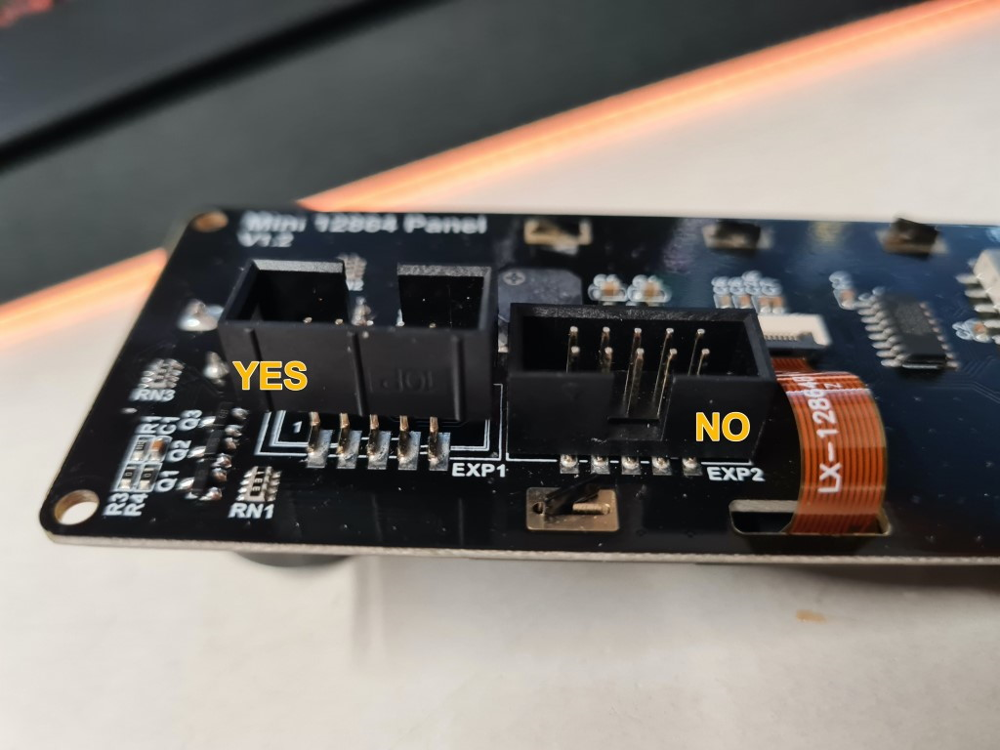

# Mini12864 Klipper Guide

## Requirements

1. An MCU must be used that is compatible with the EXP1/EXP2 wiring standard (e.g. SKR, FLY).
2. The EXP1/EXP2 ports must be available and not connected to another expansion module

## Hardware
*NOTE: The two connector housings only need to be reversed if the MCU and display are different brands.  If you have both a BigTree Tech mini12864 and a BigTree Tech MCU (Or both a FYSETC mini12864 and an FYSETC F6/S6), skip steps 1 & 2*
1. Pry off the two black connector housings from the back of the display
2. Rotate connector housings 180 degrees and insert back onto pins
3. *Fysetc Spider Only*: The Fysetc Spider requires certain components to be removed from the mini12864 display.  
   * From a Fysetc display, remove R1 & R4
   * From a BTT display, remove R1 & R6
4. Connect EXP1 and EXP2 cables to the display and to your MCU board, being sure to match port numbers (EXP1 <> EXP1).  <br> *Note: The Fysetc Spider V1.0 has a silk screen error.  __for V1.0 only__, Connect EXP1 to EXP2, and EXP2 to EXP1*




## Klipper Configuration
Most stock Voron configuration files already have appropriate configurations for this display built in, which simply needs to be un-commented.  These  configs are customized for the specific builds, and should be what you use.  *_Note: There are multiple config sections required to make the mini12864 fully operational: `[display]`, `[neopixel fysetc_mini12864]` and `[delayed_gcode setdisplayneopixel]`_*

Some users find that they want to reverse the direction the menu wheel spins.  You can easily reverse its operation by swapping the order of the two pins in the `[display]` `encoder_pins` line.  For example, if your stock config contains the line 
```
encoder_pins: ^PC7,^PC6
```
you would change it to
```
encoder_pins: ^PC6,^PC7
```

## Mini12864 Troubleshooting Checklist

The Mini12864 display can be a little tricky to get running correctly.  Here is a short checklist to help double check some of the common issues.

* Have you Rotated the headers on the back of the display?  See [Hardware](#hardware) above
* Is EXP1 connected to EXP1, and EXP2 to EXP2?
* Have you enabled all the config sections?  you must have `[display]`,  `[output_pin beeper]`, `[neopixel fysetc_mini12864]`, AND `[delayed_gcode setdisplayneopixel]` to fully enable all features of your display.  (many users may not feel the need to enable `[output_pin beeper]`)
* Voron 2 dual MCU configurations: Is your firmware configuration in agreement with your physical wiring about which MCU board the display is connected to?  ( As provided in the stock printer.cfg, the display should be connected to MCU-Z )
