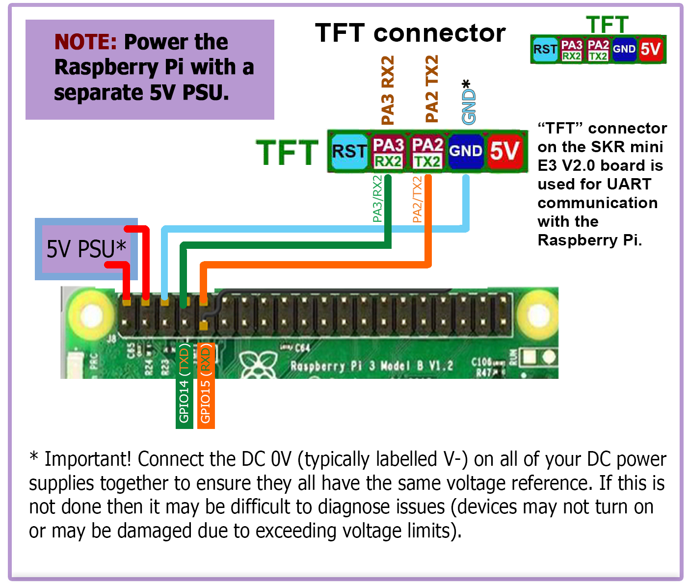

# Raspberry Pi

## Connection Using Separate Power Supply
* Since the BTT SKR mini E3 V2.0 board does not produce enough amps to power the Raspberry Pi directly, the Raspberry Pi can be powered by an independent power supply.
* Use at least 24awg wire for V+ and GND connections to the Pi's power supply
* Tie all the DC 0V (typically labelled V-) lines for all the DC power supplies together to ensure that all power supplies have the same voltage reference.
* The below diagram, shows the connections for both the "Separate Power Supply" connections and "UART serial" connections.  If "Separate Power Supply" connection is wanted and "UART serial" connection is not wanted, then only use the 5V and GND connections from the diagram below (i.e. the TX and RX lines are not needed).

######  {#SKR_mini_e3_v20_to_Pi_UART}

## Control

* Voron Design recommends using USB to control the SKR Mini E3 V2.0, which simply requires connecting a USB-A to mini-USB-type B cable between the SKR Mini E3 V2.0 and Pi.
* The option also exists to use a UART connection from the Pi header, in place of the USB.  If you prefer this option, please see the wiring diagram located above in [Connection Using Separate Power Supply](#connection-using-separate-power-supply) and use the instructions below on the Raspberry Pi.  You will want to perform the instructions below **after Mailsail/Fluidd is installed on the Raspberry Pi.**

######  {#ConnectPitoOctopusPro-Instructions_21}