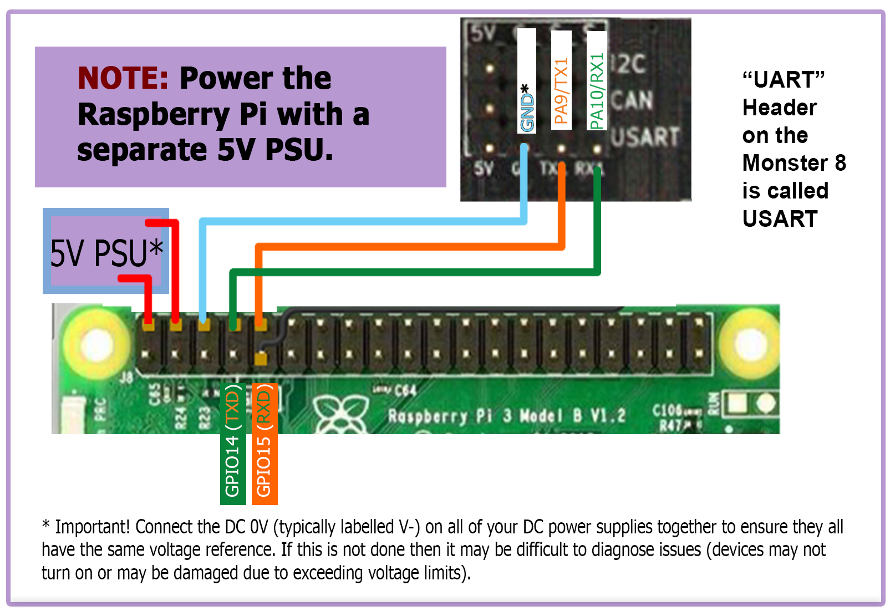

## Raspberry Pi

### Connection Using Separate Power Supply
* Since the MKS Monster 8 V1.0 board does not produce enough amps to power the Raspberry Pi directly, the Raspberry Pi can be powered by an independent power supply.
* Use at least 24awg wire for V+ and GND connections to the Pi's power supply
* Tie all the DC 0V (typically labelled V-) lines for all the DC power supplies together to ensure that all power supplies have the same voltage reference.

######  {#v2_monster8v10_to_PI_UART_1}

### Control

* Voron Design recommends using USB to control the Monster 8, which simply requires connecting a USB-A to USB-C cable between the Monster 8 and Pi.
* The option also exists to use a UART connection from the Pi header, in place of the USB.  If you prefer this option, please see the wiring diagram located above in [Connection Using Separate Power Supply](#connection-using-separate-power-supply) and use the instructions below on the Raspberry Pi.  You will want to perform the instructions below **after Mailsail/Fluidd is installed on the Raspberry Pi.**

######  {#ConnectPitoOctopusPro-Instructions_4}