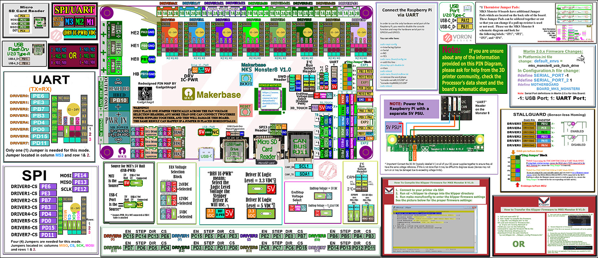
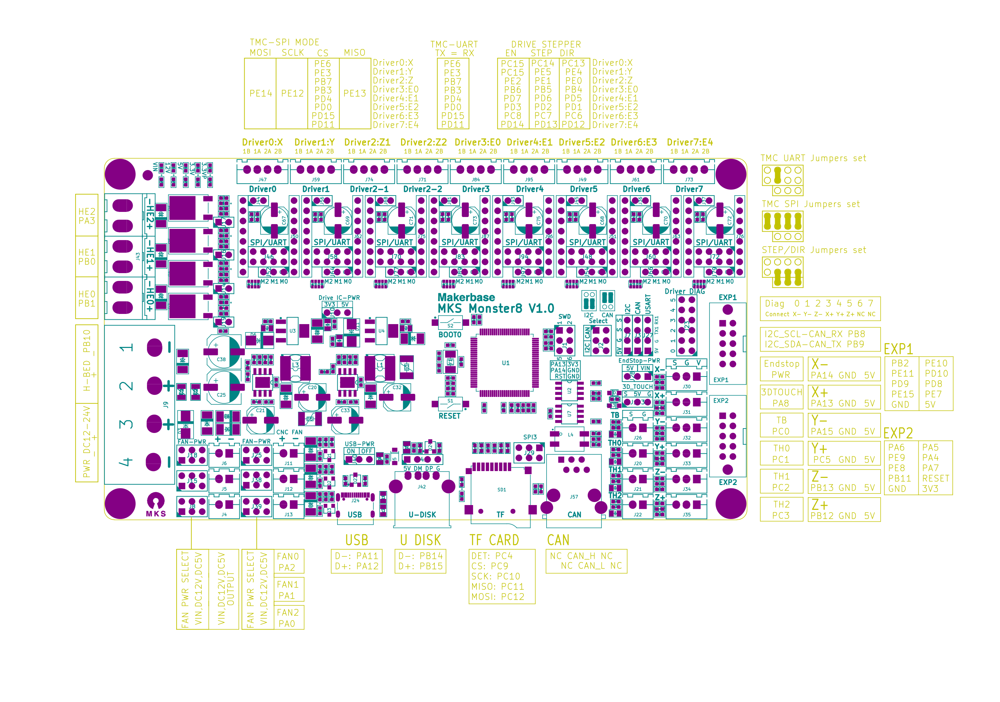

## Color PIN Diagram for MKS Monster 8 V1.0

For reference, here is the Color PIN diagram for the MKS Monster 8 V1.0

######  {#MKS_Monster8-V10-color-PIN-compressed}

* The above image is compressed. For a better quality image use the next two hyperlinks below. The above image is just a placeholder.

* If you want to open the above diagram, in a new tab of your web browser, and have the ability to zoom and download the diagram in PDF format then [click here](./images/MKS_Monster8-V1.0-color-PIN.pdf){:target="_blank" rel="noopener"}

* If you want to open the above diagram, in a new tab of your web browser, and have the ability to zoom and download the diagram in JPG format then [click here](./images/MKS_Monster8-V1.0-color-PIN.jpg){:target="_blank" rel="noopener"}

## Original MKS Monster 8 V1.0 Pinout

For reference, here is the original pinout of the MKS Monster 8 V1.0

* Note: If you see a conflict between the original pinout and any other source, please refer back to the [MKS Monster 8 V1.0 schematic diagram](<./images/MKS Monster8 V1.0_003 SCH.pdf>){:target="_blank" rel="noopener"}

######  {#MKS-Monster8-V10_003-PIN-original_1}

* If you want to open the above diagram, in a new tab of your web browser, and have the ability to zoom and download the diagram in PDF format then [click here](<./images/MKS Monster8 V1.0_003 PIN.pdf>){:target="_blank" rel="noopener"}

## The MKS's GitHub Repo for the Monster 8 V1.0 board

* MKS's documentation for Monster 8 V1.0 board is [located here](https://github.com/makerbase-mks/MKS-Monster8){:target="_blank" rel="noopener"}