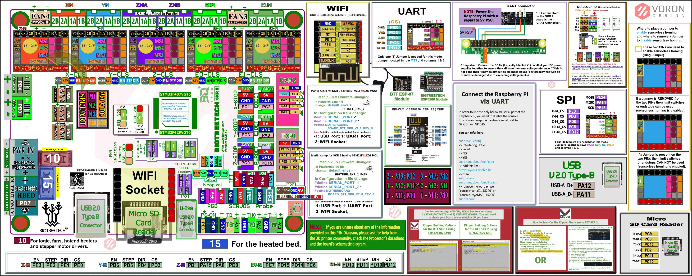
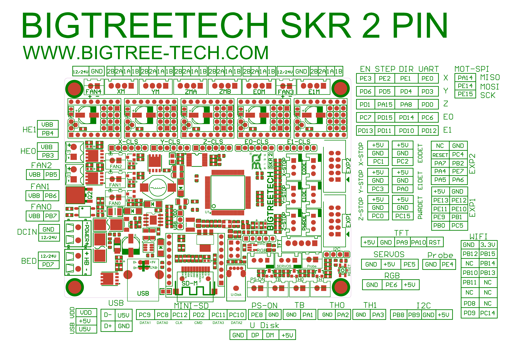

## Color PIN Diagram for SKR 2

For reference, here is the Color PIN diagram for the SKR 2

######  {#SKR_2_V1.0_Colored_PIN_Diagram-comp}

* The above image is compressed. For a better quality image use the next two hyperlinks below. The above image is just a placeholder.

* If you want to open the above diagram, in a new tab of your web browser, and have the ability to zoom and download the diagram in PDF format then [click here](./images/SKR_2_V1.0_Colored_PIN_Diagram.pdf){:target="_blank" rel="noopener"}

* If you want to open the above diagram, in a new tab of your web browser, and have the ability to zoom and download the diagram in JPG format then [click here](./images/SKR_2_V1.0_Colored_PIN_Diagram.jpg){:target="_blank" rel="noopener"}

## Original SKR 2 Pinout

For reference, here is the original pinout of the SKR 2

* Note: If you see a conflict between the original pinout and any other source, please refer back to the [BigTreeTech SKR 2 schematic diagram](<./images/BIGTREETECH SKR 2-SCH.pdf>){:target="_blank" rel="noopener"}

######  {#SKR-2-Pinpout}

* If you want to open the above diagram, in a new tab of your web browser, and have the ability to zoom and download the diagram in PDF format then [click here](<./images/BIGTREETECH SKR 2-Pin.pdf>){:target="_blank" rel="noopener"}

### The BTT's GitHub Repo for the SKR 2 board

* BTT's documentation for SKR 2 board is [located here](https://github.com/bigtreetech/SKR-2){:target="_blank" rel="noopener"}