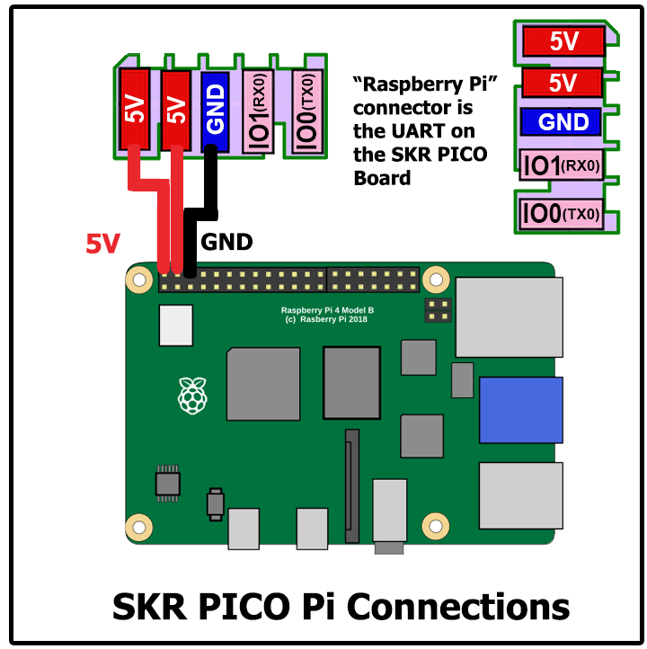
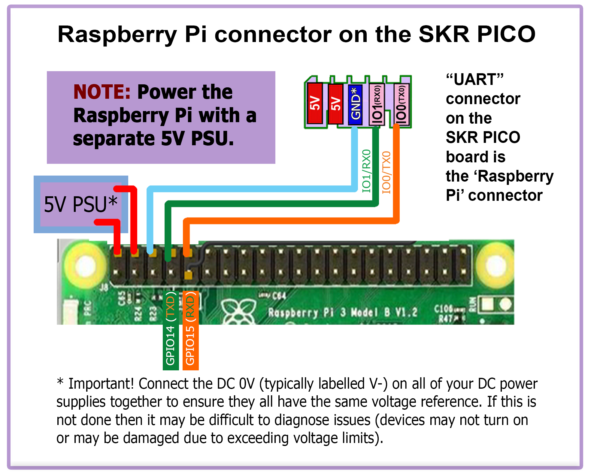
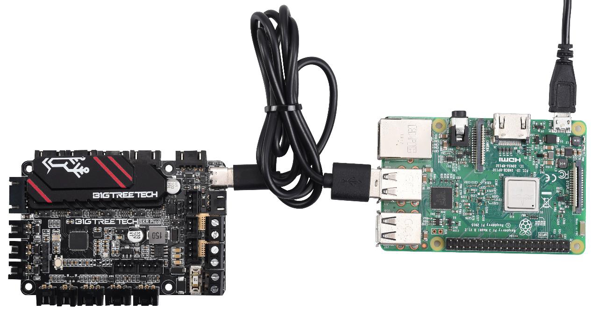
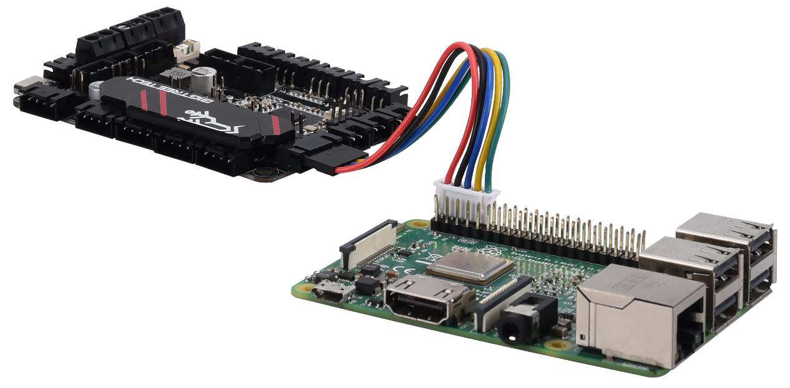

# Raspberry Pi

## Power
* The SKR Pico is capable of providing 5V power to run your Raspberry Pi.  To take advantage of this feature, connect the wires as shown below, from the pi header of the SKR Pico, to the GPIO header of the Pi.
* Use at least 24awg wire for this connection.  It may be tempting to use the common "Dupont" jumpers found in many electronics kits, however these jumpers typically use very small gauge wire, and will not carry enough current to run the Pi.  If you can, use the provided cable that arrived with the SKR Pico board.
* Tie all the DC 0V (typically labelled V-) lines for all the DC power supplies together to ensure that all power supplies have the same voltage reference.

######  {#skr-pico_pi_onlyPWR_1}

## Connection Using Separate Power Supply
* To reduce the current load on the 5V rail of the SKR Pico board, the Raspberry Pi can be powered by an independent power supply.
* Use at least 24awg wire for V+ and GND connections to the Pi's power supply
* Tie all the DC 0V (typically labelled V-) lines for all the DC power supplies together to ensure that all power supplies have the same voltage reference.
* The below diagram, shows the connections for both the "Separate Power Supply" connections and "UART serial" connections.  If "Separate Power Supply" connection is wanted and "UART serial" connection is not wanted, then only use the 5V and GND connections from the diagram below (i.e. the TX and RX lines are not needed).

######  {#skr-pico_to_Pi_UART_1}

## Control

* Voron Design recommends using USB to control the SKR Pico, which simply requires connecting a USB-A to USB-C cable between the SKR Pico and Pi.

Image of SKR Pico using USB-A to USB-C cable:
######  {#Pico-to-pi-viaUSB-Ccable_1}

* The option also exists to use a UART serial connection from the Pi header, in place of the USB.  If you prefer this option, please see the wiring diagram located above in [Connection Using Separate Power Supply](#connection-using-separate-power-supply) and use the instructions below on the Raspberry Pi.  You will want to perform the instructions below **after Mailsail/Fluidd is installed on the Raspberry Pi.**

Image of SKR Pico using UART communication ribbon cable:
######  {#Pico-to-pi-via-UARTcoms_1}
   

Instructions to be performed on the Raspberry Pi to enable UART communications:
######  {#ConnectPitoOctopusPro-Instructions_1}