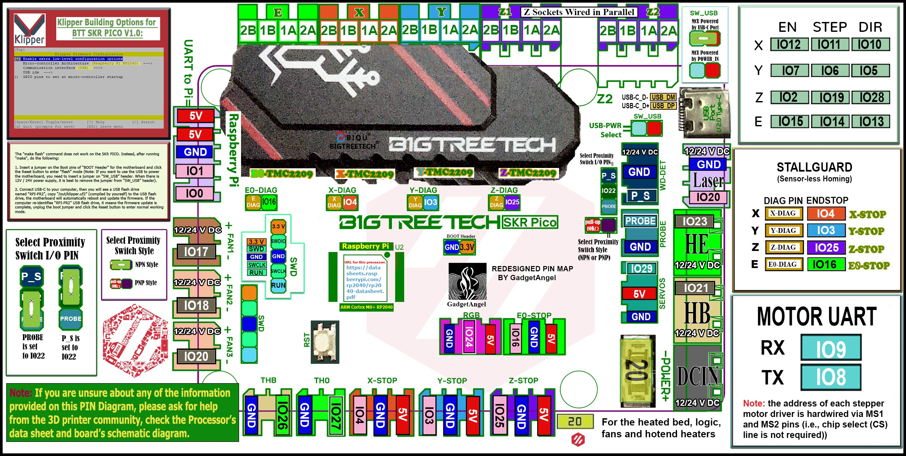

## Color PIN Diagram for SKR Pico

For reference, here is the Color PIN diagram for the SKR Pico
   

######  {#SKR_PICO_V1.0_Color_PIN_diagram}

* If you want to open the above diagram, in a new tab of your web browser, and have the ability to zoom and download the diagram in PDF format then [click here](./images/SKR_PICO_V1.0_Color_PIN_diagram.pdf){:target="_blank" rel="noopener"}

* If you want to open the above diagram, in a new tab of your web browser, and have the ability to zoom and download the diagram in JPG format then [click here](./images/SKR_PICO_V1.0_Color_PIN_diagram.jpg){:target="_blank" rel="noopener"}

## Original SKR Pico Pinout
   
For reference, here is the original pinout of the SKR Pico

* Note: If you see a conflict between the original pinout and any other source, please refer back to the [BigTreeTech SKR Pico schematic diagram](<./images/BTT SKR Pico V1.0-SCH.pdf>){:target="_blank" rel="noopener"}
   

######  {#skr-pico-pinout}

* If you want to open the above diagram, in a new tab of your web browser, and have the ability to zoom and download the diagram in PDF format then [click here](<./images/BTT SKR Pico V1.0-PIN.pdf>){:target="_blank" rel="noopener"}

## The BTT's GitHub Repo for the SKR Pico Board

* BigTreeTech documentation for SKR Pico board is [located here](https://github.com/bigtreetech/SKR-Pico){:target="_blank" rel="noopener"}