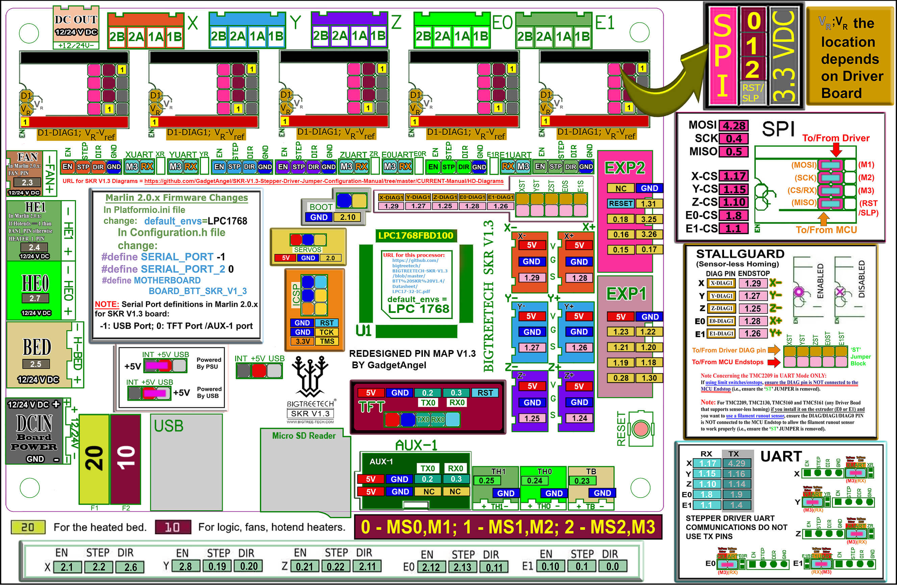
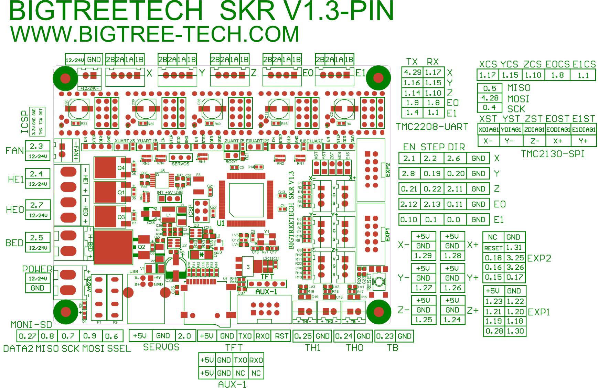

## Color PIN Diagram for SKR V1.3

For reference, here is the Color PIN diagram for the SKR V1.3

######  {#SKRV13_Colored_PIN_Diagram}

* If you want to open the above diagram, in a new tab of your web browser, and have the ability to zoom and download the diagram in PDF format then [click here](./images/SKRV1.3_Colored_PIN_Diagram.pdf){:target="_blank" rel="noopener"}

* If you want to open the above diagram, in a new tab of your web browser, and have the ability to zoom and download the diagram in JPG format then [click here](./images/SKRV1.3_Colored_PIN_Diagram_300.jpg){:target="_blank" rel="noopener"}

## Original SKR V1.3 Pinout

For reference, here is the original pinout of the SKR V1.3

* Note: If you see a conflict between the original pinout and any other source, please refer back to the [BigTreeTech SKR V1.3 schematic diagram](<./images/SKR-V1.3-SCH.pdf>){:target="_blank" rel="noopener"}

######  {#original-SKR-V13-PIN}

* If you want to open the above diagram, in a new tab of your web browser, and have the ability to zoom and download the diagram in PDF format then [click here](<./images/SKR-V1.3-PIN.pdf>){:target="_blank" rel="noopener"}

### The BTT's GitHub Repo for the SKR V1.3 board

* BTT's documentation for SKR V1.3 board is [located here](https://github.com/bigtreetech/BIGTREETECH-SKR-V1.3/tree/master/BTT%20SKR%20V1.3){:target="_blank" rel="noopener"}