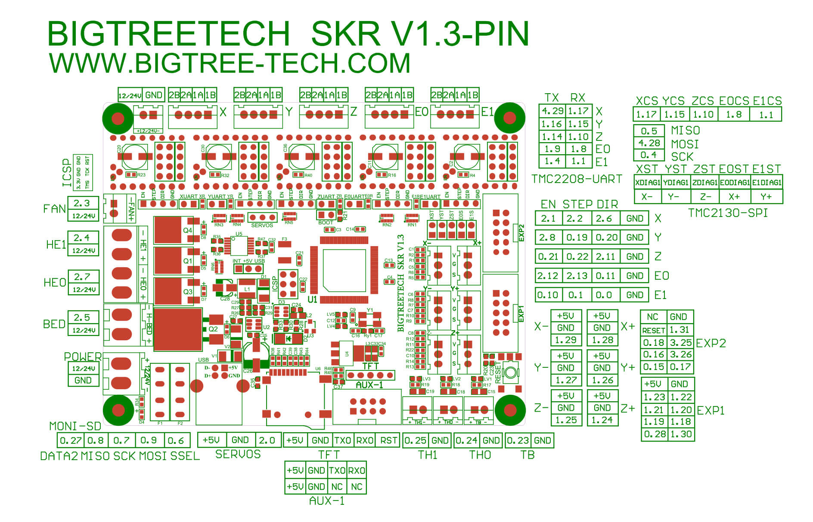

### The Klipper Configuration file for SKR V1.3 board

The Klipper Configuration file from VoronDesign/Voron-2 GitHub Repo for SKR V1.3 board is [located here; Select "V2 SKR 1.3"](../../build/software/configuration#initial-voron-printer-configuration){:target="_blank" rel="noopener"}

## Color PIN Diagram for SKR V1.3

For reference, here is the Color PIN diagram for the SKR V1.3

######  {#SKRV13_Colored_PIN_Diagram}

* If you want to open the above diagram, in a new tab of your web browser, and have the ability to zoom and download the diagram in PDF format then [click here](./images/SKRV1.3_Colored_PIN_Diagram.pdf){:target="_blank" rel="noopener"}

* If you want to open the above diagram, in a new tab of your web browser, and have the ability to zoom and download the diagram in JPG format then [click here](./images/SKRV1.3_Colored_PIN_Diagram_300.jpg){:target="_blank" rel="noopener"}

[Go Back to the Table of Contents](v2_skr13_wiring#table-of-contents)

## Original SKR V1.3 Pinout

For reference, here is the original pinout of the SKR V1.3

* Note: If you see a conflict between the original pinout and any other source, please refer back to the [BigTreeTech SKR V1.3 schematic diagram](<./images/SKR-V1.3-SCH.pdf>){:target="_blank" rel="noopener"}

######  {#original-SKR-V13-PIN}

* If you want to open the above diagram, in a new tab of your web browser, and have the ability to zoom and download the diagram in PDF format then [click here](<./images/SKR-V1.3-PIN.pdf>){:target="_blank" rel="noopener"}

[Go Back to the Table of Contents](v2_skr13_wiring#table-of-contents)

### The BTT's GitHub Repo for the SKR V1.3 board

* BTT's documentation for SKR V1.3 board is [located here](https://github.com/bigtreetech/BIGTREETECH-SKR-V1.3/tree/master/BTT%20SKR%20V1.3){:target="_blank" rel="noopener"}

## After I have Wired up the MCU Board, What Comes Next?

1. Once the MCU board is wired up and wire management has been performed, the next step is to install Mainsail/Fluidd or Octoprint, please see [The Build ═► Software Installation](../../build/software/index#software-installation){:target="_blank" rel="noopener"}

2. Once Mainsail/Fluidd or Octoprint has been installed, the next step is to **compile and install** the Klipper Firmware, please see [The Build ═► Software Installation -> Firmware Flashing(Header) -> SKR 1.3](../../build/software/skr13_klipper#skr-1314-klipper-firmware){:target="_blank" rel="noopener"}

3. Once the MCU board has the Klipper Firmware Installed, the next step is to **create/edit** the Klipper Config file (Voron2_SKR_13_Config.cfg rename it to printer.cfg) to ensure your Voron build matches your Klipper Config file, please see [the file located here; Select "V2 SKR 1.3"](../../build/software/configuration#initial-voron-printer-configuration){:target="_blank" rel="noopener"};

    * Please use the Color PIN Diagrams, [displayed above](#SKRV13_Colored_PIN_Diagram), as a source of information;

    * Please consult [The Build ═► Software Configuration](../../build/software/configuration#software-configuration){:target="_blank" rel="noopener"} on how to edit the Klipper Config file.

4. After **creating/editing** the Klipper Config file (Voron2_SKR_13_Config.cfg renamed to printer.cfg), the next step is to check all the Motors and the mechanics of the Voron printer, please see [The Build ═► Initial Startup Checks](../../build/startup/index#initial-startup-checks){:target="_blank" rel="noopener"}

[Go Back to the Table of Contents](v2_skr13_wiring#table-of-contents)