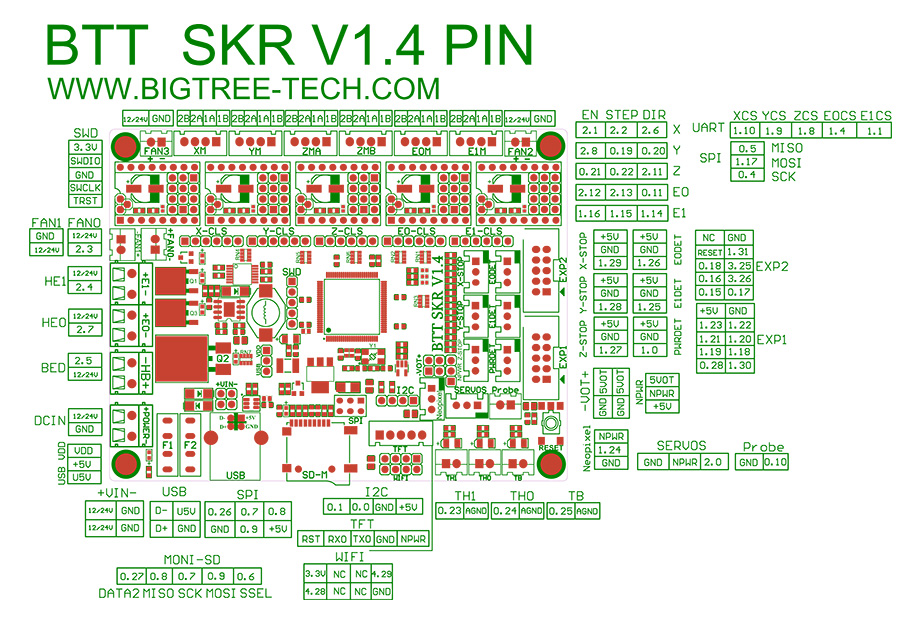

## Color PIN Diagram for SKR V1.4/V1.4Turbo

For reference, here is the Color PIN diagram for the SKR V1.4/V1.4Turbo

######  {#SKRV1.4_TURBO_Colored_PIN_Diagram}

* If you want to open the above diagram, in a new tab of your web browser, and have the ability to zoom and download the diagram in PDF format then [click here](./images/SKRV1.4_TURBO_Colored_PIN_Diagram.pdf){:target="_blank" rel="noopener"}

* If you want to open the above diagram, in a new tab of your web browser, and have the ability to zoom and download the diagram in JPG format then [click here](./images/SKRV1.4_TURBO_Colored_PIN_Diagram.jpg){:target="_blank" rel="noopener"}

## Original SKR V1.4/V1.4Turbo Pinout

For reference, here is the original pinout of the SKR V1.4/V1.4Turbo

* Note: If you see a conflict between the original pinout and any other source, please refer back to the [BigTreeTech SKR V1.4/V1.4Turbo schematic diagram](<./images/BTT SKR V1.4-SCH.pdf>){:target="_blank" rel="noopener"}

######  {#original-SKR-V1.4-pinout}

* If you want to open the above diagram, in a new tab of your web browser, and have the ability to zoom and download the diagram in PDF format then [click here](<./images/BTT SKR V1.4PIN.pdf>){:target="_blank" rel="noopener"}

## The BTT's GitHub Repo for the SKR V1.4/V1.4Turbo board

* BTT's documentation for SKR V1.4/V1.4Turbo board is [located here](https://github.com/bigtreetech/BIGTREETECH-SKR-V1.3/tree/master/BTT%20SKR%20V1.4){:target="_blank" rel="noopener"}