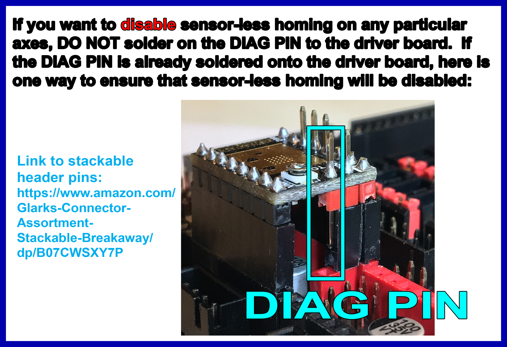

# Preparation of TMC2209 and TMC2226 UART Stepper Motor Drivers

* __IMPORTANT:__  The V2 printer does not use sensorless homing.  **If using the TMC2209 or TMC2226 stepper motor drivers with the SKR V1.4/Turbo, there are three methods to disable sensorless homing.**

1. Cut off the DIAG pin from the TMC2209 or TMC2226.
2. Use stackable header pins to ensure the DIAG pin does not make an electrical connection to the SKR board.
3. Desolder the DIAG pin from the stepper motor driver step stick.

## Disable Sensorless Homing - Method #1 - Cut Off the DIAG pin:

* **Use a small pair of wire cutters and remove the pin marked in PURPLE (DIAG PIN) from the TMC2209 or TMC2226 stepper motor driver step stick**

######  {#tmc2209-pin-removal_uart_triskr-expmot}

## Disable Sensorless Homing - Method #2 - Use Stackable Header pins:

* By not adding the stackable header pin under the DIAG PIN location, the DIAG PIN will not make an electrical connection to the board. The added benefit with stackable header pins is the driver socket will also have more room for air flow to help with dissipation of heat. See the diagram below:

######  {#disable_sensor-less_homing_uart_triskr-expmot}

* Here is the URL from the above diagram.  You can purchase the [Stackable Header PINS from Amazon](https://www.amazon.com/Glarks-Connector-Assortment-Stackable-Breakaway/dp/B07CWSXY7P){:target="_blank" rel="noopener"}.

## Disable Sensorless Homing - Method #3 - Desolder the DIAG pin:

*  **Desolder the pin, marked in purple (DIAG PIN), from the TMC2209 or TMC2226 stepper motor driver step stick** at the location shown [here](#tmc2209-pin-removal_uart_triskr-expmot)

* If you need help with desoldering, please [consult this guide](https://www.instructables.com/The-Ultimate-Guide-to-Desoldering/){:target="_blank" rel="noopener"}

## Further Reading

* [Further information about the TMC2209/TMC2226 DIAG PIN problem](https://github.com/bigtreetech/BIGTREETECH-Stepper-Motor-Driver/blob/master/TMC2209/V1.2/TMC2209%20problems%20solving.pdf){:target="_blank" rel="noopener"}.  The TMC2226 stepper motor driver's DIAG pin is also used for "output only". Therefore, it will have the same issue as the TMC2209.  Please see [page 9 in the TMC2226 datasheet](https://www.trinamic.com/fileadmin/assets/Products/ICs_Documents/TMC2226_Datasheet_V106.pdf#page=9){:target="_blank" rel="noopener"}

## Other Considerations when using TMC2209, or TMC2226 (TMCxxxx drivers with StallGuard)

* __IMPORTANT:__  If you are using a TMC2209 or TMC2226 stepper motor driver for the **extruder motor and you want to use a filament run out sensor**, please do one of the following:

1.  Cut off the DIAG pin for the **stepper motor driver step stick** in the **extruder** driver socket (E0 or E1 on the SKR board); [The location of the DIAG pin](#tmc2209-pin-removal_uart_triskr-expmot) or

2.  Use stackable header pins and ensure the **DIAG pin does not get plugged into the SKR board's** extruder driver socket location (E0 or E1 on the SKR board); [The location of the DIAG pin](#disable_sensor-less_homing_uart_triskr-expmot) or

3. Desolder the DIAG pin from the extruder driver step stick [The location of the DIAG pin](#tmc2209-pin-removal_uart_triskr-expmot);

* **The DIAG PIN must be disconnected from the SKR board on the extruder driver step stick for the filament run out sensor to work properly**, if you are using a TMC2209 or TMC2226.