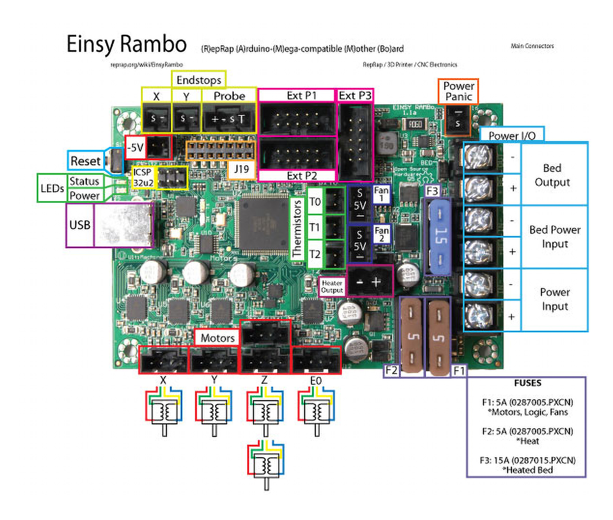

# Voron Switchwire - Einsy Rambo Wiring

## MCU

* Plug in stepper motors for X, Y, Z, and E in positions X, Y, Z, and E0
* Plug Hot End thermistor to thermistor T0 (PF0)
* Plug Hot End heater in to extruder heater HEAT-0 (PE5)
* Plug Hot End Fan in to FAN-1 (PH5)
* Plug Part Cooling Fan in to FAN-2 (PH3)
* Plug Bed Thermistor in to thermistor T2 (PF2)
* Connect Bed Heater to Bed Output (PG5)
* Connect X end stop to X-MIN (PB6)
* _Y Endstop is not used._
* Connect inductive probe to Probe input (PB4), on pins +, -, and 's' on the drawing.  _Pin 1 (T) is unused._
* Wire +V and -V from DC power supply to both Power Input and Bed Power Input.
* Connect USB Cable, but do not connect it yet to your Raspberry Pi

