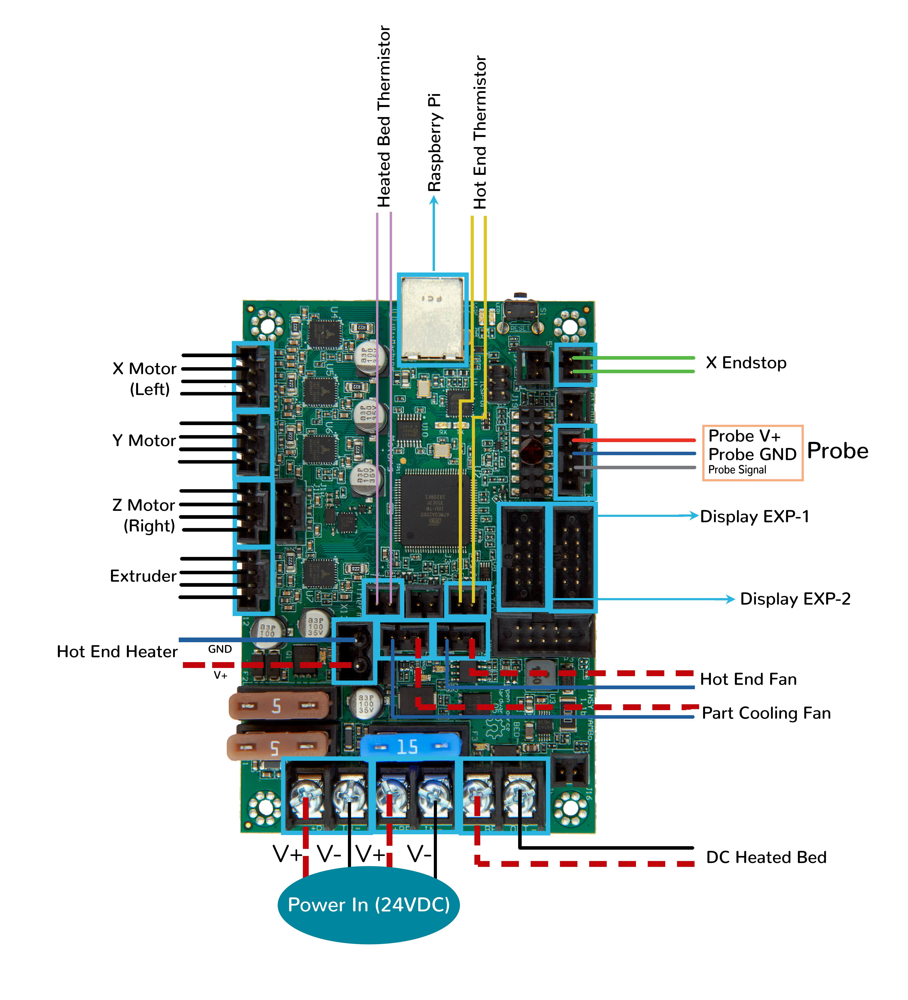
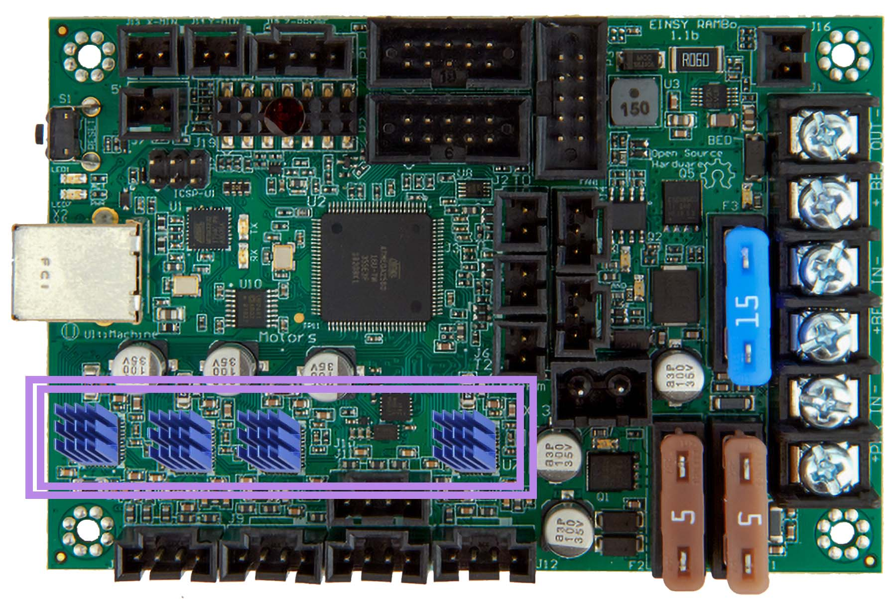

# Voron Switchwire - Einsy Rambo Wiring

## Initial Removal of Jumpers

* The Einsy Rambo will arrive without any jumpers being set.

## Initial Preparation - Set Jumpers

* **All** Jumpers should be **removed** from the Einsy Rambo board.

######  {#EinsyRambo1.1B-baord_sw}

* If you want to open the above picture, in a new tab of your web browser, then [click here](./images/EinsyRambo1.1B-baord.png){:target="_blank" rel="noopener"}

## MCU

* - [ ] Plug in stepper motors for X in positions X (motor connector)
* - [ ] Plug in stepper motors for Y in positions Y (motor connector)
* - [ ] Plug in stepper motors for Z in positions Z (motor connector)
* - [ ] Plug in stepper motors for E in positions E0 (motor connector)
* - [ ] Plug Hot End thermistor to thermistor T0 (PF0)
* - [ ] Plug Hot End heater in to extruder heater HEAT-0 (PE5)
* - [ ] Plug Hot End Fan in to FAN-1 (PH5)
* - [ ] Plug Part Cooling Fan in to FAN-2 (PH3)
* - [ ] Plug Bed Thermistor in to thermistor T2 (PF2)
* - [ ] Connect Bed Heater to Bed Output (PG5)
* - [ ] Connect X end stop to X-MIN (PB6)
* - [ ] _Y Endstop is not used._
* - [ ] Connect inductive probe to Probe (PB4), on pins +, -, and 's' on the drawing.
* - [ ] Note: the inductive probe,&nbsp; _Pin 1 (T) is unused._
* - [ ] Wire +V and -V from DC power supply to both Power Input and Bed Power Input.
* - [ ] Connect USB Cable,&nbsp; **but do not connect it yet to your Raspberry Pi**

### MCU Diagram

######  {#SW_EinsyRambo1.1B_Wiring_Diagram}

* If you want to open the above diagram, in a new tab of your web browser, and have the ability to zoom and download the diagram in JPG format then [click here](./images/SW_EinsyRambo1.1B_Wiring_Diagram_150.jpg){:target="_blank" rel="noopener"}

## Please Ensure the Heat Sinks are Installed Before Use

Note on the Orientation of the Stepper Motor Driver's Heat Sinks
: Place the heat sinks for the stepper motor drivers so that the orientation of the fins on the heat sinks are parallel to the air flow from the controller fans once the MCU board is installed on the DIN rail. Ensure the heat sinks are **not touching** the solder joints located on the top of the step stick. Please note, that your placement of heat sinks may be different from the orientation shown below.

######  {#EinsyRambo1.1b_PREP-WiringDiagram-heatsinks}

### The Klipper Configuration file for Einsy Rambo Board

The Klipper Configuration file from VoronDesign/Voron-Switchwire GitHub Repo for Einsy Rambo is [located here;](https://raw.githubusercontent.com/VoronDesign/Voron-Switchwire/master/Firmware/einsy_config.cfg){:target="_blank" rel="noopener"}

## Einsy Rambo Pinout

For reference, here is the pinout of the Einsy Rambo

* Note: If you see a conflict between the original pinout and any other source, please refer back to [The Einsy Rambo schematic diagram](<./images/Schematic Prints_Einsy Rambo_1.1a.PDF>){:target="_blank" rel="noopener"}

######  {#EinsyRambo1.1a-connections}

* If you want to open the above diagram, in a new tab of your web browser, and have the ability to zoom and download the diagram in PDF format then [click here](./images/EinsyRambo11_Pinout.pdf){:target="_blank" rel="noopener"}

## RepRap Wiki page for Einsy Rambo

* RepRap's documentation for the Einsy Rambo board is [located here](https://reprap.org/wiki/EinsyRambo){:target="_blank" rel="noopener"}

## After I have Wired up the MCU Board, What Comes Next?

1.  Once the MCU board is wired up and wire management has been performed, the next step is to install Mainsail/Fluidd or Octoprint, please see [The Build ═► Software Installation](../../build/software/index#software-installation){:target="_blank" rel="noopener"}

2.  Once Mainsail/Fluidd or Octoprint has been installed, the next step is to **compile and install** the Klipper Firmware. The firmware should be compiled for the **AVR atmega2560**, for Einsy Rambo boards sold by Ultimaker.

    * For Einsy Rambo boards sold Prusa, please see [the following article](https://nikolak.com/klipper-on-prusa-mk3s/){:target="_blank" rel="noopener"}

3.  Once the MCU board has the Klipper Firmware Installed, the next step is to **create/edit** the Klipper Config file (skr-pico-v1.0.cfg rename it to printer.cfg) to ensure your Voron build matches your Klipper Config file, please see [the file located here; Select "SW Einsy Rambo"](../../build/software/configuration#software-configuration){:target="_blank" rel="noopener"};

    *   Please use the PIN Diagram, [displayed here](#EinsyRambo1.1a-connections), as a source of information.

    * Please consult [The Build ═► Software Configuration](../../build/software/configuration#software-configuration){:target="_blank" rel="noopener"} on how to edit the Klipper Config file.

4.  After **creating/editing** the Klipper Config file (einsy_config.cfg renamed to printer.cfg), the next step is to check all the motors and the mechanics of the Voron printer, please see [The Build ═► Initial Startup Checks](../../build/startup/index#initial-startup-checks){:target="_blank" rel="noopener"}

