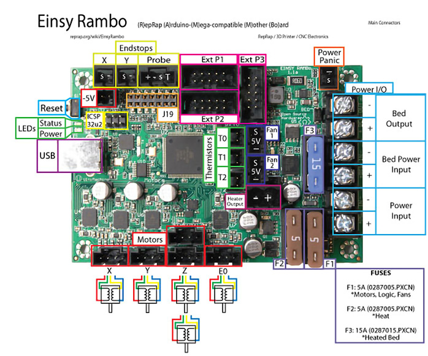

<!--
To be able to supply the Voron user and Voron Helper staff with an easy access LINK for all diagrams, I tested
a couple of different methods.  I found one method that allowed the user to left-click on the diagram
and it would open the diagram up in the web browser. I choose to not use this method because ther would be
a lot of Voron users who probably would activate this by accident and then not beable to get themselves back.

The method I choose was one that will display the LINK symbol to the left of the diagram and without adding
any title text. I ended up using header 6 with a blank title and then I use a Kramdown Syntax for specifying
a Header ID.

If I use the GFM Parser for creating a header anchor with an empty title the static web page produced
DOES NOT show the LINK symbol to the left of the diagram. The Link is setup but only I can use it in the 
web page code. An outside Voron Helper could not access the Link Address.  The GFM Parser syntax for "header anchors" forces you to use a text in the title.  If you use a title text then the LINK symbol will be generated.

But with further reading I found that Kramdown Parser does allow a "title text of empty" which produces the LINK symbol to the left of the diagram and generates the LINK address that Voron Users and Voron Helpers can access by right-clicking on the LINK symbol. The documentation for this can be found at https://kramdown.gettalong.org/syntax.html#headers ; look for "Specifying a Header ID"
-->

# Voron Switchwire - Einsy Rambo Wiring

## Initial Removal of Jumpers

* The Einsy Rambo will arrive without any jumpers being set.

## Initial Preparation - Set Jumpers

* **All** Jumpers should be removed from the Einsy Rambo board.

## MCU



    For Admin of Voron DOCs site:

    In this page the Boolean variable "UseColorText_forEinsyRambo_1" if set to 1 then the static web page will use the colorized text for the MCU descirption.

    If you set "UseColorText_forEinsyRambo_1" to anything other than 1, like 0 then the static web page will use regular text for the MCU descirption







* Plug in stepper motors for X, Y, Z, and E in positions X, Y, Z, and E0
* Plug Hot End thermistor to thermistor T0 (PF0)
* Plug Hot End heater in to extruder heater "HEAT-0/Heater output" (PE5)
* Plug Hot End Fan in to FAN-1 (PH5)
* Plug Part Cooling Fan in to FAN-2 (PH3)
* Plug Bed Thermistor in to thermistor T2 (PF2)
* Connect Bed Heater to Bed Output (PG5)
* Connect X end stop to X-MIN (PB6)
* **_Y Endstop is not used._**
* Connect inductive probe to Probe input (PB4), on pins +, -, and 's' on the drawing.  **_Pin 1 (T) is unused._**
* Wire +V and -V from DC power supply to both Power Input and Bed Power Input.
* Connect USB Cable, but do not connect it yet to your Raspberry Pi





* Plug in stepper motors for X, Y, Z, and E in positions X, Y, Z, and E0
* Plug Hot End thermistor to thermistor T0 (PF0)
* Plug Hot End heater in to extruder heater HEAT-0 (PE5)
* Plug Hot End Fan in to FAN-1 (PH5)
* Plug Part Cooling Fan in to FAN-2 (PH3)
* Plug Bed Thermistor in to thermistor T2 (PF2)
* Connect Bed Heater to Bed Output (PG5)
* Connect X end stop to X-MIN (PB6)
* _Y Endstop is not used._
* Connect inductive probe to Probe input (PB4), on pins +, -, and 's' on the drawing.  _Pin 1 (T) is unused._
* Wire +V and -V from DC power supply to both Power Input and Bed Power Input.
* Connect USB Cable, but do not connect it yet to your Raspberry Pi





{{ Color_MCU_Text_forEinsyRambo_1 }}



{{ Plain_MCU_Text_forEinsyRambo_1 }}



### MCU Diagram

######  {#SW_EinsyRambo1.1B_Wiring_Diagram}

* If you want to open the above diagram, in a new tab of your web browser, and have the ability to zoom and download the diagram in JPG format then [click here](./images/SW_EinsyRambo1.1B_Wiring_Diagram_150.jpg){:target="_blank" rel="noopener"}

## Please Ensure the Heat Sinks are Installed Before Use
   

######  {#EinsyRambo1.1b_PREP-WiringDiagram-heatsinks}

## mini 12864 Display

* See [the mini12864 guide](./mini12864_klipper_guide.md)

### The Klipper Configuration file for Einsy Rambo Board

The Klipper Configuration file from VoronDesign/Voron-Switchwire GitHub Repo for Einsy Rambo is [located here](https://github.com/VoronDesign/Voron-Switchwire/blob/master/Firmware/einsy_config.cfg){:target="_blank" rel="noopener"}

## Einsy Rambo Pinout

For reference, here is the pinout of the Einsy Rambo

* Note: If you see a conflict between the original pinout and any other source, please refer back to the [The Einsy Rambo schematic diagram](<./images/Schematic Prints_Einsy Rambo_1.1a.PDF>){:target="_blank" rel="noopener"}

######  {#EinsyRambo1.1a-connections}

* If you want to open the above diagram, in a new tab of your web browser, and have the ability to zoom and download the diagram in PDF format then [click here](<./images/EinsyRambo11_Pinout.pdf>){:target="_blank" rel="noopener"}

### RepRap Wiki page for Einsy Rambo

* RepRap's documentation for the Einsy Rambo board is [located here](https://reprap.org/wiki/EinsyRambo){:target="_blank" rel="noopener"}

## After I have Wired up the MCU Board, What Comes Next?   
   

   Once the MCU board is wired up and wire management has been performed, the next step is to compile and install the Klipper Firmware, please see [The Build ═► Software Installation](../../build/software/index.md#software-installation)

   Once the MCU board has the Klipper Firmware Installed, the next step is to edit the Klipper Config file (einsy_config.cfg) to ensure your Voron build matches your Klipper Config file, please see [The Build ═► Software Configuration](../../build/software/configuration.md#software-configuration).  Please use the Color PIN Diagrams, [displayed above](#einsy-rambo-pinout), as a source of information. 

   After editing the Klipper Config file (einsy_config.cfg), the next step is to check all the motors and the mechanics of the Voron printer, please see [The Build ═► Initial Startup Checks](../../build/startup/index.md#initial-startup-checks)

