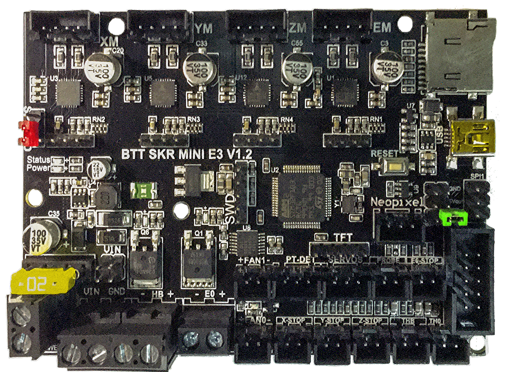
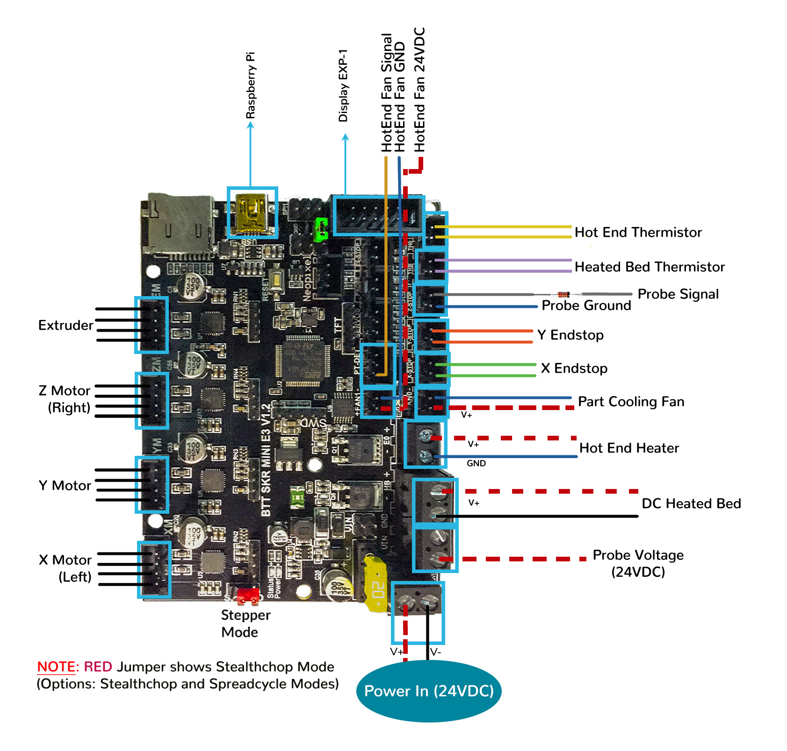
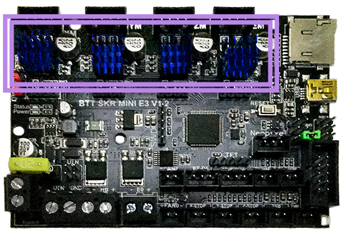

# Voron Switchwire - SKR mini E3 V1.2 Wiring

## Initial Removal of Jumpers

* There are only **two jumpers** on the SKR mini E3 V1.2 board.  The **RED SPREAD jumper** sets the board for Stealtchop or Spreadcycle mode, but this can also be set in the firmware.  The other jumper is called "NeoPWR" jumper.  See the next section about this jumper.

## Initial Preparation

* The **GREEN NeoPWR jumper** setting will decide the source of the SKR's 5V rail. The board's 5V rail can be sourced from the board itself or from an external DCDC bridge module.  One can purchase an external DCDC bridge module (sold separately) to power 5V NeoPixel LEDs.  This bridge module is called the "DCDC Mode V1.0" board. Since the Voron printer does not require the extra DCDC bridge module, **set the NeoPWR jumper** so that the board's 5V rail will be powered by the MCU (as shown by the **GREEN** jumper in the diagram below).

__IMPORTANT:__ **Double check the** __GREEN__ **jumper is set appropriately BEFORE the power supply is connected.**

######  {#PREP_SKR_mini_E3_V1.2}

* If you want to open the above picture, in a new tab of your web browser, then [click here](./images/SKR_mini_E3_V1.2_for_Prep_Diagram_150.png){:target="_blank" rel="noopener"}

## MCU

* - [ ] Plug in stepper motors for X in positions Xm (motor connector)
* - [ ] Plug in stepper motors for Y in positions Ym (motor connector)
* - [ ] Plug in stepper motors for Z in positions Zm (motor connector)
* - [ ] Plug in stepper motors for E in positions Em (motor connector)
* - [ ] Plug Hot End thermistor to thermistor TH0 (PA0)
* - [ ] Plug Hot End heater in to E0 (PC8)
* - [ ] Plug Hot End Fan Signal into PT-DET's Signal PIN (PC12)
* - [ ] Plug Hot End Fan V+ and GND into FAN1
* - [ ] Plug Part Cooling Fan in to FAN0 (PA8)
* - [ ] Plug Bed Thermistor in to THB (PC3)
* - [ ] Connect Bed Heater to HB connector (PC9)
* - [ ] Connect X end stop to X-STOP connector (PC0)
* - [ ] Connect Y end stop to Y-STOP connector (PC1)
* - [ ] Plug Probe GND and Signal (with&nbsp;**BAT85 diode**) in to Z-STOP (PC2)
* - [ ] Connect Probe +V (Probe Voltage) to VIN in terminal on the "Power DCOUT" connector next to HB
* - [ ] Wire 24V and -V from DC power supply to VIN and GND terminals in corner on the "Power DCIN" connector
* if using USB to communicate with Pi:
    1. - [ ] Connect USB Cable to your SKR mini E3, but do not connect it yet to your Raspberry Pi
* if using UART (3-wire communication) with Pi:
    1. - [ ] [complete the steps for setting up UART Serial communications with the Raspberry Pi](./mini_e3_v12_RaspberryPi#raspberry-pi){:target="_blank" rel="noopener"}
    2. - [ ] Connect UART cable to your SKR mini E3, but do not connect it yet to your Raspberry Pi

BAT85
: a Schottky barrier diode. BAT85 is needed to protect the SKR board (MCU board) from being fried.  An Inductive Probe device (Omron TL-Q5MC2; Omron TL-Q5MC2-Z or Panasonic GX-HL15BI-P) communicates at a much higher voltage level (10V - 30V) then the MCU board.  The BAT85 is used to protect the input signal PIN of the MCU board; without the BAT85 the MCU board will be damaged.  If two BAT85s are used in series, the circuit will protect the MCU board and still allow the inductive probe to function properly. [For more information, click here](./index#bat85-diode){:target="_blank" rel="noopener"}

### MCU Diagram

######  {#SW_Wiring_Diagram_SKR_mini_E3_V1.2}

* If you want to open the above diagram, in a new tab of your web browser, and have the ability to zoom and download the diagram in JPG format then [click here](./images/SW_Wiring_Diagram_SKR_mini_E3_V1.2_150.jpg){:target="_blank" rel="noopener"}

## Please Ensure the Heat Sinks are Installed Before Use

Note on the Orientation of the Stepper Motor Driver's Heat Sinks
: Place the heat sinks for the stepper motor drivers so that the orientation of the fins on the heat sinks are parallel to the air flow from the controller fans once the MCU board is installed on the DIN rail. Ensure the heat sinks are **not touching** the solder joints on the MCU board. Please note, that your placement of heat sinks may be different from the orientation shown below.

######  {#SKR_E3_Mini_V1.2_heatsinks}

## Raspberry Pi

### Power
* The BTT SKR mini E3 V1.2 board is **NOT capable of providing 5V power** to run your Raspberry Pi.

## Setting up UART Serial Communications with the Raspberry Pi

* see [the SKR mini E3 V1.2 Raspberry Pi Section](./mini_e3_v12_RaspberryPi#raspberry-pi){:target="_blank" rel="noopener"}

<!--### The Klipper Configuration file for SKR Mini E3 V1.2 board

The Klipper Configuration file from VoronDesign/Voron-Switchwire GitHub Repo for SKR Mini E3 V1.2 board is [located here](https://github.com/VoronDesign/Voron-Switchwire/blob/master/Firmware/xxxxxxxxxxxxxxxsw_skr_mini_e3_v12_config.cfg)
-->

## URL Resources Links for the SKR mini E3 V1.2 (PIN Diagrams and Repo)

* see [The SKR mini E3 V1.2 Resource Section](./mini_e3_v12_Resources#color-pin-diagram-for-skr-mini-e3-v12){:target="_blank" rel="noopener"}

## After I have Wired up the MCU Board, What Comes Next?

1. Once the MCU board is wired up and wire management has been performed, the next step is to install Mainsail/Fluidd or Octoprint, please see [The Build ═► Software Installation](../../build/software/index#software-installation){:target="_blank" rel="noopener"}

2. Once Mainsail/Fluidd or Octoprint has been installed, the next step is to **compile and install** the Klipper Firmware, please see [The Build ═► Software Installation -> Firmware Flashing(Header) -> SKR mini e3 V1.2](../../build/software/miniE3_v12_klipper#skr-mini-e3-v12-klipper-firmware){:target="_blank" rel="noopener"}

3. Once the MCU board has the Klipper Firmware Installed, the next step is to **create** the Klipper Config file (create printer.cfg);

    * Please use the Color PIN Diagrams, [displayed here](./mini_e3_v12_Resources#color-pin-diagram-for-skr-mini-e3-v12){:target="_blank" rel="noopener"}, as a source of information;

    * Please consult [The Build ═► Software Configuration](../../build/software/configuration#software-configuration){:target="_blank" rel="noopener"} on how to edit the Klipper Config file.

4. After **creating** the Klipper Config file (printer.cfg), the next step is to check all the Motors and the mechanics of the Voron printer, please see [The Build ═► Initial Startup Checks](../../build/startup/index#initial-startup-checks){:target="_blank" rel="noopener"}

