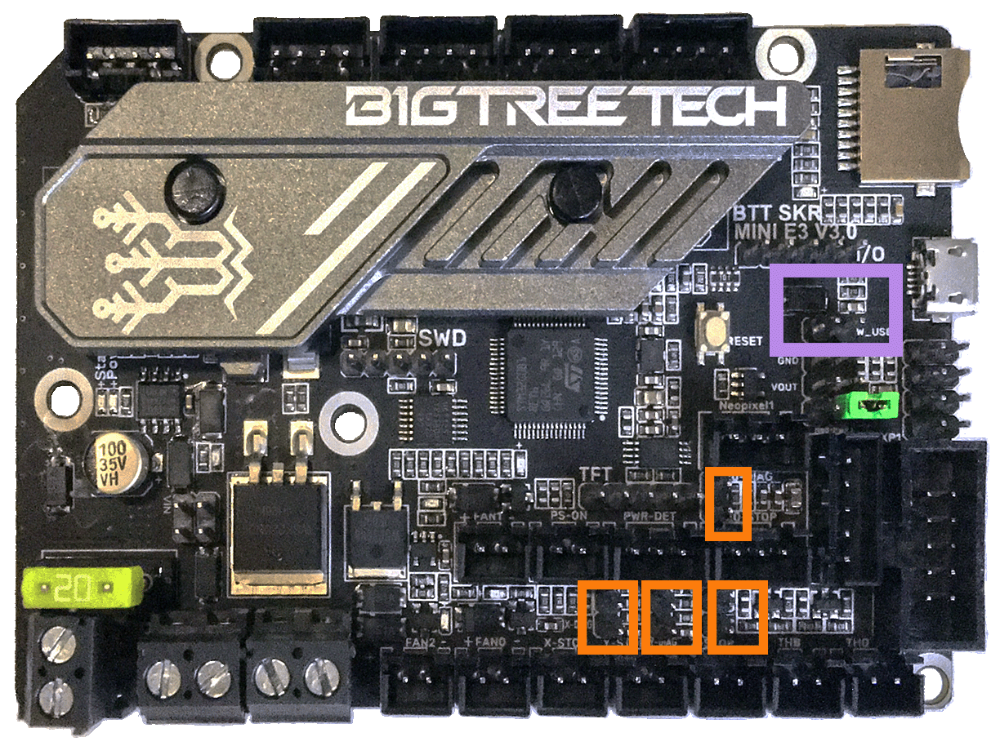

# Voron Switchwire - SKR mini E3 V3.0 Wiring

## Initial Removal of Jumpers

* There is only **one jumper** on the SKR mini E3 V3.0 board.  This jumper will be set in the next step.

## Initial Preparation - Set Jumper

* Set the on-board jumper, located at the position as shown by the **GREEN** jumper in the diagram below:

######  {#PREP_SKR_mini_E3_V3.0}

### USB Voltage Selection Header

* Ensure the **removal of the SW_USB 5V power supply jumper ("SW_USB header, shown in the RED box")** which avoids the interaction between the USB 5V of Raspberry Pi and the DC-DC 5V of the motherboard.

######  {#SSKR_MINI_E3_V3.0_voltageselect}

## MCU

* Plug in stepper motors for X, Y, Z, and E in positions Xm, Ym, ZAm, and Em
* Plug Hot End thermistor to thermistor TH0 (PA0)
* Plug Hot End heater in to E0 (PC8)
* Plug Hot End Fan in to FAN1 (PC7)
* Plug Part Cooling Fan in to FAN0 (PC6)
* Plug Bed Thermistor in to THB (PC4)
* Connect Bed Heater to HB connector (PC9)
* Connect X end stop to X-STOP connector (PC0)
* Connect Y end stop to Y-STOP connector (PC1)
* Plug Probe GND and Signal (with BAT85 diode) in to Z-STOP (PC2)
* Connect Probe +V (Probe Voltage) to VIN in terminal on "DCIN (Power)" connector
* Wire 24V and -V from DC power supply to VIN and GND terminals of the "DCIN (Power)" connector
* Connect USB Cable to your SKR mini E3, **but do not connect it yet to your Raspberry Pi**

### MCU Diagram

######  {#SW_Wiring_Diagram_SKR_mini_E3_V3.0}

* If you want to open the above diagram, in a new tab of your web browser, and have the ability to zoom and download the diagram in JPG format then [click here](./images/SW_Wiring_Diagram_SKR_mini_E3_V3.0_150.jpg){:target="_blank" rel="noopener"}

## Raspberry Pi

### Power
* The BTT SKR mini E3 V3.0 board is **NOT capable of providing 5V power** to run your Raspberry Pi.

### Setting up UART Communications with the Raspberry Pi

* see [the SKR mini E3 V3.0 Raspberry Pi Section](./skr_miniE3v30_RaspberryPi#raspberry-pi){:target="_blank" rel="noopener"}

<!--### The Klipper Configuration file for SKR Mini E3 V3.0

The Klipper Configuration file from VoronDesign/Voron-Switchwire GitHub Repo for SKR Mini E3 V3.0 board is [located here](https://github.com/VoronDesign/Voron-Switchwire/blob/master/Firmware/xxxxxxxskr_mini_e3_v3_config.cfg)
-->

## Color PIN Diagram for SKR Mini E3 V3.0
For reference, here is the Color PIN diagram for the SKR mini E3 V3.0

######  {#skr_mini_E3_V3.0_Color_PIN_diagram}

* If you want to open the above diagram, in a new tab of your web browser, and have the ability to zoom and download the diagram in PDF format then [click here](./images/SKR_mini_E3_V3.0_Color_PIN_diagram_300.pdf){:target="_blank" rel="noopener"}

* If you want to open the above diagram, in a new tab of your web browser, and have the ability to zoom and download the diagram in JPG format then [click here](./images/SKR_mini_E3_V3.0_Color_PIN_diagram_300.jpg){:target="_blank" rel="noopener"}

## Original SKR Mini E3 V3.0 Pinout

For reference, here is the original pinout of the SKR mini E3 V3.0

* Note: If you see a conflict between the original pinout and any other source, please refer back to the [BigTreeTech SKR mini E3 V3.0 schematic diagram](<./images/BTT E3 SKR MINI V3.0_SCH.pdf>){:target="_blank" rel="noopener"}

######  {#miniE3-v30-pinout}

* If you want to open the above diagram, in a new tab of your web browser, and have the ability to zoom and download the diagram in PDF format then [click here](<./images/BTT E3 SKR MINI V3.0_PIN.pdf>){:target="_blank" rel="noopener"}

### The BTT's GitHub Repo for the BTT SKR mini E3 V3.0 Board

*  BTT's documentation for BTT SKR mini E3 V3.0 board is [located here](https://github.com/bigtreetech/BIGTREETECH-SKR-mini-E3/tree/master/hardware/BTT%20SKR%20MINI%20E3%20V3.0){:target="_blank" rel="noopener"}

## After I have Wired up the MCU Board, What Comes Next?

1. Once the MCU board is wired up and wire management has been performed, the next step is to install Mainsail/Fluidd or Octoprint, please see [The Build ═► Software Installation](../../build/software/index#software-installation){:target="_blank" rel="noopener"}

2. Once Mainsail/Fluidd or Octoprint has been installed, the next step is to **compile and install** the Klipper Firmware, please use the [Color Pin Diagram displayed here, look for "Klipper Building Options"](./images/SKR_mini_E3_V3.0_Color_PIN_diagram_300.pdf){:target="_blank" rel="noopener"}; an alternative source of information on [how to build and install the Klipper firmware for the SKR mini E3 V3.0 is located here](https://github.com/bigtreetech/BIGTREETECH-SKR-mini-E3/tree/master/firmware/V3.0/Klipper#how-to-use-klipper-on-skr-mini-e3-v30){:target="_blank" rel="noopener"}

3. Once the MCU board has the Klipper Firmware Installed, the next step is to **create** the Klipper Config file (create a printer.cfg file);

    * Please use the Color PIN Diagrams, [displayed here](#skr_mini_E3_V3.0_Color_PIN_diagram), as a source of information;

    * Please consult [The Build ═► Software Configuration](../../build/software/configuration#software-configuration){:target="_blank" rel="noopener"} on how to edit the Klipper Config file.

4. After **creating** the Klipper Config file (printer.cfg), the next step is to check all the Motors and the mechanics of the Voron printer, please see [The Build ═► Initial Startup Checks](../../build/startup/index#initial-startup-checks){:target="_blank" rel="noopener"}