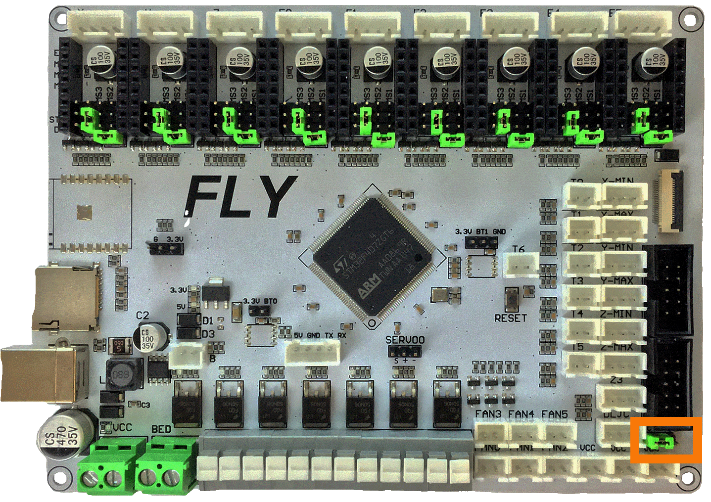

# Trident - Mellow FLYF407ZG (TMC2208, TMC2209, TMC2225, TMC2226) Wiring

## Initial Removal of Female JST-XH connectors

* Remove **all the JST-XH female connectors from their corresponding sockets.**  When my board arrived all the white female JST-XH connectors were plugged into the male JST-XH sockets.  The diagram below, shows the locations of the pre-installed female JST-XH connectors (as shown by the YELLOW jumpers).

######  {#FLYF407ZG_PREP-Removal_UART_tri}

## Initial Preparation - Set Jumpers

* Set the on-board jumpers, located at the positions as shown by the **GREEN** jumpers in the diagram below:

######  {#FLYF407ZG_UART_Mode_for_Prep_tri}

* If you want to open the above picture, in a new tab of your web browser, then [click here](./images/FLYF407ZG_UART_PREP.png){:target="_blank" rel="noopener"}

### End Stop Voltage Selection Header

* In the diagram below, the **ORANGE box** indicates the header with **a GREEN** jumper which is set for 5VDC.

    * __IMPORTANT:__ **When the FLYboard is shipped the end stop voltage selection header will be empty (i.e., a jumper will not be found here).  One MUST place a jumper on this header, so that the voltage pin in the end stop connectors will carry a charge (X-, X+, Y-, Y+, Z-, Z+, Z3, and DLJC).  The choice is 5VDC or Vin.  We recommend you set this header to 5VDC.**

* __IMPORTANT:__ **Double check all the** __GREEN__ **jumpers are set appropriately, especially the jumper called out by the _COLORED BOX_, BEFORE the power supply is connected.**

###  End Stop Voltage Selection Diagram

######  {#FLYF407ZG_UART_VoltageSelect_tri}

* If you want to open the above picture, in a new tab of your web browser, then [click here](./images/FLYF407ZG_UART_voltageSelect.png){:target="_blank" rel="noopener"}

## Stepper Motor Drivers
* - [ ] Inspect the stepper motor drivers for left over rosin, and clean with IPA, if needed
* - [ ] Before installing heat sinks on to the stepper motor drivers,&nbsp;[please read this](#please-ensure-the-heat-sinks-are-installed-before-use)
* - [ ] Install heat sinks on all stepper motor drivers

## MCU Wiring

* - [ ] Connect 24V and GND (V+ and V-) from the PSU to Power In
* - [ ] Connect stepper driver for the B Motor (gantry left) into position X (or DRIVER:X)
* - [ ] Plug in stepper motor for the B Motor (gantry left) into position X (or MOTOR:X)
* - [ ] Connect stepper driver for the A Motor (gantry right) into position Y (or DRIVER:Y)
* - [ ] Plug in stepper motor for the A Motor (gantry right) into position Y(or MOTOR:Y)
* - [ ] Connect stepper driver for the extruder motor into position E0 (or DRIVER:E0)
* - [ ] Plug in stepper motor for the extruder motor into position E0 (or MOTOR:E0)
* - [ ] Connect stepper driver for the Z into positions E2 (or DRIVER:E2)
* - [ ] Plug in stepper motor for the Z into positions E2 (or MOTOR:E2)
* - [ ] Connect stepper driver for the Z1 into positions E3 (or DRIVER:E3)
* - [ ] Plug in stepper motor for the Z1 into positions E3 (or MOTOR:E3)
* - [ ] Connect stepper driver for the Z2 into positions E4 (or DRIVER:E4)
* - [ ] Plug in stepper motor for the Z2 into positions E4 (or MOTOR:E4)
* - [ ] Plug Hot End thermistor to thermistor T0 (PA0)
* - [ ] Plug Hot End heater in to HEATER_0/HE0 (PF7)
* - [ ] Plug Bed Heater thermistor in to thermistor T1 (PC1)
* - [ ] Plug SSR Control for Heated Bed in to BED (PE2)
* - [ ] Plug Probe PWR and GND into VCC/DCout
* - [ ] Plug Probe Signal (with&nbsp;**BAT85 diode**) in to SERVO0, pin 1 {located toward USB} (PE11)
* - [ ] Plug Hot End Fan in to FAN0 (PF8)
* - [ ] Plug Part Cooling Fan in to FAN1 (PF9)
* - [ ] Connect X end stop to X-MAX connector (PC2)
* - [ ] Connect Y end stop to Y-MAX connector (PF1)
* - [ ] Plug in Exhaust Fan in to FAN2 (PA2)
* - [ ] Plug in Controller Fan 1 in to FAN3 (PA1)
* - [ ] Plug in Controller Fan 2 in to FAN4 (PE13)
* - [ ] Plug Z end stop Switch into Z-MAX (PC15)
* - [ ] Plug display wires in to EXP1 and EXP2
* if using USB to communicate with Pi:
    1. - [ ] Connect USB Cable to FLYF407ZG board, but do not connect it yet to your Raspberry Pi
* if using UART (3-wire communication) with Pi:
    1. - [ ] [complete the steps for setting up UART Serial communications with the Raspberry Pi](./flyf407zg_RaspberryPi#raspberry-pi){:target="_blank" rel="noopener"}
    2. - [ ] Connect UART cable to FLYF407ZG board, but do not connect it yet to your Raspberry Pi

BAT85
: a Schottky barrier diode. BAT85 is needed to protect the FLYF407ZG board (MCU board) from being fried.  An Inductive Probe device (Omron TL-Q5MC2; Omron TL-Q5MC2-Z or Panasonic GX-HL15BI-P) communicates at a much higher voltage level (10V - 30V) then the MCU board.  The BAT85 is used to protect the input signal PIN of the MCU board; without the BAT85 the MCU board will be damaged.  If two BAT85s are used in series, the circuit will protect the MCU board and still allow the inductive probe to function properly. [For more information, click here](./index#bat85-diode){:target="_blank" rel="noopener"}

## MCU Wiring Diagram

######  {#Trident_Wiring_Diagram_FLYF407ZG_UART_tri}

* If you want to open the above diagram, in a new tab of your web browser, and have the ability to zoom and download the diagram in JPG format then [click here](./images/Trident_WiringDiag_FLYF407ZG_UART.jpg){:target="_blank" rel="noopener"}

## Please Ensure the Heat Sinks are Installed Before Use

### MCU with Heat Sinks Installed

Note on the Orientation of the Stepper Motor Driver's Heat Sinks
: Place the heat sinks for the stepper motor drivers so that the orientation of the fins on the heat sinks are parallel to the air flow from the controller fans once the MCU board is installed on the DIN rail. Ensure the heat sinks are **not touching** the solder joints located on the top of the step stick. Please note, that your placement of heat sinks may be different from the orientation shown below.

######  {#FLYF407ZG_UART_Heatsinks_tri}

## Raspberry Pi

### Power
* The Mellow FLYF407ZG is **NOT capable of providing 5V power** to run your Raspberry Pi.

## Setting up UART Serial Communications with the Raspberry Pi

* Please see [the Mellow FLYF407ZG Raspberry Pi Section](./flyf407zg_RaspberryPi#raspberry-pi){:target="_blank" rel="noopener"}

## SSR Wiring

* Wire colors will vary depending on your locale.

######  {#FLYF407ZG-ssr-UART-wiring_tri}

* If you want to open the above diagram, in a new tab of your web browser, and have the ability to zoom and download the diagram in PNG format then [click here](./images/FLYF407ZG-ssr-UART-wiring.png){:target="_blank" rel="noopener"}

## The Klipper Configuration file by Antage for Mellow FLYF407ZG Board

* The Klipper Configuration file for Mellow FLYF407ZG board is [located here](https://gist.githubusercontent.com/antage/1976d9df8e8a1126ebbe6f3935145394/raw/6bc4c53194be75a9889fba754ffa61fbb5c7cb89/printer.ini){:target="_blank" rel="noopener"};

## URL Resources Links for the Mellow FLYF407ZG (PIN Diagrams and Repo)

* see [The Mellow FLYF407ZG Resource Section](./flyf407zg_Resources#color-pin-diagram-for-fly-flyf407zg){:target="_blank" rel="noopener"}

## Additional Information Concerning the Mellow FLYF407ZG board

For reference, here is additional information about the Mellow FLYF407ZG board:

1.  If you use a separate (independent power supply), you can replace the USB cable with a direct wire connection to the Raspberry Pi and use UART communications between the FLYF407ZG board and the Raspberry Pi.  Please see [the Mellow FLYF407ZG Raspberry Pi Section](./flyf407zg_RaspberryPi#raspberry-pi){:target="_blank" rel="noopener"}

2. Pinout the ESP-12S which can be used with the FLYF407ZG pre-soldered WIFI socket or via the EXP1 and EXP2 connectors. Please see [the Additional Information Section](./flyf407zg_additional_resources#pin-out-of-esp-12s-wifi-chip){:target="_blank" rel="noopener"}

3. Pinout the EEPROM 24CO2 Chip which can be used with the FLYF407ZG pre-soldered EEPROM socket. Please see [the Additional Information Section](./flyf407zg_additional_resources#pin-out-of-the-eeprom-chip){:target="_blank" rel="noopener"}

4. Pinout the MAX6675 Chip which can be used with the FLYF407ZG pre-soldered MAX6675 socket. Also, additional information on K-Type Thermocouples that can be used at T6 connector once a MAX6675 chip is soldered in place.   Please see [the Additional Information Section](./flyf407zg_additional_resources#pin-out-of-the-max6675-chip){:target="_blank" rel="noopener"}

5. Important information about possible issues with the Mellow FLYF407ZG board.  Please see [the Additional Information Section](./flyf407zg_additional_resources#information-on-issues-with-the-mellow-flyf407zg-board){:target="_blank" rel="noopener"}

## Advanced Setup - Resource Link for SPI setup (TMC2100, TMC2130, TMC5160, TMC5161, TMC5160HV, TMC5160_PRO)

* see [The Mellow FLYF407ZG SPI Setup Section](../../community/electronics/GadgetAngel/tri_flyf407zg_wiring#trident---mellow-flyf407zg-wiring-for-both-spi-and-uart-modes){:target="_blank" rel="noopener"}

## After I have Wired up the MCU Board, What Comes Next?

1. Once the MCU board is wired up and wire management has been performed, the next step is to install Mainsail/Fluidd or Octoprint, please see [The Build ═► Software Installation](../../build/software/index#software-installation){:target="_blank" rel="noopener"}

2. Once Mainsail/Fluidd or Octoprint has been installed, the next step is to **compile and install** the Klipper Firmware, please see [The Build ═► Software Installation -> Firmware Flashing(Header) -> FLY FLYF407ZG](../../build/software/flyf407zg_klipper#fly-flyf407zg-klipper-firmware){:target="_blank" rel="noopener"}

3. Once the MCU board has the Klipper Firmware Installed, the next step is to **create/edit** the Klipper Config file by Antage (printer.ini rename it to printer.cfg) to ensure your Voron build matches Antage's Klipper Config file, please see [the file located here](https://gist.githubusercontent.com/antage/1976d9df8e8a1126ebbe6f3935145394/raw/6bc4c53194be75a9889fba754ffa61fbb5c7cb89/printer.ini){:target="_blank" rel="noopener"};

    * Please use the Color PIN Diagrams, [displayed here](./flyf407zg_Resources#color-pin-diagram-for-mellow-flyf407zg){:target="_blank" rel="noopener"}, as a source of information;

    * Please consult [The Build ═► Software Configuration](../../build/software/configuration#software-configuration){:target="_blank" rel="noopener"} on how to edit the Klipper Config file.

4. After **creating/editing** the Klipper Config file (printer.ini renamed to printer.cfg), the next step is to check all the Motors and the mechanics of the Voron printer, please see [The Build ═► Initial Startup Checks](../../build/startup/index#initial-startup-checks){:target="_blank" rel="noopener"}

