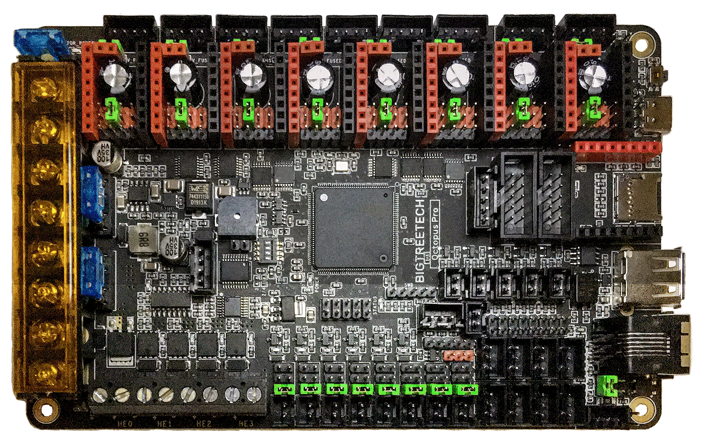
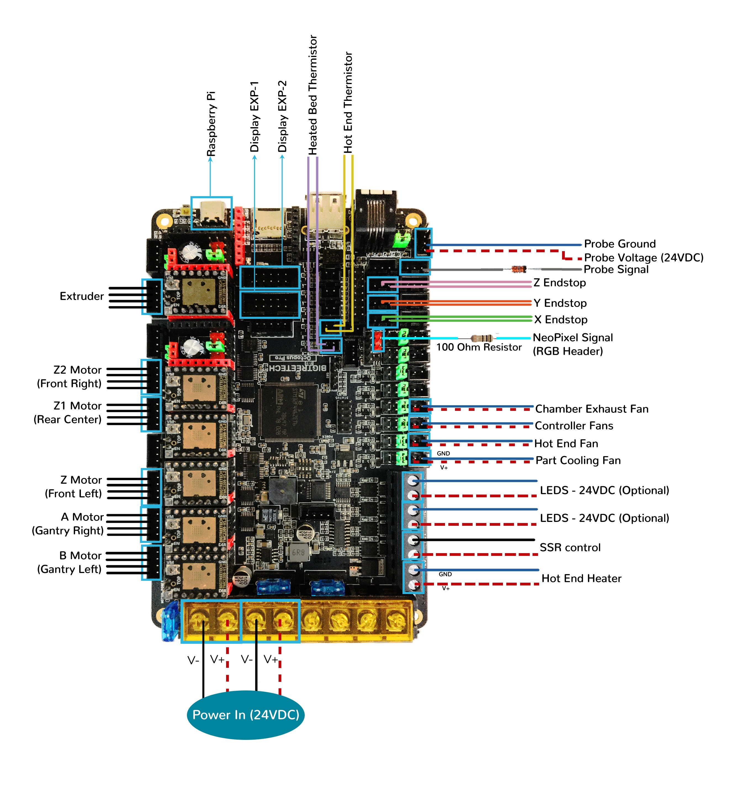
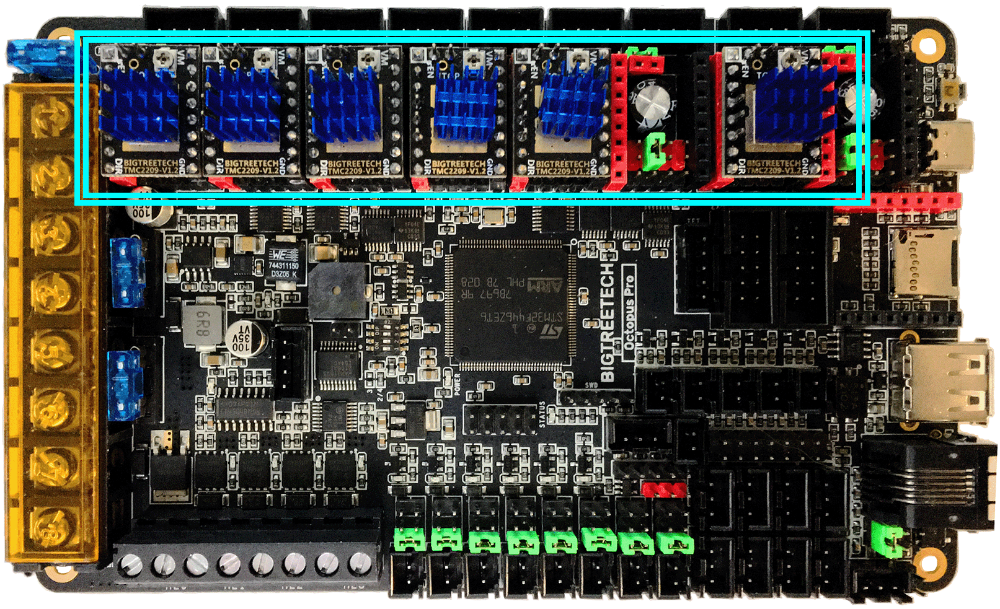

# Trident - BTT Octopus Pro V1.0 (TMC2208, TMC2209, TMC2225, TMC2226) Wiring

## Initial Removal of Jumpers

* Remove **all YELLOW** on-board jumpers, located at the positions shown below.

######  {#Octopus_Pro_PREP-Removal_UART_Tri}

## Initial Preparation - Set Jumpers

* Set the on-board jumpers, located at the positions as shown by the **GREEN** jumpers in the diagram below:

######  {#Octopus_Pro_F446_UART_Mode_for_Prep1_Tri}

* If you want to open the above picture, in a new tab of your web browser, then [click here](./images/Octopus_Pro_F446_UART_Mode_for_Prep1.png){:target="_blank" rel="noopener"}

## USB-PWR Selection Header and DIAG Headers

* As shown in the diagram below, ensure the **removal of the USB-PWR jumper (as shown in the YELLOW box")** which avoids the interaction between the USB 5V of Raspberry Pi and the DC-DC 5V of the motherboard.

* Ensure **all of "DIAG Jumpers" (shown in the BLUE box) are removed** to avoid the influence of TMC2209 DIAG on the endstop.

__IMPORTANT:__ **Double check all the** __GREEN__ **jumpers are set appropriately, especially the jumpers called out by the _COLORED BOXES_, BEFORE the power supply is connected.**

######  {#Octopus_Pro_F446_UART_Mode_for_Prep_150_tri}

* If you want to open the above picture, in a new tab of your web browser, then [click here](./images/Octopus_Pro_F446_UART_Mode_for_Prep_150.png){:target="_blank" rel="noopener"}

## (FAN & MOTOR POWER & PROBE) Voltage Selection Headers

* In the diagram below, the **BLUE box** indicates the "fan voltage selection headers" with **GREEN** jumpers which are set for 24VDC.

    * __IMPORTANT:__ **If fans that use 5VDC or 12VDC are used, please take NOTE of these "fan voltage selection headers" and set the jumpers to the appropriate jumper position so that the correct fan voltage will be produced to run the 5VDC or 12VC fan.  If the fan voltage selection jumper is set for 24VDC and a 5VDC/12VDC fan is connected to it, the Octopus Pro board will be damaged.**

* In the diagram below, the **ORANGE box** indicates the "probe voltage selection header" with a **GREEN** jumper which is set for 24VDC. If a PROBE voltage of 5VDC or 12VDC is desired, this jumper needs to be changed.

    * __IMPORTANT:__ **If the voltage required by the PROBE device does not match the voltage selected by the "probe voltage selection Jumper" then the Octopus Pro board could be damaged.**

* In the diagram below, the **PURPLE boxes** indicate the PT100/PT1000 DIP switches and its corresponding connector. The default setting of all the DIP switches is set to OFF. This default setting is undefined.  Therefore, **before you install the Octopus Pro board, a valid setting must be chosen.  Choose between a 2-wire or 4-wire arrangement: ([2-wire: 7, 11] or [4-wire: 4, 8])**.  The setting on this board is 7 as shown in the diagram.

* In the diagram below, the **YELLOW box** indicates the motor power selection headers with **GREEN** jumpers which are set for 24VDC.  Each stepper motor driver has this header so that each individual socket can be set to either 24VDC (Vin) or MOTOR_POWER voltage.

    * __IMPORTANT:__ **If the motor power selection headers DO NOT match the voltage being supplied to the stepper driver, the Octopus Pro board will be damaged along with the stepper motor driver.  Set each of the motor power selection jumpers to the appropriate position so that the stepper driver _voltage needed, matches the PSU voltage selected_ by the motor power selection jumper. For example, If the stepper motor driver voltage is set for 48VDC and the actual stepper motor driver runs at 24VDC, the Octopus Pro board and the stepper motor driver will be damaged.**

* __IMPORTANT:__ **Double check all the** __GREEN__ **jumpers are set appropriately, especially the jumpers called out by the _COLORED BOXES_, BEFORE the power supply is connected.**

## (FAN & MOTOR POWER & PROBE) Voltage Selection Diagram

######  {#Octopus_Pro_F446_UART_VoltageSelect_Tri}

* If you want to open the above picture, in a new tab of your web browser, then [click here](./images/Octopus_Pro_F446_UART_VoltageSelect_150.png){:target="_blank" rel="noopener"}

## Stepper Motor Drivers
* - [ ] Inspect the stepper motor drivers for left over rosin, and clean with IPA, if needed
* - [ ] Before installing heat sinks on to the stepper motor drivers,&nbsp;[please read this](#please-ensure-the-heat-sinks-are-installed-before-use)
* - [ ] Install heat sinks on all stepper motor drivers

## MCU Wiring

* - [ ] Connect 24V and GND (V+ and V-) from the PSU to PWR and MOTOR_POWER
* - [ ] Connect stepper driver for the B Motor (gantry left) into position DRIVER0 (driver socket)
* - [ ] Plug in stepper motor for the B Motor (gantry left) into position MOTOR0 (motor connector)
* - [ ] Connect stepper driver for the A Motor (gantry right) into position DRIVER1 (driver socket)
* - [ ] Plug in stepper motor for the A Motor (gantry right) into position MOTOR1 (motor connector)
* - [ ] Connect stepper driver for the Z into positions DRIVER2 (driver socket)
* - [ ] Plug in stepper motor for the Z into positions MOTOR2_1 (motor connector)
* - [ ] Connect stepper driver for the Z1 into positions DRIVER3 (driver socket)
* - [ ] Plug in stepper motor for the Z1 into positions MOTOR3 (motor connector)
* - [ ] Connect stepper driver for the Z2 into positions DRIVER4 (driver socket)
* - [ ] Plug in stepper motor for the Z2 into positions MOTOR4 (motor connector)
* - [ ] Connect stepper driver for the extruder motor into position DRIVER6 (driver socket)
* - [ ] Plug in stepper motor for the extruder motor into position MOTOR6 (motor connector)
* - [ ] Connect the hot end heater to HE0 (PA2)
* - [ ] Connect the bed SSR (DC Control Side) to HE1 (PA3)
* - [ ] Connect the part cooling fan to FAN0 (PA8)
* - [ ] Connect the hot end fan to FAN1 (PE5)
* - [ ] Connect the controller fans to FAN2 (PD12)
* - [ ] Connect the chamber exhaust fan to FAN3 (PD13)
* - [ ] Connect the hot end thermistor to T0 (PF4)
* - [ ] Connect the bed thermistor to TB (PF3)
* - [ ] Connect the X endstop to STOP_0 (PG6)
* - [ ] Connect the Y endstop to STOP_1 (PG9)
* - [ ] Connect the Z endstop to STOP_2 (PG10)
* - [ ] Plug Probe Signal (with&nbsp;**BAT85 diode**) in to STOP_7 (PG15)
* - [ ] Connect the V+ an 0V wires on the probe to PROBE
* if using a mini12864 display:
    1. - [ ] [complete the steps in the mini 12864 Display section](#mini-12864-display)
    2. - [ ] connect to EXP1 & EXP2
* if using USB to communicate with Pi:
    1. - [ ] Connect USB Cable to your Octopus Pro board, but do not connect it yet to your Raspberry Pi
* if using UART (3-wire serial communication) with Pi:
    1. - [ ] [complete the steps for setting up UART Serial communications with the Raspberry Pi](./OctopusPro_RaspberryPi#raspberry-pi){:target="_blank" rel="noopener"}
    2. - [ ] Connect UART serial cable to your Octopus Pro board, but do not connect it yet to your Raspberry Pi

*  

BAT85
: a Schottky barrier diode. BAT85 is needed to protect the Octopus Pro board (MCU board) from being fried.  An Inductive Probe device (Omron TL-Q5MC2; Omron TL-Q5MC2-Z or Panasonic GX-HL15BI-P) communicates at a much higher voltage level (10V - 30V) then the MCU board.  The BAT85 is used to protect the input signal PIN of the MCU board; without the BAT85 the MCU board will be damaged.  If two BAT85s are used in series, the circuit will protect the MCU board and still allow the inductive probe to function properly. [For more information, click here](./index#bat85-diode){:target="_blank" rel="noopener"}

## MCU Wiring Diagram

######  {#Tri_Wiring_Diagram_Octopus_ProF446_V1_UART_tri}

* If you want to open the above diagram, in a new tab of your web browser, and have the ability to zoom and download the diagram in JPG format then [click here](./images/Trident_Wiring_Diagram_Octopus_ProF446_V1_UART_150.jpg){:target="_blank" rel="noopener"}

## Please Ensure the Heat Sinks are Installed Before Use

Note on the Orientation of the Stepper Motor Driver's Heat Sinks
: Place the heat sinks for the stepper motor drivers so that the orientation of the fins on the heat sinks are parallel to the air flow from the controller fans once the MCU board is installed on the DIN rail. Ensure the heat sinks are **not touching** the solder joints located on the top of the step stick. Please note, that your placement of heat sinks may be different from the orientation shown below.

## MCU with Heat Sinks Installed

######  {#Tri_Octopus_Pro_UART_Heatsinks_tri}

## Further Information about the PROBE port:

* see [the Octopus Pro Probe port section](./OctopusPro_ProbePort#btt-octopus-pro-probe-port){:target="_blank" rel="noopener"}

## Powering the Raspberry Pi & Setting up UART Serial Communications with the Raspberry Pi

* see [the Octopus Pro Raspberry Pi Section](./OctopusPro_RaspberryPi#raspberry-pi){:target="_blank" rel="noopener"}

## SSR Wiring

* Wire colors will vary depending on your locale.

######  {#BTTOctopus_Pro-ssr-UART-wiring_Tri}

* If you want to open the above diagram, in a new tab of your web browser, and have the ability to zoom and download the diagram in PNG format then [click here](./images/BTTOctopus_Pro-ssr-UART-wiring.png){:target="_blank" rel="noopener"}

## mini 12864 Display

* See [the mini12864 guide](./mini12864_klipper_guide.md){:target="_blank" rel="noopener"}

## The Klipper Configuration file for BTT Octopus Pro V1.0 Board

* The Klipper Configuration file from VoronDesign/Voron-Trident GitHub Repo for BTT Octopus Pro 1.0 board is [located here](https://raw.githubusercontent.com/VoronDesign/Voron-Trident/main/Firmware/Octopus/Trident_Octopus_Config.cfg){:target="_blank" rel="noopener"};

## URL Resources Links for the Octopus Pro (PIN Diagrams and Repo)

* see [The Octopus Pro Resource Section](./OctopusPro_Resources#color-pin-diagram-for-btt-octopus-pro-v10){:target="_blank" rel="noopener"}

## Advanced Setup - Resource Link for SPI setup (TMC2100, TMC2130, TMC5160, TMC5161, TMC5160HV, TMC5160_PRO)

* see [The Octopus Pro SPI Setup Section](../../community/electronics/GadgetAngel/tri_octopus_pro_wiring#trident---btt-octopus-pro-v10-wiring-for-both-spi-and-uart-modes){:target="_blank" rel="noopener"}

## After I have Wired up the MCU Board, What Comes Next?

1. Once the MCU board is wired up and wire management has been performed, the next step is to install Mainsail/Fluidd or Octoprint, please see [The Build ═► Software Installation](../../build/software/index#software-installation){:target="_blank" rel="noopener"}

2. Once Mainsail/Fluidd or Octoprint has been installed, the next step is to **compile and install** the Klipper Firmware, please see [The Build ═► Software Installation -> Firmware Flashing(Header) -> BTT Octopus](../../build/software/octopus_klipper#octopuspro-klipper-firmware){:target="_blank" rel="noopener"}

3. Once the MCU board has the Klipper Firmware Installed, the next step is to **create/edit** the Klipper Config file (Trident_Octopus_Config.cfg rename it to printer.cfg) to ensure your Voron build matches your Klipper Config file, please see [the file located here; Select "Trident Octopus"](../../build/software/configuration#initial-voron-printer-configuration){:target="_blank" rel="noopener"};

    * Please use the Color PIN Diagrams, [displayed here](./OctopusPro_Resources#color-pin-diagram-for-btt-octopus-pro-v10){:target="_blank" rel="noopener"}, as a source of information;

    * Please consult [The Build ═► Software Configuration](../../build/software/configuration#software-configuration){:target="_blank" rel="noopener"} on how to edit the Klipper Config file.

4. After **creating/editing** the Klipper Config file (Trident_Octopus_Config.cfg renamed to printer.cfg), the next step is to check all the Motors and the mechanics of the Voron printer, please see [The Build ═► Initial Startup Checks](../../build/startup/index#initial-startup-checks){:target="_blank" rel="noopener"}

