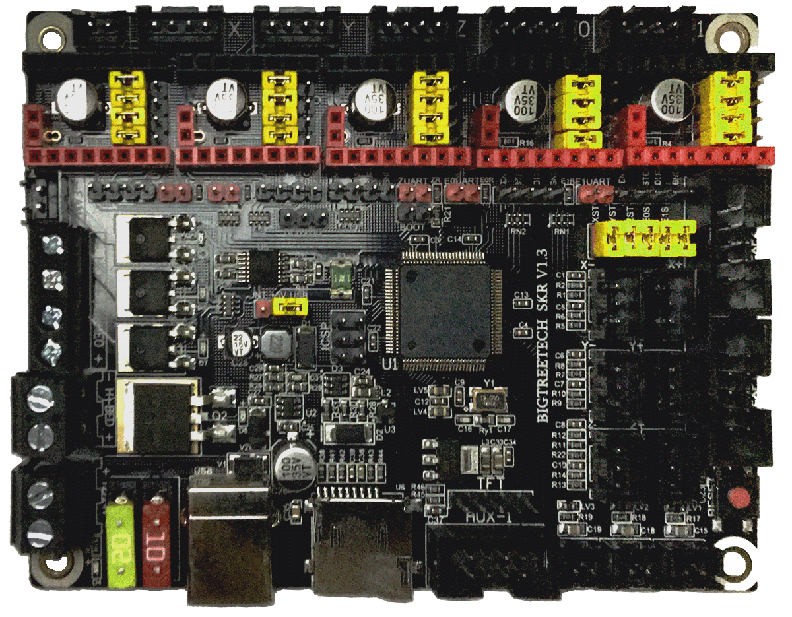
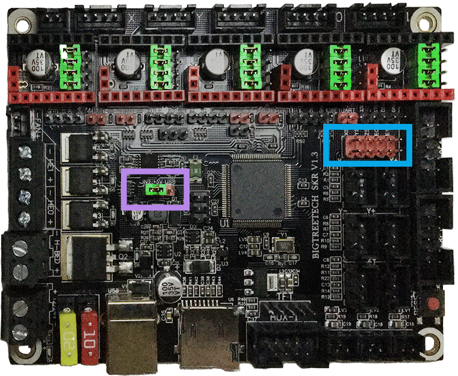
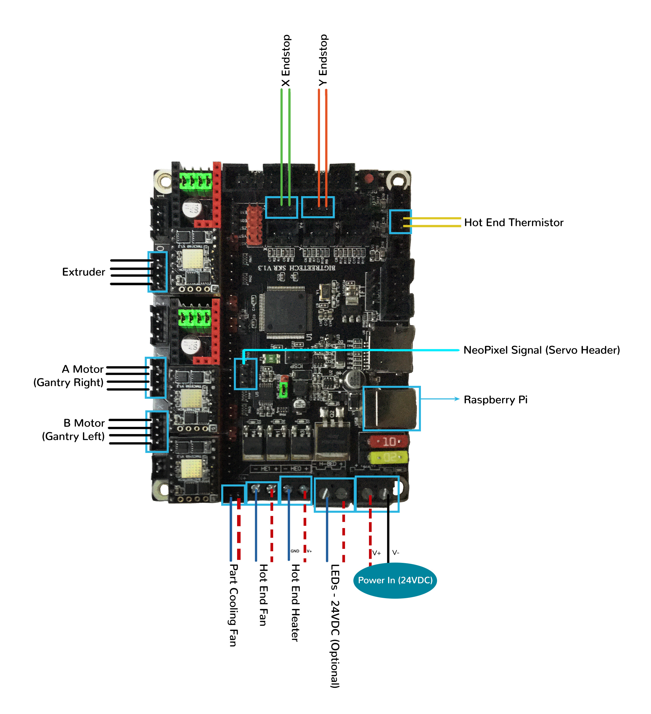
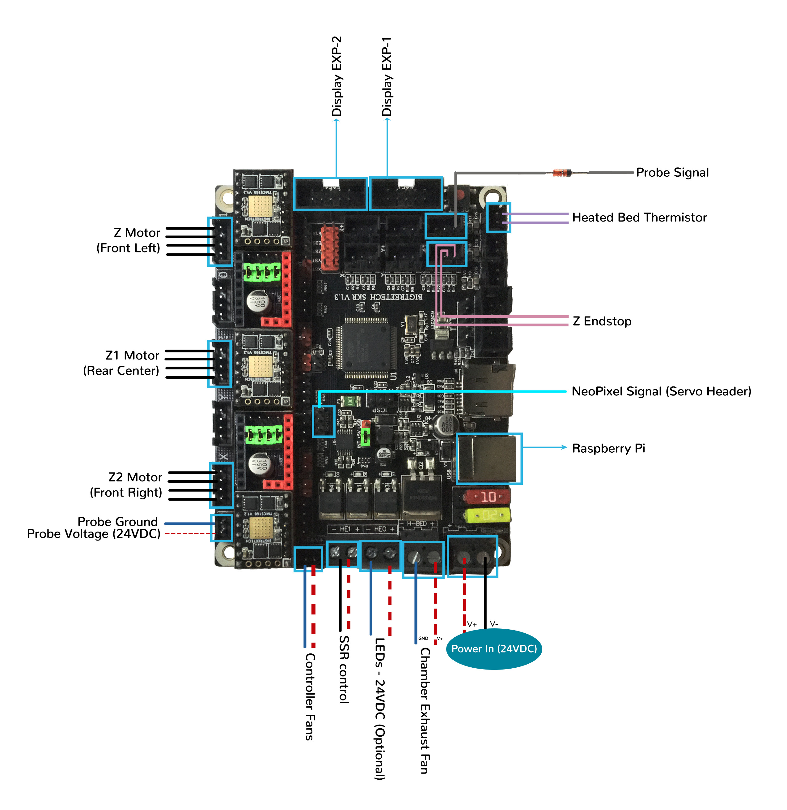
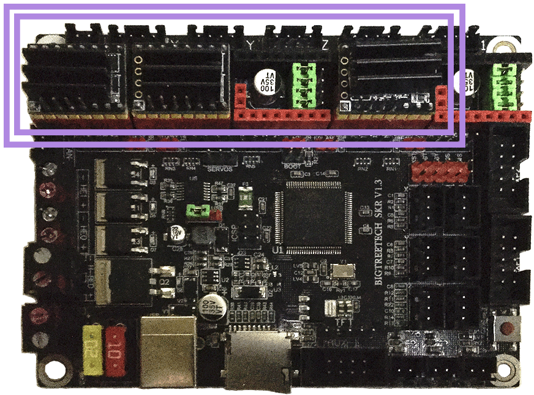
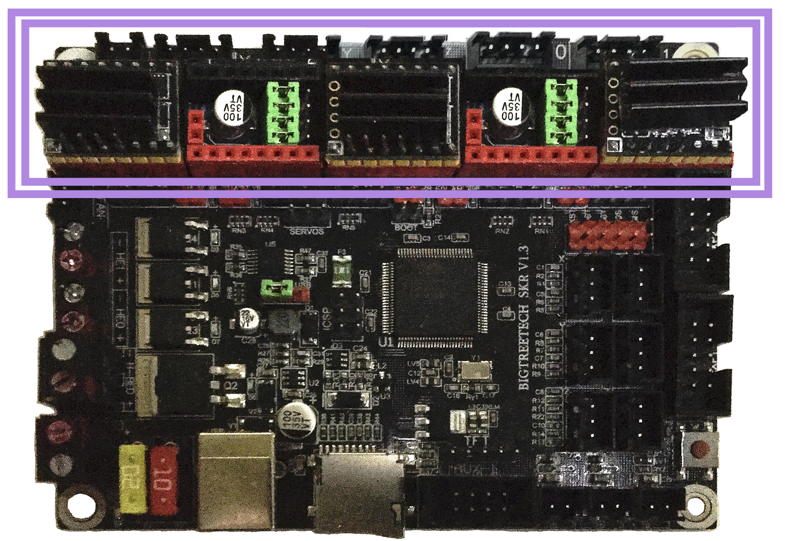
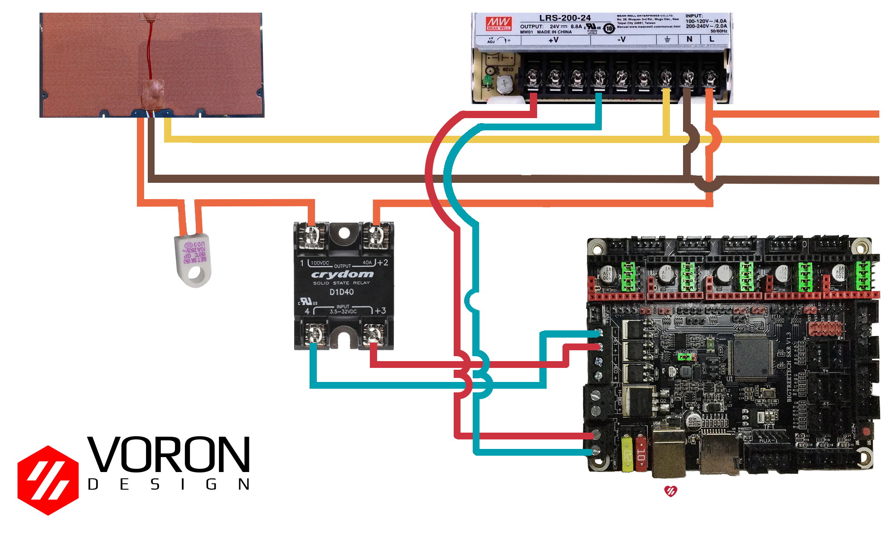

# Trident - SKR V1.3 in SPI Mode (TMC2100, TMC2130, TMC5160, TMC5161, TMC5160HV, TMC5160_PRO)

## Initial Removal of Jumpers

We have no idea what state your board is in when you start this process.  Someone could have moved jumpers around already.  But since we are here, on the SPI end of the site, then I assume that you might want to look at the next section **before** removing **all the jumpers** because if all the jumpers are already set for SPI mode then removing them and placing them right back in would be a waste of your valuable time.

**If one does not understand what I mean by "if the jumpers are set for SPI" then I would recommend that removing all the jumpers would be the place to start.**

Remove **all YELLOW** on-board jumpers, located at the positions shown below:

######  {#SKR_V13_PREP-Removal_SPI3}

## Initial Preparation for SPI Mode - Set Jumpers

* Ensure **all of "DIAG Jumpers" or "ST Jumper Block" (shown in the BLUE box) are removed**, since the Voron printer does not use sensorless homing.

* Ensure the "Power Selection Jumper" (shown in the **RED box**) is in the LEFT position (as shown in the diagram below) on the "Power Selection" header. This setting prevents the USB 5V power supply from being used.

* Set the on-board jumpers, located at the positions as shown by the **GREEN** jumpers in the diagram below:

######  {#SKR_V13_in_SPI_mode_for_Prep_150_2}

## Stepper Motor Drivers
* Inspect the stepper motor drivers for left over rosin, and clean with IPA, if needed
* Install heat sinks on all stepper motor drivers

## MCU X/Y/E, Hot End in SPI Mode

* Place stepper drivers for X, Y, and E in positions X, Y, and E0
* Plug in stepper motors for X, Y, and E in positions X, Y, and E0
* Plug Hot End thermistor to thermistor TH0 (P0.24)
* Plug Hot End heater in to HE0 (P2.7)
* Plug Hot End Fan in to HE1 (P2.4)
* Plug Part Cooling Fan in to Fan (P2.3)
* Connect X end stop to X+ connector (P1.28)
* Connect Y end stop to Y+ connector (P1.26)
* Wire 24V and 0V from DC power supply to Power/DCIN
* Connect USB Cable to your SKR V1.3, **but do not connect it yet to your Raspberry Pi**

### MCU X/Y/E, Hot End in SPI Mode Wiring Diagram

######  {#Trident_Wiring_Diagram_BTT_SKRV13_XYE_in_SPI_mode}

* If you want to open the above diagram, in a new tab of your web browser, and have the ability to zoom and download the diagram in JPG format then [click here](./images/Trident_Wiring_Diagram_BTT_SKRV1.3_XYE_in_SPI_mode_150.jpg){:target="_blank" rel="noopener"}

## MCU Z, Bed, Exhaust Fan in SPI Mode

* Place stepper drivers for Z2, Z1, and Z0 into positions X, Z, and E1
* Plug in stepper motors for Z2, Z1, and Z0 into positions X, Z, and E1
* Plug Bed Thermistor in to TB (P0.23)
* Plug in Exhaust Fan in to H-BED (P2.5)
* Plug in Controller Fans in to FAN (P2.3)
* Plug SSR Control for Heated Bed in to HE1 (P2.4)
* Plug Z Endstop Switch into Z- (P1.25)
* Plug Probe Signal (with BAT85 diode) in to Z+ (P1.24)
* Plug Probe GND and Probe Voltage in to "DC OUT" connector next to X motor connector
* Plug display wires in to EXP1 and EXP2
* Wire 24V and 0V from DC power supply to Power/DCIN
* Connect USB Cable to your SKR 1.3, **but do not connect it yet to your Raspberry Pi**

### MCU Z, Bed, Exhaust Fan in SPI Mode Wiring Diagram

######  {#Trident_Wiring_Diagram_BTT_SKRV13_Z_in_SPI_mode}

* If you want to open the above diagram, in a new tab of your web browser, and have the ability to zoom and download the diagram in JPG format then [click here](./images/Trident_Wiring_Diagram_BTT_SKRV1.3_Z_in_SPI_mode_150.jpg){:target="_blank" rel="noopener"}

[Go Back to the Table of Contents](./tri_skr_V13#table-of-contents)

## Please Ensure the Heat Sinks are Installed Before Use

### MCU X/Y/E, Hot End with Heat Sinks Installed

######  {#SKR_V13_SPI_Heatsinks_2}

### MCU Z, Bed, Exhaust Fan with Heat Sinks Installed

######  {#Trident_SKR_V13_SPI_Heatsinks2}

## SSR Wiring (Board Shown is in SPI mode)

* Wire colors will vary depending on your locale.

######  {#btt-SKRV13inSPI-ssr-wiring_2}

* If you want to open the above diagram, in a new tab of your web browser, and have the ability to zoom and download the diagram in PNG format then [click here](./images/btt-SKRV1.3inSPI-ssr-wiring.png){:target="_blank" rel="noopener"}

[Go Back to the Table of Contents](./tri_skr_V13#table-of-contents)

## mini 12864 Display

* See [the mini12864 guide](./mini12864_klipper_guide#mini12864-klipper-guide){:target="_blank" rel="noopener"}

### The Klipper Configuration file for SKR V1.3 board

The Klipper Configuration file from VoronDesign/Voron-Trident GitHub Repo for SKR V1.3 board is [located here](https://raw.githubusercontent.com/VoronDesign/Voron-Trident/main/Firmware/Voron_Trident_SKR_1.3.cfg){:target="_blank" rel="noopener"}

## URL Resources Links for the SKR V1.3 (PIN Diagrams and Repo)

* see [The SKR V1.3 Resource Section](./skr_v13_Resources#color-pin-diagram-for-skr-v13){:target="_blank" rel="noopener"}

## After I have Wired up the MCU Board, What Comes Next?

1. Once the MCU board is wired up and wire management has been performed, the next step is to install Mainsail/Fluidd or Octoprint, please see [The Build ═► Software Installation](../../build/software/index#software-installation){:target="_blank" rel="noopener"}

2. Once Mainsail/Fluidd or Octoprint has been installed, the next step is to **compile and install** the Klipper Firmware, please see [The Build ═► Software Installation -> Firmware Flashing(Header) -> SKR 1.3](../../build/software/skr13_klipper#skr-1314-klipper-firmware){:target="_blank" rel="noopener"}

3. Once the MCU board has the Klipper Firmware Installed, the next step is to **create/edit** the Klipper Config file (Voron_Trident_SKR_1.3.cfg rename it to printer.cfg) to ensure your Voron build matches your Klipper Config file, please see [the file located here](https://raw.githubusercontent.com/VoronDesign/Voron-Trident/main/Firmware/Voron_Trident_SKR_1.3.cfg){:target="_blank" rel="noopener"};

    * Please use the Color PIN Diagrams, [displayed above](./skr_v13_Resources#SKRV13_Colored_PIN_Diagram){:target="_blank" rel="noopener"}, as a source of information;

    * Please consult [The Build ═► Software Configuration](../../build/software/configuration#software-configuration){:target="_blank" rel="noopener"} on how to edit the Klipper Config file.

4. After **creating/editing** the Klipper Config file (Voron_Trident_SKR_1.3.cfg renamed to printer.cfg), the next step is to check all the Motors and the mechanics of the Voron printer, please see [The Build ═► Initial Startup Checks](../../build/startup/index#initial-startup-checks){:target="_blank" rel="noopener"}
