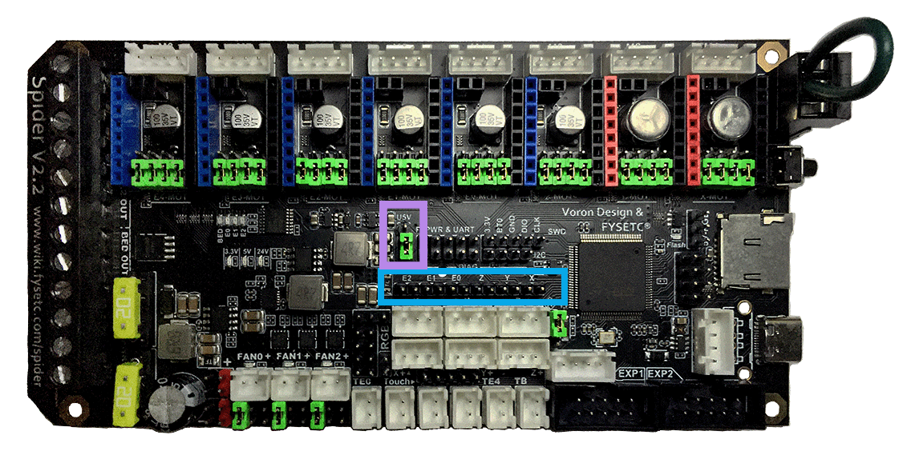
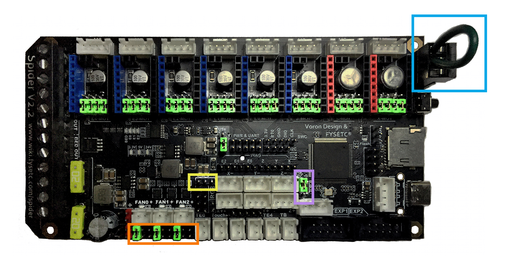
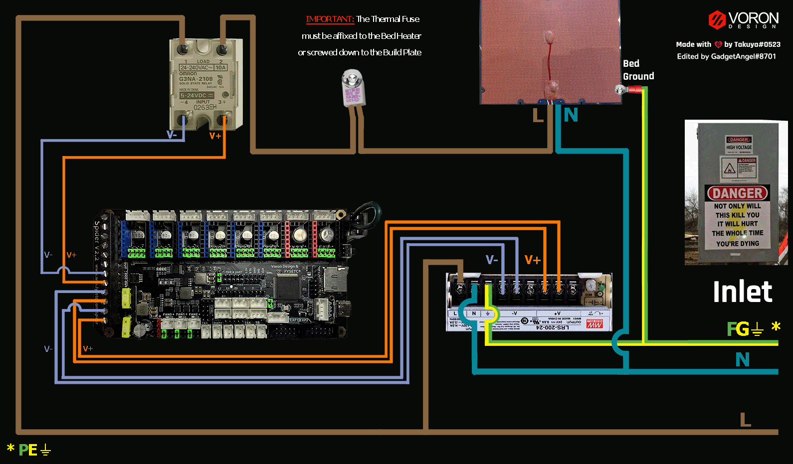

# Trident - Fysetc Spider V2.2 in SPI Mode (TMC2100, TMC2130, TMC5160, TMC5161, TMC5160HV, TMC5160_PRO)

## Initial Removal of Jumpers

* Remove **all YELLOW** on-board jumpers, located at the positions shown below:

######  {#FYSETC_Spider_V22_PREP-Removal_SPI_5}

## Initial Preparation for SPI Mode - Set Jumpers

* Ensure **all of "DIAG Jumpers" (shown in the BLUE box) are removed** because the Voron printer does not use sensorless homing.

* Ensure the "Power Selection Jumper" (shown in the **RED box**) is in the bottom position (as shown in the diagram below) on the "Power Selection" header. This setting prevents the USB 5V power supply from being used.

* Set the on-board jumpers, located at the positions as shown by the **GREEN** jumpers in the diagram below:

######  {#FYSETC_Spider_V22_in_SPI_Mode_PREP_5}

### (FAN & MOTOR POWER & PROBE) Voltage Selection Headers

* In the diagram below, the **BLUE boxes** indicate the headers with **GREEN** jumpers **or a WIRE jumper** which are set for 24VDC.

* In the diagram below, the **RED box** indicates the RGB Block header's Jumper is not present, but this header can be used to run fans. Other headers that can be used with fans (as shown by a **BLUE box**) have their Fan Voltage Selections headers which are located below the FAN0, FAN1 and FAN2 connectors. The **GREEN** jumpers are set for a fan voltage of 24VDC.

    * __IMPORTANT:__ **If fans that use 5VDC or 12VDC are used, please take NOTE of these "fan voltage selection headers" and set the jumpers to the appropriate jumper position so that the correct fan voltage will be produced to run the 5VDC or 12VC fan.  If the fan voltage selection jumper is set for 24VDC and a 5VDC/12VDC fan is connected to it, the Fysetc Spider board will be damaged.**

* In the diagram below, the **BLUE box** to the right of Z- connector, is the header for setting the PROBE voltage. The **GREEN** jumper sets the PROBE voltage for 24VDC.  If a PROBE voltage of 5V is desired, this jumper needs to be changed.

    * __IMPORTANT:__ **If the voltage required by the PROBE device does not match the voltage selected by the "probe voltage selection Jumper" then the Fysetc Spider board could be damaged.**

* In the diagram below the **wire jumper**, located in upper right-hand corner of the board, is set so that the X-MOT and Y-MOT stepper motor driver voltage will be 24VDC.  **If X-MOT and Y-MOT stepper motor drivers at 48VDC** are used, the **wire jumper** will need to be placed **between the 48V pin and the GND pin** of this connector.

    *  __IMPORTANT:__ **If the wire jumper, which selects the power voltage for X-MOT and Y-MOT stepper motor driver slots, DOES NOT match the voltage being supplied to the stepper driver, the Fysetc Spider board will be damaged along with the stepper motor driver.  Set the wire jumper to the appropriate position so that the stepper driver _voltage needed, matches the PSU voltage selected_ by the wire jumper. For example, If the stepper motor driver voltage is set for 48VDC and the actual stepper motor driver runs at 24VDC, the Fysetc Spider board and the stepper motor driver will be damaged.**

* __IMPORTANT:__ **Double check all the** __GREEN__ **jumpers and the WIRE jumper BEFORE the power supply is connected, to ensure these jumpers and wire jumper are set appropriately.**

### (FAN & MOTOR POWER & PROBE) Voltage Selection Diagram

######  {#FYSETC_Spider_V22_inSPIMode_VoltageSelect_5}

## Stepper Drivers
* If using Fysetc drivers, inspect for left over rosin, and clean with IPA if need
* Install step drivers in all slots except E3-MOT and E4-MOT
* Install heat sinks on all step drivers
* _**NOTE: if the board has been powered, ensure that motor power caps are fully drained before inserting stepper drivers: Temporarily connect a 100K resistor between VMOT+ and VMOT- to safely drain the capacitors**_ See [Fysetc Spider 3.3v issue](https://github.com/FYSETC/FYSETC-SPIDER/blob/main/Spider%203.3v%20issue.md){:target="_blank" rel="noopener"}

## MCU Wiring for SPI Mode

* Connect 24V Power from the PSU to PWR IN and BED_POWER/DCIN
* Connect stepper driver for the B Motor (gantry left) into position X-MOT
* Plug in stepper motor for the B Motor (gantry left) into position M1
* Connect stepper driver for the A Motor (gantry right) into position Y-MOT
* Plug in stepper motor for the A Motor (gantry right) into position M2
* Connect stepper drivers for the Z, Z1, and Z2 into positions Z-MOT, E1-MOT, and E2-MOT
* Plug in stepper motors for the Z, Z1, and Z2 into positions M3, M5, and M6
* Connect stepper driver for the extruder motor into position E0-MOT
* Plug in stepper motor for the extruder motor into position M4
* Connect the hot end heater to E0 OUT (PB15)
* Connect the chamber exhaust fan to E2 OUT (PB3)
* Connect the bed SSR (DC Control Side) to BED OUT (PB4)
* Connect the hot end fan to FAN0 (PA13)
* Connect the part cooling fan to FAN1 (PA14)
* Connect the controller fans to FAN2 (PB2)
* Connect the hot end thermistor to TE0 (PC0)
* Connect the bed thermistor to TB (PB0)
* Connect the X endstop to X+ (PA1)
* Connect the Y endstop to Y+ (PA2)
* Connect the PROBE to Z+ (PA3)
* Connect the Z endstop to Z- (PA0)
* if using a mini12864 display, connect to EXP1 & EXP2, only after completing the steps shown [below](#mini-12864-display)

## MCU Wiring Diagram for SPI Mode

######  {#Trident_Wiring_Diagram_FYSETC_Spider_V22_in_SPI_5}

* If you want to open the above diagram, in a new tab of your web browser, and have the ability to zoom and download the diagram in JPG format then [click here](./images/Trident_Wiring_Diagram_FYSETC_Spider_V2.2_in_SPI_mode_150.jpg){:target="_blank" rel="noopener"}

[Go Back to the Table of Contents](./tri_spiderv22_wiring#table-of-contents)

## Please Ensure the Heat Sinks are Installed Before Use

### MCU in SPI Mode with Heat Sinks Installed

######  {#Trident_FYSETC_Spider_v22_SPI_Heatsinks_5}

## Powering the Raspberry Pi & Setting up UART Communications with the Raspberry Pi

* see [the Raspberry Pi Section](./Fysetc_Spider_RaspberryPi#raspberry-pi){:target="_blank" rel="noopener"}

## SSR Wiring (Board Shown is in SPI mode)

* Wire colors will vary depending on your locale.

######  {#fysetc-spiderv22-ssr-SPI-wiring_5}

* If you want to open the above diagram, in a new tab of your web browser, and have the ability to zoom and download the diagram in PNG format then [click here](./images/fysetc-spiderv2.2inSPI-ssr-wiring_150.png){:target="_blank" rel="noopener"}
   

[Go Back to the Table of Contents](./tri_spiderv22_wiring#table-of-contents)

## mini 12864 Display

* *spider Rev 1.0 only*: the EXP1 & EXP2 header labels are swapped. Connect  EXP1 (display) to EXP2(spider), and EXP2 (display) to EXP1 (spider).  On the Spider 1.1 or later: connect EXP1->EXP1, and EXP2->EXP2
* *Fysetc mini12864 only*:  components R1 and R4 must be removed from the board before connecting to the Spider.  Note: new displays are shipping with this step already complete, but this should be verified before connecting
* *BTT mini12864 only* remove components R1, and C6, and rotate the connectors 180 degrees
* See [the mini12864 guide](./mini12864_klipper_guide#mini12864-klipper-guide){:target="_blank" rel="noopener"}

<!--
### The Klipper Configuration file for Fysetc Spider V2.2 Board

The Klipper Configuration file from VoronDesign/Voron-Trident GitHub Repo for Fysetc Spider V2.2 board is [located here; Select "V2 Spider"](../../build/software/configuration#initial-voron-printer-configuration){:target="_blank" rel="noopener"}

[Go Back to the Table of Contents](./tri_spiderv22_wiring#table-of-contents)
-->

## URL Resources Links for the Fystec Spider (PIN Diagrams and Repo)

* See [The Fysetc Spider V2.2 Resource Section](./Fysetc_Spider_Resources_v2#color-pin-diagram-for-fysetc-spider-v22){:target="_blank" rel="noopener"}

## After I have Wired up the MCU Board, What Comes Next?

1. Once the MCU board is wired up and wire management has been performed, the next step is to install Mainsail/Fluidd or Octoprint, please see [The Build ═► Software Installation](../../build/software/index#software-installation){:target="_blank" rel="noopener"}

2. Once Mainsail/Fluidd or Octoprint has been installed, the next step is to **compile and install** the Klipper Firmware, please see [The Build ═► Software Installation -> Firmware Flashing(Header) -> Fysetc Spider](../../build/software/spider_klipper#spider-klipper-firmware){:target="_blank" rel="noopener"}

3. Once the MCU board has the Klipper Firmware Installed, the next step is to **create** the Klipper Config file (printer.cfg);

    * Please use the Color PIN Diagrams, [displayed above](./Fysetc_Spider_Resources_v2#FYSETC_Spider_V22-color-PIN_1){:target="_blank" rel="noopener"}, as a source of information;

    * Please consult [The Build ═► Software Configuration](../../build/software/configuration#software-configuration){:target="_blank" rel="noopener"} on how to edit the Klipper Config file.

4. After **creating** the Klipper Config file (printer.cfg), the next step is to check all the Motors and the mechanics of the Voron printer, please see [The Build ═► Initial Startup Checks](../../build/startup/index#initial-startup-checks){:target="_blank" rel="noopener"}

[Go Back to the Table of Contents](./tri_spiderv22_wiring#table-of-contents)