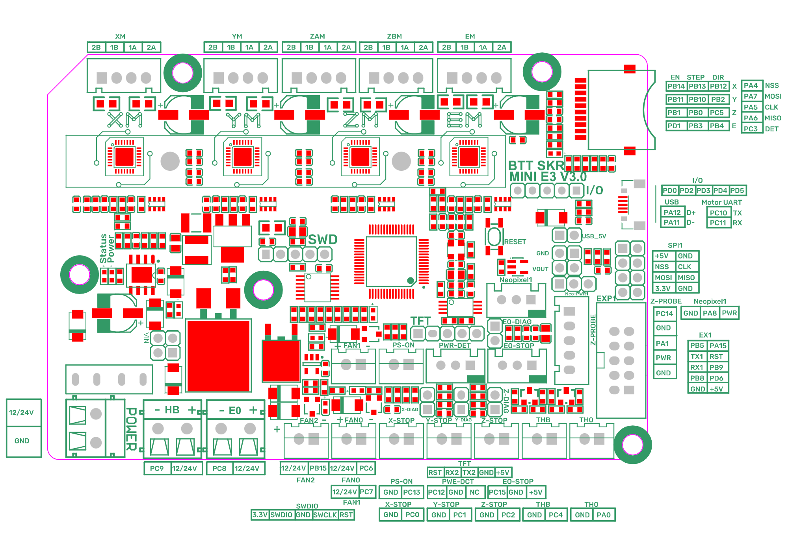

# Voron V0.1 - SKR mini E3 V3.0 Wiring

## Initial Preparation
Reconfigure the on-board jumper(s) as shown {See the lime green jumper(s)}

## MCU

* Plug in stepper motors for X, Y, Z, and E in positions Xm, Ym, ZAm, and Em
* Plug Hot End thermistor to thermistor TH0
* Plug Hot End heater in to E0
* Plug Hot End Fan Signal into FAN1
* Plug Hot End V+ (+5VDC) into Z-Probe's NPWR PIN
* Plug Part Cooling Fan in to FAN0
* Plug Bed Thermistor in to THB
* Connect The DC bed to HB
* Connect X end stop to X-STOP connector
* Connect Y end stop to Y-STOP connector
* Connect Z end stop to Z-STOP connector
* Wire 24V and -V from DC power supply to POWER/DCIN (Power In)
* Connect USB Cable to your SKR mini E3, but do not connect it yet to your Raspberry Pi

### 

### Here is the URL for [the Klipper Configuration file from VoronDesign/Voron-0 GitHub Repo, Voron0.1 branch for SKR mini E3 V3.0 board](https://github.com/VoronDesign/Voron-0/blob/Voron0.1/Firmware/skr-mini-E3-v3.0.cfg)

## Color PIN Diagram for SKR mini E3 V3.0

For reference, here is the Color PIN diagram for the SKR mini E3 V3.0

### 

## Original SKR mini E3 V3.0 Pinout

For reference, here is the original pinout of the SKR mini E3 V3.0

### Here is the URL for the [GitHub repository of BTT SKR mini E3 V3.0](https://github.com/bigtreetech/BIGTREETECH-SKR-mini-E3/tree/master/hardware/BTT%20SKR%20MINI%20E3%20V3.0/Hardware)
