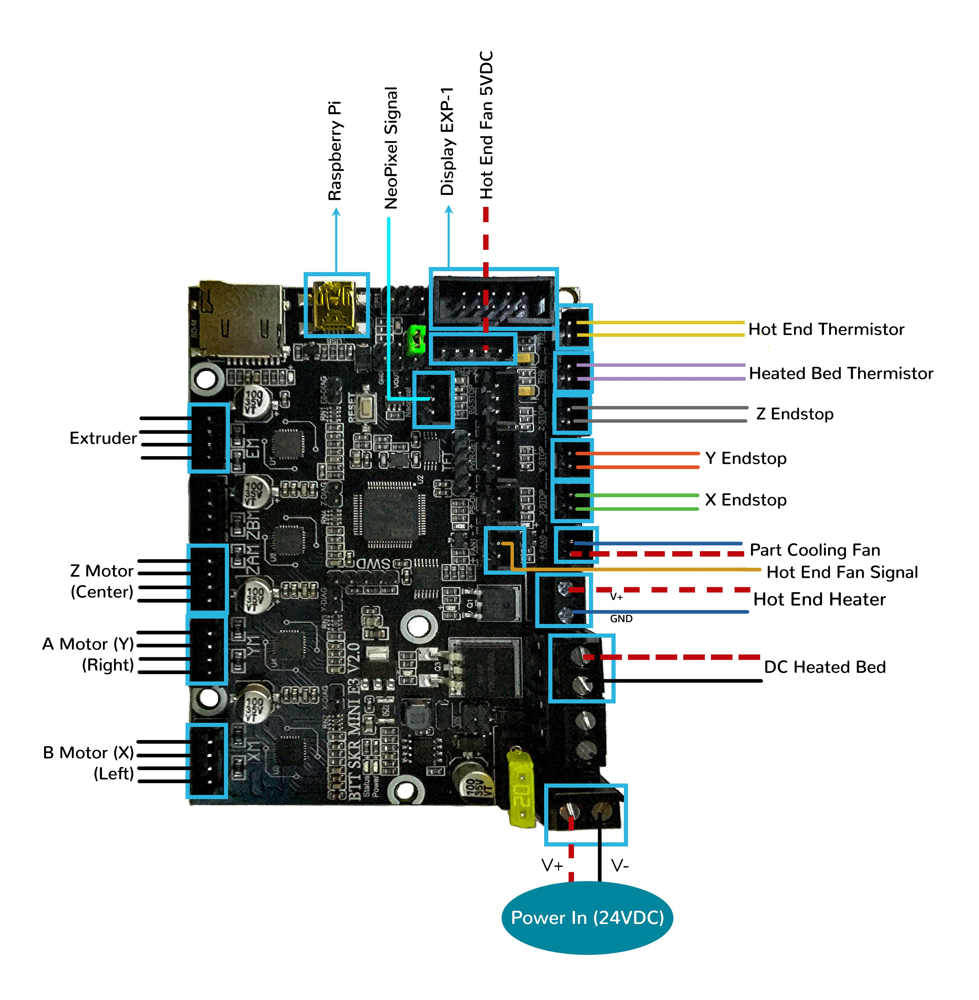

# Voron V0.1 - SKR mini E3 V2.0 Wiring

## Initial Preparation

* Set the on-board jumper(s), located at the positions as shown by the GREEN jumper(s) in the below diagram:

## MCU

* Plug in stepper motors for X, Y, Z, and E in positions Xm, Ym, ZAm, and Em
* Plug Hot End thermistor to thermistor TH0
* Plug Hot End heater in to E0
* Plug Hot End Fan Signal into FAN1's Signal PIN
* Plug Hot End Fan V+ (+5VDC) into Z-Probe connector's 5V PIN
* Plug Part Cooling Fan in to FAN0
* Plug Bed Thermistor in to THB
* Connect The DC bed to HB
* Connect X end stop to X-STOP connector
* Connect Y end stop to Y-STOP connector
* Connect Z end stop to Z-STOP connector
* Wire 24V and -V from DC power supply to VIN and GND on "DCIN/Power" connector
* Connect USB Cable to your SKR mini E3, but do not connect it yet to your Raspberry Pi

### MCU Diagram

## Please Ensure the Heat Sinks are Installed Before Use

### The Klipper Configuration file for SKR mini E3 V2.0 Board

The Klipper Configuration file from VoronDesign/Voron-0 GitHub Repo, Voron0.1 branch for SKR mini E3 V2.0 board is [located here](https://github.com/VoronDesign/Voron-0/blob/Voron0.1/Firmware/skr-mini-E3-v2.0.cfg)

## Color PIN Diagram for SKR Mini E3 V2.0

For reference, here is the Color PIN diagram for the SKR mini E3 V2.0

## Original SKR Mini E3 V2.0 Pinout

For reference, here is the pinout of the SKR mini E3 V2.0

### The BTT's GitHub Repo for the BTT SKR mini E3 V2.0 Board

The GitHub repository for BTT SKR mini E3 V2.0 board is [located here](https://github.com/bigtreetech/BIGTREETECH-SKR-mini-E3/tree/master/hardware/BTT%20SKR%20MINI%20E3%20V2.0)
