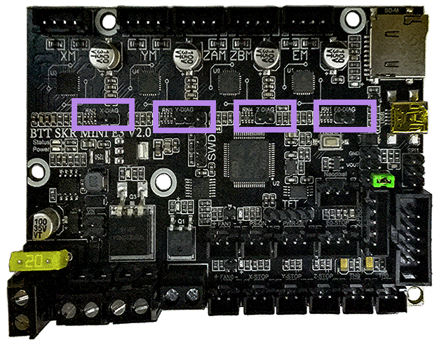
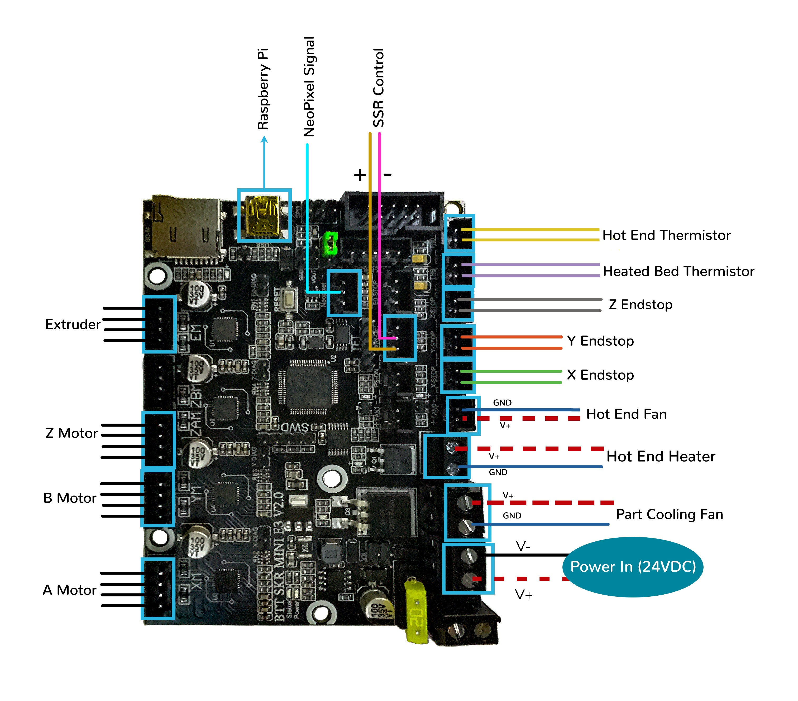
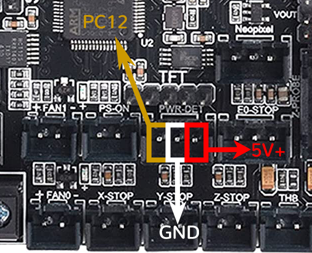
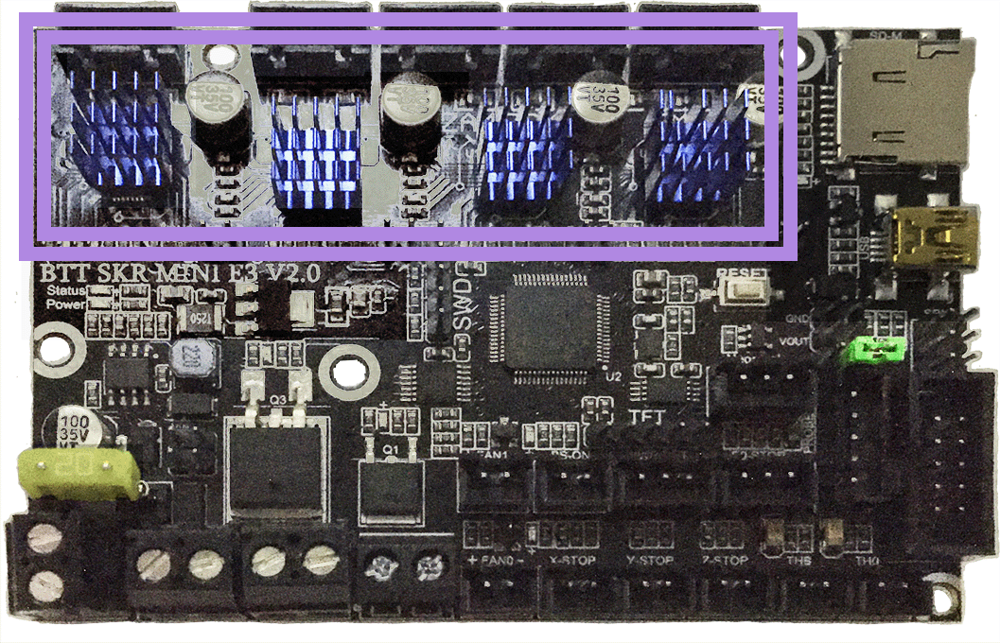

# Voron V0.0 - SKR mini E3 V2.0 Wiring

## Initial Removal of Jumpers

* There is only **one jumper** on the SKR mini E3 V2.0 board. This jumper is called "Neo-PWR1" jumper.  See the next section about this jumper.

## Initial Preparation

* The Neo-PWR1 jumper setting will decide the source of the SKR's 5V rail. The board's 5V rail can be sourced from the board itself or from an external DCDC bridge module.  One can purchase an external DCDC bridge module (sold separately) to power 5V NeoPixel LEDs.  This bridge module is called the "DCDC Mode V1.0" board. Since the Voron printer does not require the extra DCDC bridge module, **set the Neo-PWR1 jumper** so that the board's 5V rail will be powered by the MCU (as shown by the **GREEN** jumper in the diagram below).

* Ensure **all of "DIAG Jumpers" (shown in the PURPLE boxes) are removed** to avoid the influence of TMC2209 DIAG on the endstops.

######  {#PREP_v01_SKR_mini_E3_V2.0}

## MCU

* - [ ] Plug in stepper motors for X in positions Xm (motor connector)
* - [ ] Plug in stepper motors for Y in positions Ym (motor connector)
* - [ ] Plug in stepper motors for Z in positions ZAm (motor connector)
* - [ ] Plug in stepper motors for E in positions Em (motor connector)
* - [ ] Plug Hot End thermistor to thermistor TH0 (PA0)
* - [ ] Plug Hot End heater in to E0 (PC8)
* - [ ] Plug Hot End Fan in to FAN0 (PC6)
* - [ ] Plug Part Cooling Fan in to HB (PC9)
* - [ ] Plug Heated Bed Thermistor in to THB (PC3)
* Connect SSR pins to PT-DET:
  1. - [ ] Crydom SSR: SSR Input + => PC12, SSR Input => GND
  2. - [ ] MagicStudios / Knacro 1-Channel SSR: CH1 => PC12, DC- => GND, DC+ => NC
* - [ ] Connect X end stop to X-STOP connector (PC0)
* - [ ] Connect Y end stop to Y-STOP connector (PC1)
* - [ ] Connect Z end stop to Z-STOP connector (PC2)
* - [ ] Wire 24V and -V from DC power supply to VIN and GND on POWER/DCIN connector
* - [ ] Connect USB Cable to your SKR mini E3,&nbsp;**but do not connect it yet to your Raspberry Pi**

### MCU Diagram

######  {#Voron00_Wiring_Diagram_SKR_mini_E3_V20}

* If you want to open the above diagram, in a new tab of your web browser, and have the ability to zoom and download the diagram in JPG format then [click here](./images/Voron0.0_Wiring_Diagram_SKR_mini_E3_V2.0.jpg){:target="_blank" rel="noopener"}

### Wiring for MagicStudios / Knacro 1-Channel SSR

The MagicStudios / Knacro SSR requires 3 wires instead of the 2 referenced above.

## Please Ensure the Heat Sinks are Installed Before Use

Note on the Orientation of the Stepper Motor Driver's Heat Sinks
: Place the heat sinks for the stepper motor drivers so that the orientation of the fins on the heat sinks are parallel to the air flow from the controller fans once the MCU board is installed on the DIN rail. Ensure the heat sinks are **not touching** the solder joints located on the top of the step stick. Please note, that your placement of heat sinks may be different from the orientation shown below.

######  {#v00_SKR_mini_E3_V20_heatsinks}

## Raspberry Pi

### Power
* The BTT SKR mini E3 V2.0 board is **NOT capable of providing 5V power** to run your Raspberry Pi.

## Setting up UART Communications with the Raspberry Pi

* see [the SKR mini E3 V2.0 Raspberry Pi Section](./mini_e3_v20_RaspberryPi#raspberry-pi){:target="_blank" rel="noopener"}

### The Klipper Configuration file for SKR mini E3 V2.0 Board

The Klipper Configuration file from /VoronDesign/Voron-0 GitHub Repo, Voron0.0 branch for SKR mini E3 V2.0 board is [located here, note: Not compatible with V0.1](https://raw.githubusercontent.com/VoronDesign/Voron-0/Voron0.0/VORON-0/Firmware/SKR_E3_Mini_2.0/printer.cfg){:target="_blank" rel="noopener"};

## URL Resources Links for the SKR mini E3 V2.0 (PIN Diagrams and Repo)

* see [The SKR mini E3 V2.0 Resource Section](./mini_e3_v20_Resources#color-pin-diagram-for-skr-mini-e3-v20){:target="_blank" rel="noopener"}

## After I have Wired up the MCU Board, What Comes Next?

1. Once the MCU board is wired up and wire management has been performed, the next step is to install Mainsail/Fluidd or Octoprint, please see [The Build ═► Software Installation](../../build/software/index#software-installation){:target="_blank" rel="noopener"}

2. Once Mainsail/Fluidd or Octoprint has been installed, the next step is to **compile and install** the Klipper Firmware, please see [The Build ═► Software Installation -> Firmware Flashing(Header) -> SKR mini e3 V2.0](../../build/software/miniE3_v20_klipper#skr-mini-e3-v20-klipper-firmware){:target="_blank" rel="noopener"}

3. Once the MCU board has the Klipper Firmware Installed, the next step is to **create/edit** the Klipper Config file (the file is already named printer.cfg) to ensure your Voron build matches your Klipper Config file, please see [the file located here; note: Not compatible with V0.1](https://raw.githubusercontent.com/VoronDesign/Voron-0/Voron0.0/VORON-0/Firmware/SKR_E3_Mini_2.0/printer.cfg){:target="_blank" rel="noopener"};

    * Please consult the [README file that comes with the printer.cfg file](https://github.com/VoronDesign/Voron-0/tree/Voron0.0/VORON-0/Firmware){:target="_blank" rel="noopener"} for further information about this klipper configuration.

    * Please use the Color PIN Diagrams, [displayed here](./mini_e3_v20_Resources#color-pin-diagram-for-skr-mini-e3-v20){:target="_blank" rel="noopener"}, as a source of information;

    * Please consult [The Build ═► Software Configuration](../../build/software/configuration#software-configuration){:target="_blank" rel="noopener"} on how to edit the Klipper Config file.

4. After **creating/editing** the Klipper Config file (the file is already named printer.cfg), the next step is to check all the Motors and the mechanics of the Voron printer, please see [The Build ═► Initial Startup Checks](../../build/startup/index#initial-startup-checks){:target="_blank" rel="noopener"}