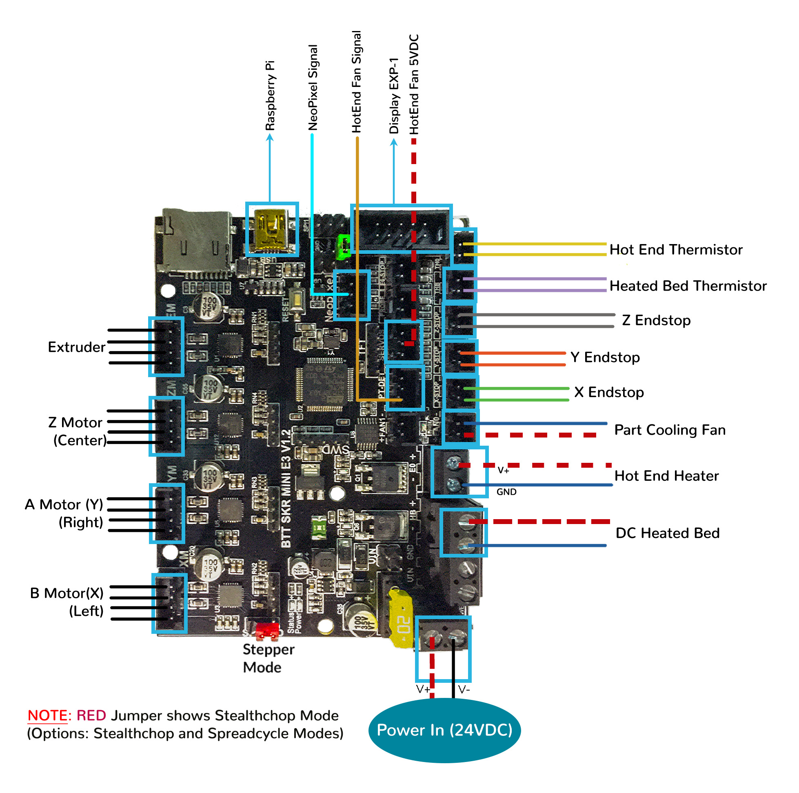
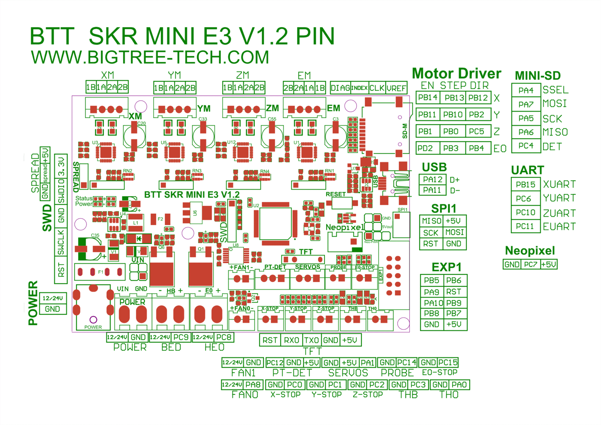

# Voron V0.1 - SKR mini E3 V1.2 Wiring

## Initial Removal of Jumpers

* There are only **two jumpers** on the SKR mini E3 V1.2 board.  The SPREAD jumper sets the board for Stealtchop or Spreadcycle mode, but this can also be set in the firmware.  The other jumper is called "NeoPWR" jumper.  See the next section about this jumper.

## Initial Preparation

* The NeoPWR jumper setting will decide the source of the SKR's 5V rail. The board's 5V rail can be sourced from the board itself or from an external DCDC bridge module.  One can purchase an external DCDC bridge module (sold separately) to power 5V NeoPixel LEDs.  This bridge module is called the "DCDC Mode V1.0" board. Since the Voron printer does not require the extra DCDC bridge module, set the NeoPWR jumper so that the board's 5V rail will be powered by the MCU.

* Set the on-board jumper, located at the position as shown by the **GREEN** jumper in the diagram below:

* Please take **NOTE** of the **RED jumper ("Stepper Mode" Jumper)**.  Please set this **RED Jumper** to the Stealthchop Mode or SpreadCycle Mode.

######  {#PREP_v01_SKR_mini_E3_V12}

## MCU

* Plug in stepper motors for X, Y, Z, and E in positions Xm, Ym, Zm, and Em
* Plug Hot End thermistor to thermistor TH0 (PA0)
* Plug Hot End heater in to E0 (PC8)
* Plug Hot End Fan Signal into PT-DET's Signal PIN (PC12)
* Plug Hot End Fan V+ (+5VDC) into SERVOS connector's 5V PIN
* Plug Part Cooling Fan in to FAN0 (PA8)
* Plug Bed Thermistor in to THB (PC3)
* Connect The DC bed to HB (PC9)
* Connect X end stop to X-STOP connector (PC0)
* Connect Y end stop to Y-STOP connector (PC1)
* Connect Z end stop to Z-STOP connector (PC2)
* Wire 24V and -V from DC power supply to VIN and GND on "POWER/DCIN" connector
* Connect USB Cable to your SKR mini E3, **but do not connect it yet to your Raspberry Pi**

### MCU Diagram

######  {#Voron01_Wiring_Diagram_SKR_mini_E3_V12}

* If you want to open the above diagram, in a new tab of your web browser, and have the ability to zoom and download the diagram in JPG format then [click here](./images/Voron0.1_Wiring_Diagram_SKR_mini_E3_V1.2_150.jpg){:target="_blank" rel="noopener"}

## Please Ensure the Heat Sinks are Installed Before Use

######  {#v01_SKR_E3_Mini_V12_heatsinks}

 

<!--### The Klipper Configuration file forSKR Mini E3 V1.2 board

The Klipper Configuration file from VoronDesign/Voron-0 GitHub Repo, Voron0.1 branch for SKR Mini E3 V1.2 board is [located here](https://github.com/VoronDesign/Voron-0/blob/Voron0.1/Firmware/xxxxxxxxxxxxxxxsw_skr_mini_e3_v12_config.cfg)
-->

## Color PIN Diagram for SKR Mini E3 V1.2

For reference, here is the Color PIN diagram for the SKR mini E3 V1.2

######  {#v01_SKR_mini_E3_V12_Color_PIN_diagram}

* If you want to open the above diagram, in a new tab of your web browser, and have the ability to zoom and download the diagram in PDF format then [click here](./images/SKR_mini_E3_V1.2_Color_PIN_diagram_300.pdf){:target="_blank" rel="noopener"}

* If you want to open the above diagram, in a new tab of your web browser, and have the ability to zoom and download the diagram in JPG format then [click here](./images/SKR_mini_E3_V1.2_Color_PIN_diagram_300.jpg){:target="_blank" rel="noopener"}

## Original SKR Mini E3 V1.2 Pinout

For reference, here is the original pinout of the SKR mini E3 V1.2

* Note: If you see a conflict between the original pinout and any other source, please refer back to the [BigTreeTech SKR mini E3 V1.2 schematic diagram](<./images/BTT SKR mini E3 V1.2sch.pdf>){:target="_blank" rel="noopener"}

######  {#v01_miniE3-V12-pinout}

* If you want to open the above diagram, in a new tab of your web browser, and have the ability to zoom and download the diagram in PDF format then [click here](<./images/BTT SKR MINI E3 V1.2PIN.pdf>){:target="_blank" rel="noopener"}

### The BTT's GitHub Repo for the BTT SKR mini E3 V1.2 Board

*  BTT's documentation for BTT SKR mini E3 V1.2 board is [located here](https://github.com/bigtreetech/BIGTREETECH-SKR-mini-E3/tree/master/hardware/BTT%20SKR%20MINI%20E3%20V1.2){:target="_blank" rel="noopener"}

## After I have Wired up the MCU Board, What Comes Next?

1. Once the MCU board is wired up and wire management has been performed, the next step is to install Mainsail/Fluidd or Octoprint, please see [The Build ═► Software Installation](../../build/software/index#software-installation){:target="_blank" rel="noopener"}

2. Once Mainsail/Fluidd or Octoprint has been installed, the next step is to **compile and install** the Klipper Firmware, please see [The Build ═► Software Installation -> Firmware Flashing(Header) -> SKR mini e3 V1.2](../../build/software/miniE3_v12_klipper#skr-mini-e3-v12-klipper-firmware){:target="_blank" rel="noopener"}

3. Once the MCU board has the Klipper Firmware Installed, the next step is to **create** the Klipper Config file (printer.cfg);

    * Please use the Color PIN Diagrams, [displayed above](#v01_SKR_mini_E3_V12_Color_PIN_diagram), as a source of information;

    * Please consult [The Build ═► Software Configuration](../../build/software/configuration#software-configuration){:target="_blank" rel="noopener"} on how to edit the Klipper Config file.

4. After **creating** the Klipper Config file (printer.cfg), the next step is to check all the Motors and the mechanics of the Voron printer, please see [The Build ═► Initial Startup Checks](../../build/startup/index#initial-startup-checks){:target="_blank" rel="noopener"}