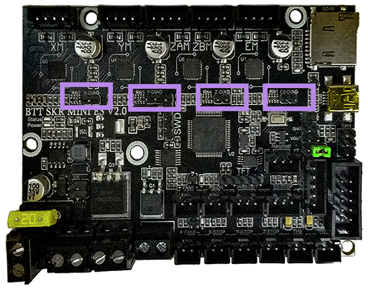
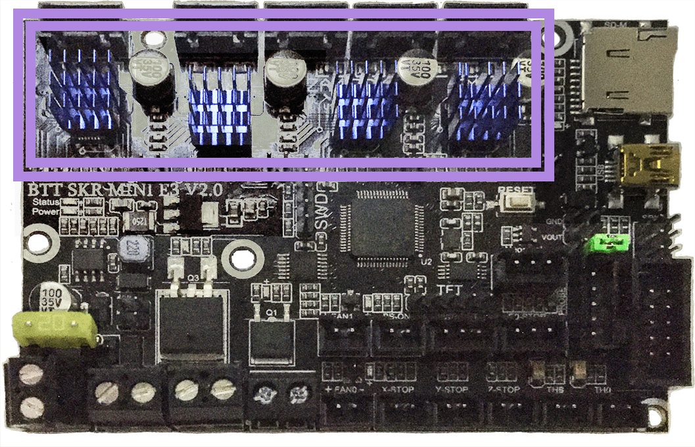
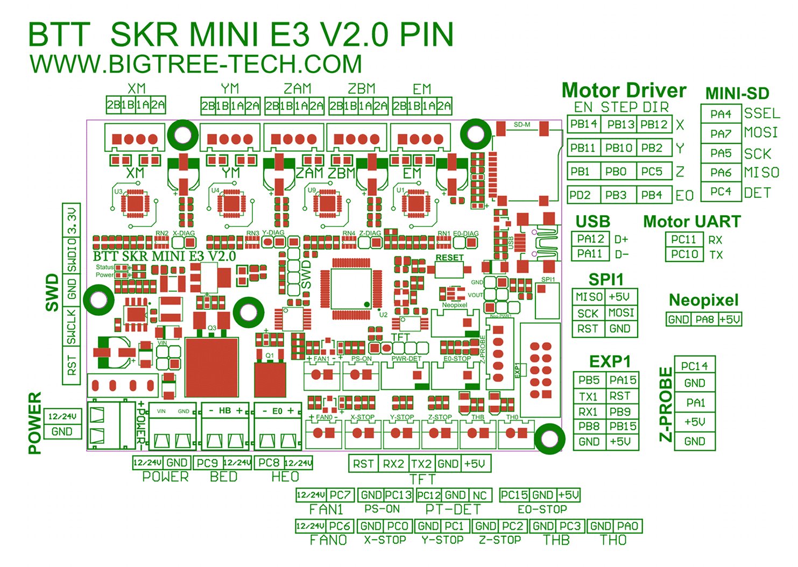

# Voron V0.1 - SKR mini E3 V2.0 Wiring

## Initial Removal of Jumpers

* There is only **one jumper** on the SKR mini E3 V2.0 board.  This jumper will be set in the next step.

## Initial Preparation

* Set the on-board jumper, located at the position as shown by the **GREEN** jumper in the diagram below:

######  {#PREP_v01_SKR_mini_E3_V2.0}

## MCU

* Plug in stepper motors for X, Y, Z, and E in positions Xm, Ym, ZAm, and Em
* Plug Hot End thermistor to thermistor TH0 (PA0)
* Plug Hot End heater in to E0 (PC8)
* Plug Hot End Fan Signal into FAN1's Signal PIN (PC7)
* Plug Hot End Fan V+ (+5VDC) into Z-Probe connector's 5V PIN
* Plug Part Cooling Fan in to FAN0 (PC6)
* Plug Bed Thermistor in to THB (PC3)
* Connect The DC bed to HB (PC9)
* Connect X end stop to X-STOP connector (PC0)
* Connect Y end stop to Y-STOP connector (PC1)
* Connect Z end stop to Z-STOP connector (PC2)
* Wire 24V and -V from DC power supply to VIN and GND on "POWER/DCIN" connector
* Connect USB Cable to your SKR mini E3, **but do not connect it yet to your Raspberry Pi**

### MCU Diagram

######  {#Voron0.1_Wiring_Diagram_SKR_mini_E3_V20}

* If you want to open the above diagram, in a new tab of your web browser, and have the ability to zoom and download the diagram in JPG format then [click here](./images/Voron0.1_Wiring_Diagram_SKR_mini_E3_V2.0.jpg){:target="_blank" rel="noopener"}

## Please Ensure the Heat Sinks are Installed Before Use

######  {#v01_SKR_mini_E3_V2.0_heatsinks}

### The Klipper Configuration file for SKR mini E3 V2.0 Board

The Klipper Configuration file from VoronDesign/Voron-0 GitHub Repo, Voron0.1 branch for SKR mini E3 V2.0 board is [located here; Select "V0 SKR mini e3 2.0"](../../build/software/configuration#software-configuration){:target="_blank" rel="noopener"}

## Color PIN Diagram for SKR Mini E3 V2.0

For reference, here is the Color PIN diagram for the SKR mini E3 V2.0

######  {#v01_skr_mini_E3_V2.0_Color_PIN_diagram}

* If you want to open the above diagram, in a new tab of your web browser, and have the ability to zoom and download the diagram in PDF format then [click here](./images/SKR_mini_E3_V2.0_Color_PIN_diagram_300.pdf){:target="_blank" rel="noopener"}

* If you want to open the above diagram, in a new tab of your web browser, and have the ability to zoom and download the diagram in JPG format then [click here](./images/SKR_mini_E3_V2.0_Color_PIN_diagram_300.jpg){:target="_blank" rel="noopener"}

## Original SKR Mini E3 V2.0 Pinout

For reference, here is the original pinout of the SKR mini E3 V2.0

* Note: If you see a conflict between the original pinout and any other source, please refer back to the [BigTreeTech SKR mini E3 V2.0 schematic diagram](<./images/BTT SKR MINI E3 V2.0SCHpdf.PDF>){:target="_blank" rel="noopener"}

######  {#v01_miniE3-v20-pinout}

* If you want to open the above diagram, in a new tab of your web browser, and have the ability to zoom and download the diagram in PDF format then [click here](<./images/BTT SKR MINI E3 V2.0-PIN.pdf>){:target="_blank" rel="noopener"}

### The BTT's GitHub Repo for the SKR mini E3 V2.0

*  BTT's documentation for SKR mini E3 V2.0 board is [located here](https://github.com/bigtreetech/BIGTREETECH-SKR-mini-E3/tree/master/hardware/BTT%20SKR%20MINI%20E3%20V2.0){:target="_blank" rel="noopener"}

## After I have Wired up the MCU Board, What Comes Next?

1. Once the MCU board is wired up and wire management has been performed, the next step is to install Mainsail/Fluidd or Octoprint, please see [The Build ═► Software Installation](../../build/software/index#software-installation){:target="_blank" rel="noopener"}

2. Once Mainsail/Fluidd or Octoprint has been installed, the next step is to **compile and install** the Klipper Firmware, please see [The Build ═► Software Installation -> Firmware Flashing(Header) -> SKR mini e3 V2.0](../../build/software/miniE3_v20_klipper#skr-mini-e3-v20-klipper-firmware){:target="_blank" rel="noopener"}

3. Once the MCU board has the Klipper Firmware Installed, the next step is to **create/edit** the Klipper Config file (skr-mini-E3-v2.0.cfg rename it to printer.cfg) to ensure your Voron build matches your Klipper Config file, please see [the file located here; Select "V0 SKR mini e3 2.0"](../../build/software/configuration#software-configuration){:target="_blank" rel="noopener"};

    * Please use the Color PIN Diagrams, [displayed above](#v01_skr_mini_E3_V2.0_Color_PIN_diagram), as a source of information;

    * Please consult [The Build ═► Software Configuration](../../build/software/configuration#software-configuration){:target="_blank" rel="noopener"} on how to edit the Klipper Config file.

4. After **creating/editing** the Klipper Config file (skr-mini-E3-v2.0.cfg renamed to printer.cfg), the next step is to check all the Motors and the mechanics of the Voron printer, please see [The Build ═► Initial Startup Checks](../../build/startup/index#initial-startup-checks){:target="_blank" rel="noopener"}