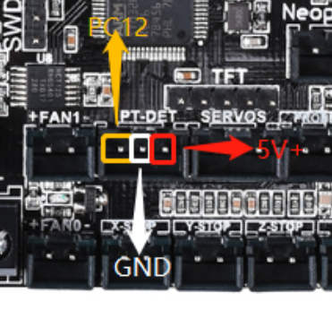
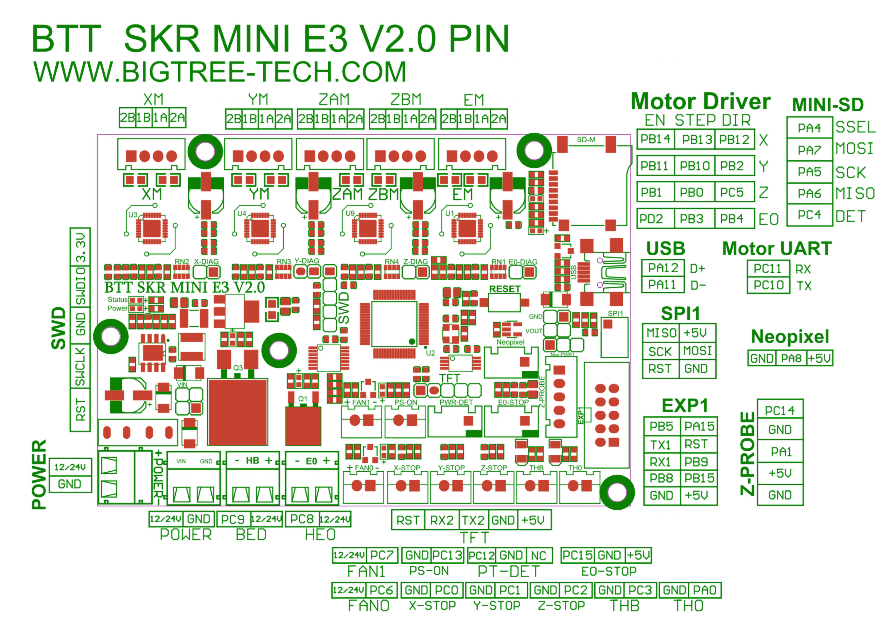

# Voron V0 - SKR mini E3 V2.0 Wiring

## MCU

* Plug in stepper motors for X, Y, Z, and E in positions Xm, Ym, ZAm, and Em
* Plug Hot End thermistor to thermistor TH0
* Plug Hot End heater in to E0
* Plug Hot End Fan in to FAN0
* Plug Part Cooling Fan in to HB
* Plug Bed Thermistor in to THB
* Connect SSR pins to PT-DET connector
  * Crydom SSR: SSR Input + => PC12, SSR Input => GND
  * MagicStudios / Knacro 1-Channel SSR: CH1 => PC12, DC- => GND, DC+ => NC
* Connect X end stop to X-STOP connector
* Connect Y end stop to Y-STOP connector
* Connect Z end stop to Z-STOP connector
* Wire 24V and -V from DC power supply to VIN and GND
* Connect USB Cable to your SKR mini E3, but do not connect it yet to your Raspberry Pi

### Wiring for MagicStudios / Knacro 1-Channel SSR

The MagicStudios / Knacro SSR requires 3 wires instead of the 2 referenced above.

## Mini E3 V2.0 Pinout

For reference, here is the pinout of the SKR mini E3 V2.0

