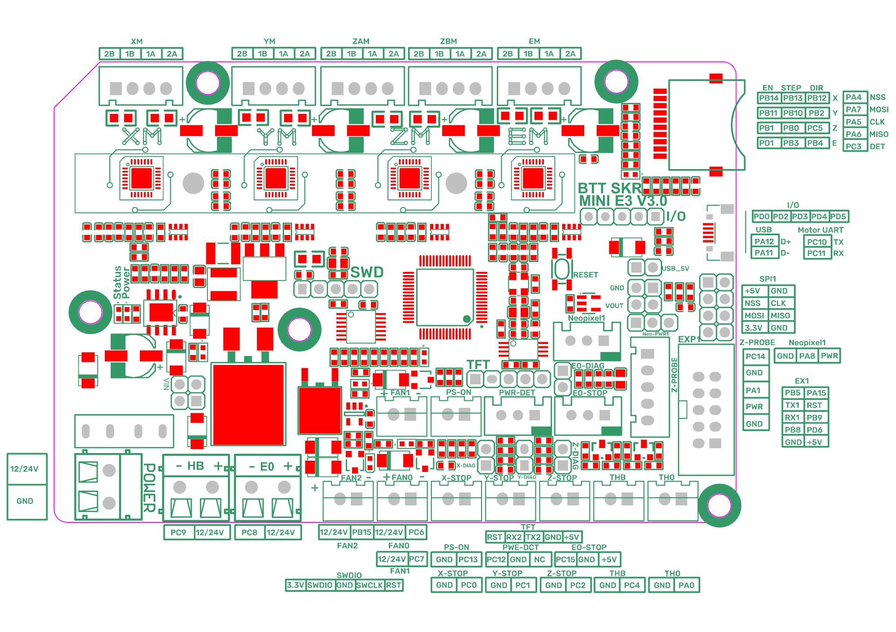

# Voron V0.1 - SKR mini E3 V3.0 Wiring

## MCU

#See the below diagram for connector locations.

* Plug in stepper motors for X, Y, Z, and E in positions XM, YM, ZAM, and EM
* Plug Hot End thermistor to thermistor TH0 (PA0)
* Plug Hot End heater in to E0 (PC8)
* Plug Hot End Fan in to FAN0 (PC6)- make sure JST connector polarity is correct.
* Plug Part Cooling Fan in to HB (PC9)- make sure JST connector polarity is correct.
* Plug Bed Thermistor in to THB (PC4)
* If using mains voltage to heat bed, connect SSR control pins to PWR-DET connector (PC12)
  * Crydom SSR: SSR Input + => PC12, SSR Input => GND
  * MagicStudios / Knacro 1-Channel SSR: CH1 => PC12, DC- => GND, DC+ => NC
* Connect X end stop to X-STOP connector (PC0)
* Connect Y end stop to Y-STOP connector (PC1)
* Connect Z end stop to Z-STOP connector (PC2)
* Wire V+ and V- from the DC power supply to VIN and GND. Double check the polarity of your connections.
* Connect USB Cable to your SKR mini E3, but do not connect it yet to your Raspberry Pi

