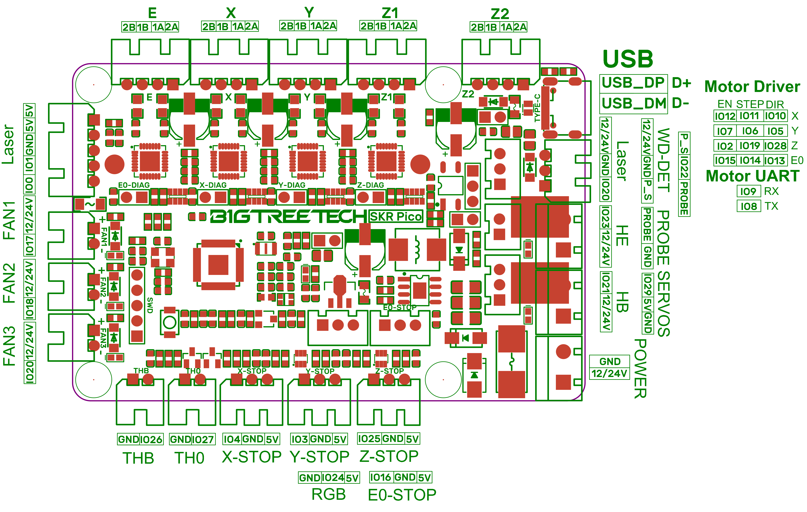

# Voron V0.1 - SKR Pico Wiring

## Initial Removal of Jumpers

* The BTT SKR Pico will arrive without any jumpers being set.

## Initial Preparation - Set Jumpers

* **All** Jumpers should be removed from the SKR Pico board.

## MCU

* Plug in stepper motors for X, Y, Z, and E in positions X, Y, Z1, and E
* Plug Hot End thermistor to thermistor TH0
* Plug Hot End heater in to HE
* Plug Hot End Fan Signal in to FAN2
* Plug Hot End Fan V+ (+5VDC) to "LASER" connector's 5V PIN
* Plug Part Cooling Fan in to FAN1
* Plug Bed Thermistor in to THB
* Connect The DC bed to HB
* Connect X end stop to X-STOP connector
* Connect Y end stop to Y-STOP connector
* Connect Z end stop to Z-STOP connector
* Wire 24V and -V from DC power supply to POWER
* Connect USB Cable to your SKR Pico, **but do not connect it yet to your Raspberry Pi**

### MCU Diagram

######  {#Voron0.1_Wiring_Diagram_SKR_PICO}

* Downloadable BTT SKR Pico's MCU Wiring Diagram in .jpg format is [located here](./images/Voron0.1_Wiring_Diagram_SKR_PICO_V1.0.jpg)

### The Klipper Configuration file for SKR Pico board
   
The Klipper Configuration file from VoronDesign/Voron-0 GitHub Repo, Voron0.1 branch for SKR Pico board is [located here](https://github.com/VoronDesign/Voron-0/blob/Voron0.1/Firmware/skr-pico-v1.0.cfg)

## Color PIN Diagram for SKR Pico

For reference, here is the Color PIN diagram for the SKR Pico
   

######  {#SKR_PICO_V1.0_Color_PIN_diagram}

* Downloadable BTT SKR Pico Color PIN diagram in .pdf format is [located here](./images/SKR_PICO_V1.0_Color_PIN_diagram.pdf)

* Downloadable BTT SKR Pico Color PIN diagram in .jpg format is [located here](./images/SKR_PICO_V1.0_Color_PIN_diagram.jpg)

 

    The .PDF file will not receive a public URL until web page is deployed.

    The public Jupyter Notebook's "nbviewer" process only accepts 

    "public URLs" for .pdf files as an input parameter.

    Only call the Jupyter Notebook's nbviewer process when you are not running this web page locally.









* Downloadable and LOCAL ZOOM capable web display for BTT BTT SKR Pico Color PIN diagram is [located here]({{ colorfilename | prepend:site.url }}) 



* Downloadable and ZOOM capable web display for BTT BTT SKR Pico Color PIN diagram is [located here]({{ nbviewer_url | append: "blob/main" | append: colorfilename }}) 



## Original SKR Pico Pinout
   
For reference, here is the original pinout of the SKR Pico

* Note: If you see a conflict between the original pinout and any other source, please refer back to the [BigTreeTech SKR Pico schematic diagram](https://github.com/bigtreetech/SKR-Pico/blob/master/Hardware/BTT%20SKR%20Pico%20V1.0-SCH.pdf)
   

######  {#skr-pico-pinout}

### The BTT's GitHub Repo for the SKR Pico Board

* BigTreeTech documentation for SKR Pico board is [located here](https://github.com/bigtreetech/SKR-Pico)

* Downloadable and ZOOM capable web display for BTT's SKR Pico original pinout is [located here](http://nbviewer.jupyter.org/github/bigtreetech/SKR-Pico/blob/master/Hardware/BTT%20SKR%20Pico%20V1.0-PIN.pdf)