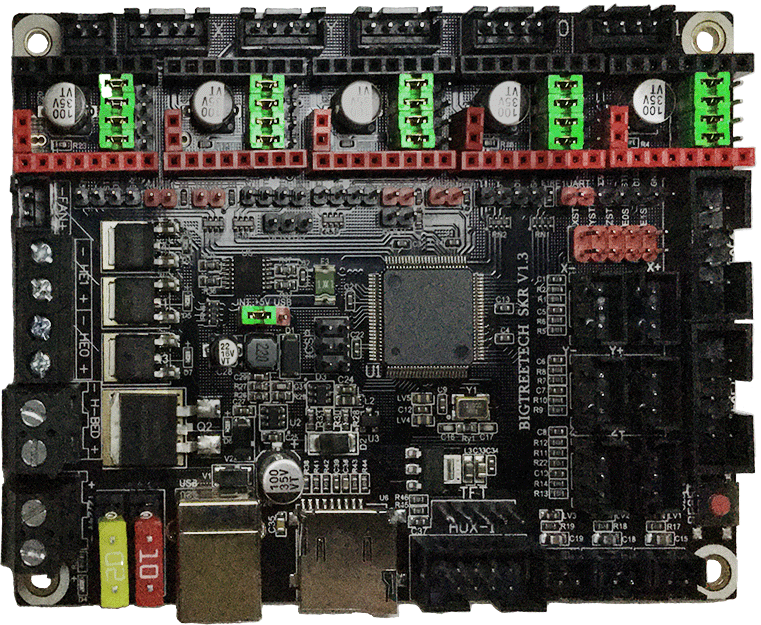
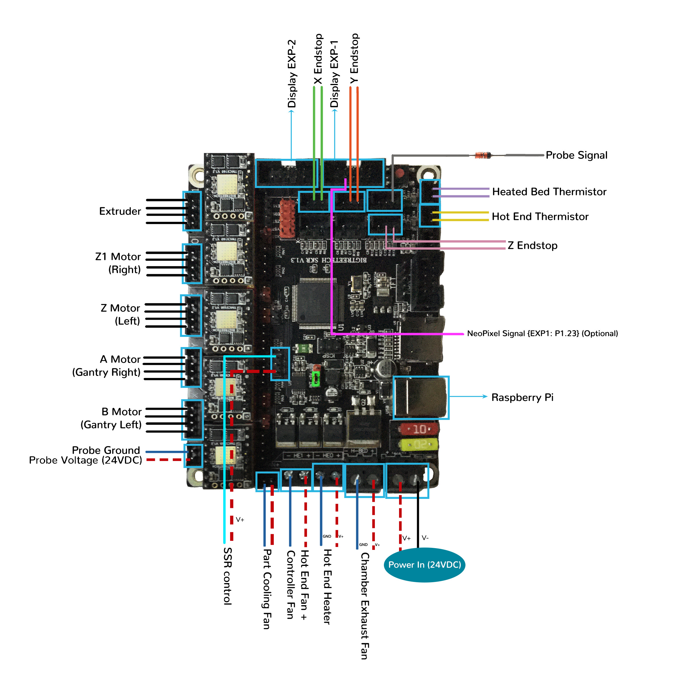
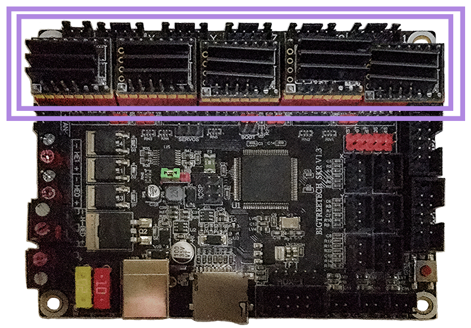
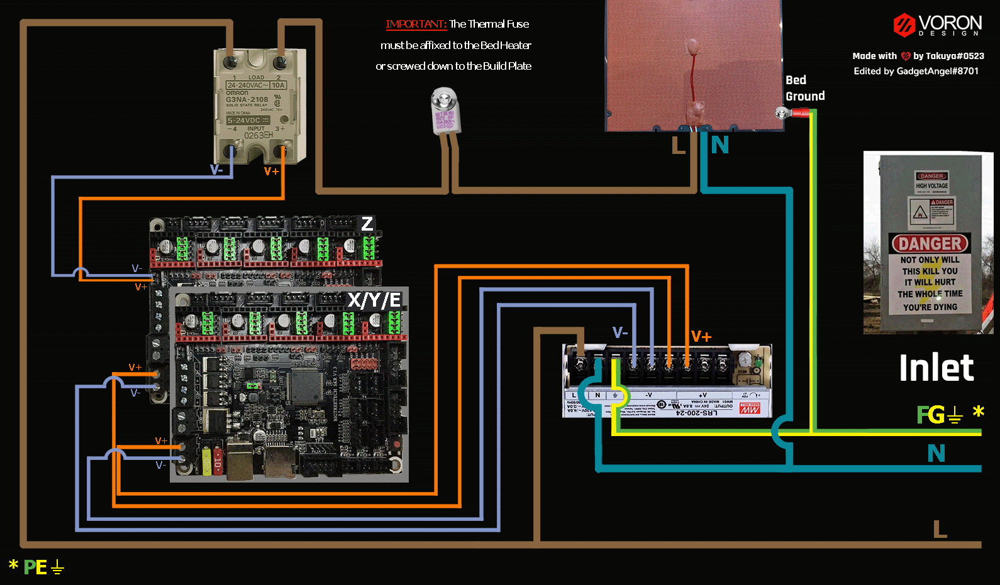

# Voron V1 - SKR V1.3: TMC2100, TMC2130, TMC5160, TMC5161, TMC5160HV, TMC5160_PRO

## Initial Removal of Jumpers

We have no idea what state your board is in when you start this process.  Someone could have moved jumpers around already.  But since we are here, on the SPI end of the site, then I assume that you might want to look at the next section **before** removing **all the jumpers** because if all the jumpers are already set for SPI mode then removing them and placing them right back in would be a waste of your valuable time.

**If one does not understand what I mean by "if the jumpers are set for SPI" then I would recommend that removing all the jumpers would be the place to start.**

Remove **all YELLOW** on-board jumpers, located at the positions shown below:

######  {#SKR_V13_PREP-Removal_SPI_v1}

## Initial Preparation for SPI Mode - Set Jumpers

* Set the on-board jumpers, located at the positions as shown by the **GREEN** jumpers in the diagram below:

######  {#SKR_V13_in_SPI_mode_PREP_150_v1}

* If you want to open the above picture, in a new tab of your web browser, then [click here](./images/SKR_V1.3_in_SPI_mode_PREP_150.png){:target="_blank" rel="noopener"}

## Voltage Selection Header and Other Headers

* **Set the USB-PWR jumper to the INT position (as shown in the PURPLE box)** to avoid the interaction between the USB 5V of Raspberry Pi and the DC-DC 5V of the motherboard.

* Ensure **all of "DIAG Jumpers" or "ST Jumper Block" (shown in the BLUE box) are removed**, since the Voron printer does not use sensorless homing.

######  {#SKR_V1.3_in_UART_voltageselect_v1}

* If you want to open the above picture, in a new tab of your web browser, then [click here](./images/SKR_V1.3_in_UART_voltageselect.png){:target="_blank" rel="noopener"}

## Stepper Motor Drivers
* Inspect the stepper motor drivers for left over rosin, and clean with IPA, if needed
* Install heat sinks on all stepper motor drivers

## MCU in SPI Mode

* - [ ] Place stepper drivers for X in positions X (driver socket)
* - [ ] Place stepper drivers for Y in positions Y (driver socket)
* - [ ] Place stepper drivers for Z in positions Z (driver socket)
* - [ ] Place stepper drivers for Z1 in positions E0 (driver socket)
* - [ ] Place stepper drivers for E in positions E1 (driver socket)
* - [ ] Plug in stepper motors for X in positions X (motor connector)
* - [ ] Plug in stepper motors for Y in positions Y (motor connector)
* - [ ] Plug in stepper motors for Z in positions Z (motor connector)
* - [ ] Plug in stepper motors for Z1 in positions E0 (motor connector)
* - [ ] Plug in stepper motors for E in positions E1 (motor connector)
* - [ ] Plug Hot End thermistor to thermistor TH0 (P0.24)
* - [ ] Plug Hot End heater in to HE0 (P2.7)
* - [ ] Plug Hot End Fan + Controller Fan in to HE1 (P2.4)
* - [ ] Plug Heated Bed thermistor in to TB (P0.23)
* - [ ] Plug SSR Control for Heated Bed in to Servos (P2.0)
* - [ ] Plug Part Cooling Fan in to Fan (P2.3)
* - [ ] Connect X end stop to X+ connector (P1.28)
* - [ ] Connect Y end stop to Y+ connector (P1.26)
* - [ ] Connect Z end stop to Z- connector (P1.25)
* - [ ] Plug Probe PWR and GND into DCOUT next to the X motor connector
* - [ ] Plug Probe Signal (with&nbsp;**BAT85 diode**) in to Z+ (P1.24)
* - [ ] Plug in Chamber Exhaust Fan in to H-BED (P2.5)
* - [ ] Plug display wires in to EXP1 and EXP2
* - [ ] Wire 24V and 0V from DC power supply to DCIN/Power In
* - [ ] Connect USB Cable to your SKR V1.3,&nbsp; **but do not connect it yet to your Raspberry Pi**

BAT85
: a Schottky barrier diode. BAT85 is needed to protect the SKR board (MCU board) from being fried.  An Inductive Probe device (Omron TL-Q5MC2; Omron TL-Q5MC2-Z or Panasonic GX-HL15BI-P) communicates at a much higher voltage level (10V - 30V) then the MCU board.  The BAT85 is used to protect the input signal PIN of the MCU board; without the BAT85 the MCU board will be damaged.  If two BAT85s are used in series, the circuit will protect the MCU board and still allow the inductive probe to function properly. [For more information, click here](./index#bat85-diode){:target="_blank" rel="noopener"}

### MCU in SPI Mode Wiring Diagram

######  {#V1_Wiring_Diagram_BTT_SKRV13_XYE_in_SPI_mode}

* If you want to open the above diagram, in a new tab of your web browser, and have the ability to zoom and download the diagram in JPG format then [click here](./images/V1_Wiring_Diagram_BTT_SKRV1.3_XYE_in_SPI_mode.jpg){:target="_blank" rel="noopener"}

## Please Ensure the Heat Sinks are Installed Before Use

Note on the Orientation of the Stepper Motor Driver's Heat Sinks
: Place the heat sinks for the stepper motor drivers so that the orientation of the fins on the heat sinks are parallel to the air flow from the controller fans once the MCU board is installed on the DIN rail. Ensure the heat sinks are **not touching** the solder joints located on the top of the step stick. Please note, that your placement of heat sinks may be different from the orientation shown below.

### MCU with Heat Sinks Installed

######  {#V1_SKR_V13_in_SPI_mode_Heatsinks}

## Raspberry Pi

### Power
* The BTT SKR V1.3 board is **NOT capable of providing 5V power** to run your Raspberry Pi.

## Setting up UART Communications with the Raspberry Pi

* see [the Raspberry Pi Section](./skrv13_RaspberryPi#raspberry-pi){:target="_blank" rel="noopener"}

## SSR Wiring (Board Shown is in SPI mode)

* Wire colors will vary depending on your locale.

######  {#btt-SKRV13inSPI-ssr-wiring}

* If you want to open the above diagram, in a new tab of your web browser, and have the ability to zoom and download the diagram in PNG format then [click here](./images/btt-SKRV1.3inSPI-ssr-wiring.png){:target="_blank" rel="noopener"}

### The Klipper Configuration file for SKR V1.3 board

The Klipper Configuration file from VoronDesign/Voron-1/Voron1.8 GitHub Repo for SKR V1.3 board is [located here;](https://raw.githubusercontent.com/VoronDesign/Voron-1/Voron1.8/Firmware/klipper_configurations/SKR_1.3/Voron_1_SKR_13_Config.cfg){:target="_blank" rel="noopener"}

## URL Resources Links for the SKR V1.3 (PIN Diagrams and Repo)

* see [The SKR V1.3 Resource Section](./skr_v13_Resources#color-pin-diagram-for-skr-v13){:target="_blank" rel="noopener"}

## After I have Wired up the MCU Board, What Comes Next?

1. Once the MCU board is wired up and wire management has been performed, the next step is to install Mainsail/Fluidd or Octoprint, please see [The Build ═► Software Installation](../../build/software/index#software-installation){:target="_blank" rel="noopener"}

2. Once Mainsail/Fluidd or Octoprint has been installed, the next step is to **compile and install** the Klipper Firmware, please see [The Build ═► Software Installation -> Firmware Flashing(Header) -> SKR 1.3](../../build/software/skr13_klipper#skr-1314-klipper-firmware){:target="_blank" rel="noopener"}

3. Once the MCU board has the Klipper Firmware Installed, the next step is to **create/edit** the Klipper Config file (Voron_1_SKR_13_Config.cfg rename it to printer.cfg) to ensure your Voron build matches your Klipper Config file, please see [the file located here](https://raw.githubusercontent.com/VoronDesign/Voron-1/Voron1.8/Firmware/klipper_configurations/SKR_1.3/Voron_1_SKR_13_Config.cfg){:target="_blank" rel="noopener"};

    * Please use the Color PIN Diagrams, [displayed above](./skr_v13_Resources#SKRV13_Colored_PIN_Diagram){:target="_blank" rel="noopener"}, as a source of information;

    * Please consult [The Build ═► Software Configuration](../../build/software/configuration#software-configuration){:target="_blank" rel="noopener"} on how to edit the Klipper Config file.

4. After **creating/editing** the Klipper Config file (Voron_1_SKR_13_Config.cfg renamed to printer.cfg), the next step is to check all the Motors and the mechanics of the Voron printer, please see [The Build ═► Initial Startup Checks](../../build/startup/index#initial-startup-checks){:target="_blank" rel="noopener"}