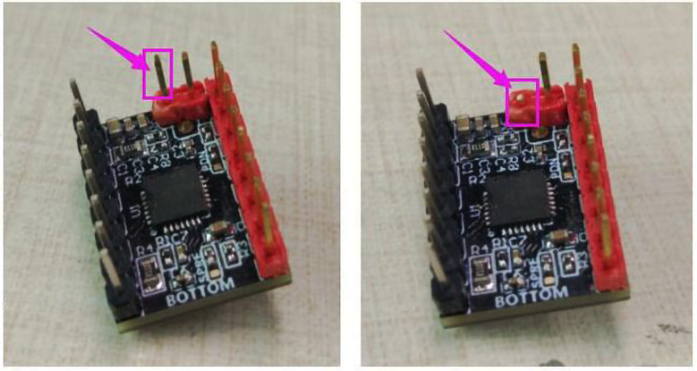
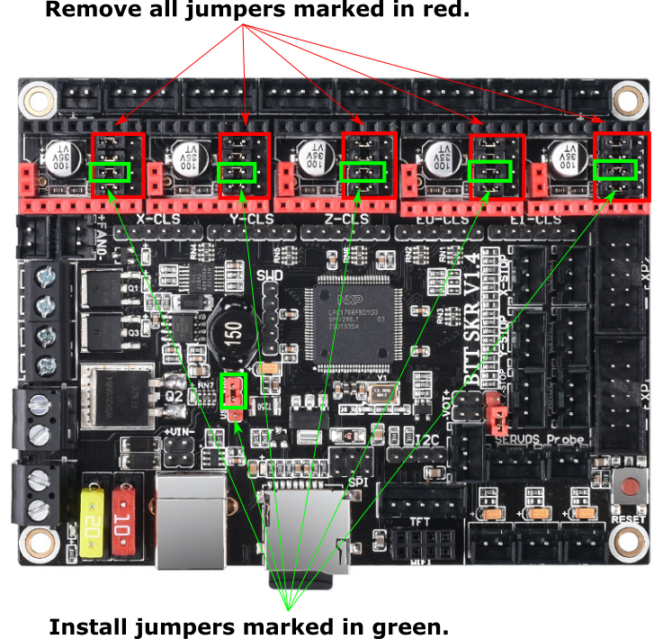
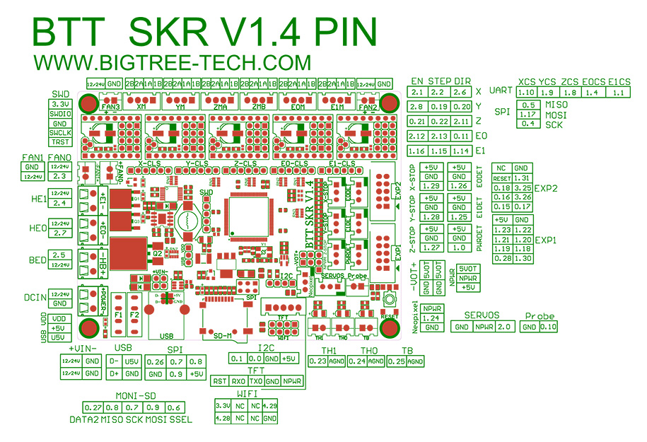

# Voron V1 - SKR 1.4 Wiring

## Initial Preparation

* If using the TMC2209 stepper drivers, use a small pair of wire cutters and remove the pin marked in purple.  This is to disable sensorless homing which is not needed for the V2.

* Reconfigure the on-board jumpers as shown.

## MCU

* Place stepper drivers for X, Y, Z, Z1, and E in positions X, Y, Z, E0, and E1
* Plug in stepper motors for X, Y, Z, Z1, and E in positions X, Y, Z, E0, and E1 (one of the Z connectors will be empty)
* Plug Hot End thermistor to thermistor TH0 (P0.24)
* Plug Hot End heater in to HE0 (P2.7)
* Plug Hot End Fan + Controller Fan in to HE1 (P2.4)
* Plug Bed Heater thermistor in to TB (P0.23)
* Plug SSR Control for Heated Bed in to Neopixel (P1.24)
* Plug Part Cooling Fan in to Fan (P2.3)
* Connect X end stop to X-STOP connector (P1.28)
* Connect Y end stop to Y-STOP connector (P1.26)
* Connect Z end stop to Z-STOP connector (P1.25)
* Plug Probe PWR and GND into FAN2
* Plug Probe Signal (with BAT85 diode) in to Probe (P0.10)
* Plug in Exhaust Fan in to HB (P2.5)
* Plug display wires in to EXP1 and EXP2
* Wire 24V and 0V from DC power supply to Power In
* Connect USB Cable to your SKR 1.4, but do not connect it yet to your Raspberry Pi

## SKR 1.4 Pinout

For reference, here is the pinout of the SKR 1.4

