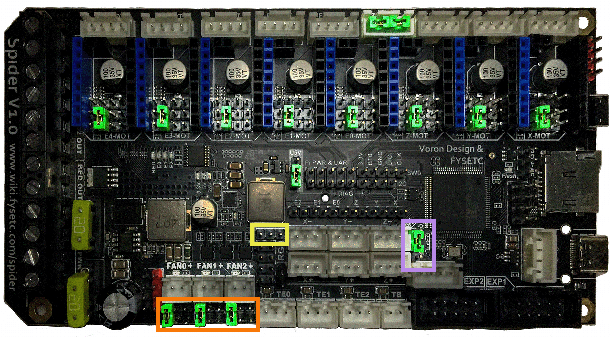
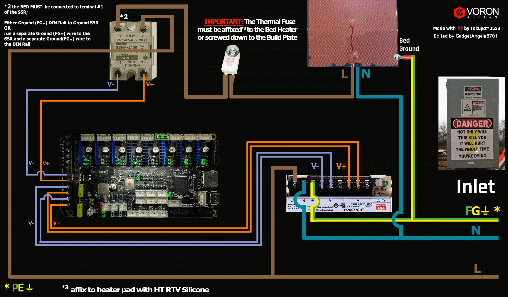

# Voron V1 - Fysetc Spider V1.1 (TMC2208, TMC2209, TMC2225, TMC2226) Wiring

## Initial Removal of Jumpers

* Remove **all YELLOW** on-board jumpers, located at the positions shown below:

* __NOTE:__ The Fysetc Spider V1.0 board has jumpers located inside the endstop connectors when the board is first unpacked, **remove them**.

######  {#FYSETC_Spider_V10_PREP-Removal_v1_uart}

## Initial Preparation - Set Jumpers

* Set the on-board jumpers, located at the positions as shown by the **GREEN** jumpers in the diagram below:

######  {#FYSETC_Spider_V10_in_UART_Mode_PREP_v1}

* If you want to open the above picture, in a new tab of your web browser, then [click here](./images/FYSETC_Spider_V1.0_in_UART_mode_PREP.png){:target="_blank" rel="noopener"}

## USB-PWR Selection Header and DIAG Headers

* **Set the USB-PWR jumper to the +5V position (as shown in the PURPLE box)** to avoid the interaction between the USB 5V of Raspberry Pi and the DC-DC 5V of the motherboard. The top pin on this header is labeled "U5V", and the middle and bottom pins do not have labels, but the Fysetc Spider V1.0 schematic diagram labels the bottom pin as "+5V".  Ensure the USB-PWR jumper is set as shown in the diagram below.

* Ensure **all of "DIAG Jumpers" (shown in the BLUE box) are removed** to avoid the influence of TMC2209 DIAG on the endstop.

__IMPORTANT:__ **Double check all the** __GREEN__ **jumpers are set appropriately, especially the jumpers called out by the _COLORED BOXES_, BEFORE the power supply is connected.**

######  {#FYSETC_Spider_V10_in_UART_Mode_PREP2_v1}

* If you want to open the above picture, in a new tab of your web browser, then [click here](./images/FYSETC_Spider_V1.0_in_UART_mode_PREP2.png){:target="_blank" rel="noopener"}

## (FAN & PROBE) Voltage Selection Headers

* In the diagram below, the **YELLOW box** indicates the RGB Block header's Jumper is not present, but this header can be used to run fans. Other headers that can be used with fans (as shown by a **ORANGE box**) have their Fan Voltage Selections headers which are located below the FAN0, FAN1 and FAN2 connectors. The **GREEN** jumpers are set for a fan voltage of 24VDC.

    * __IMPORTANT:__ **If fans that use 5VDC or 12VDC are used, please take NOTE of these "fan voltage selection headers" and set the jumpers to the appropriate jumper position so that the correct fan voltage will be produced to run the 5VDC or 12VC fan.  If the fan voltage selection jumper is set for 24VDC and a 5VDC/12VDC fan is connected to it, the Fysetc Spider board will be damaged.**

* In the diagram below, the **PURPLE box** to the right of Z- connector, is the header for setting the PROBE voltage. The **GREEN** jumper sets the PROBE voltage for 24VDC.  If a PROBE voltage of 5V is desired, this jumper needs to be changed.

    * __IMPORTANT:__ **If the voltage required by the PROBE device does not match the voltage selected by the "probe voltage selection Jumper" then the Fysetc Spider board could be damaged.**

* __IMPORTANT:__ **Double check all the** __GREEN__ **jumpers BEFORE the power supply is connected, to ensure these jumpers are set appropriately.**

## (FAN & PROBE) Voltage Selection Diagram

######  {#FYSETC_Spider_V10_inUARTMode_VoltageSelect_v1}

* If you want to open the above picture, in a new tab of your web browser, then [click here](./images/FYSETC_Spider_V1.0_inUARTMode_VoltageSelect_150.png){:target="_blank" rel="noopener"}

## Stepper Drivers
* - [ ] If using Fysetc drivers, inspect for left over rosin, and clean with IPA if need
* _**NOTE: if the board has been powered, ensure that motor power caps are fully drained before inserting stepper drivers: Temporarily connect a 100K resistor between VMOT+ and VMOT- to safely drain the capacitors**_ See [Fysetc Spider 3.3v issue](https://github.com/FYSETC/FYSETC-SPIDER/blob/main/Spider%203.3v%20issue.md){:target="_blank" rel="noopener"}
* - [ ] Install step drivers in all slots except Z-MOT, E2-MOT and E3-MOT
* - [ ] Before installing heat sinks on to the stepper motor drivers,&nbsp;[please read this](#please-ensure-the-heat-sinks-are-installed-before-use)
* - [ ] Install heat sinks on all stepper motor drivers

## MCU Wiring

* - [ ] Connect 24V Power from the PSU to PWR IN and BED_POWER/DCIN
* - [ ] Connect stepper driver for the B Motor (gantry left) into position X-MOT (driver socket).
* - [ ] Plug in stepper motor for the B Motor (gantry left) into position X-MOT (motor connector).
* - [ ] Connect stepper driver for the A Motor (gantry right) into position Y-MOT (driver socket).
* - [ ] Plug in stepper motor for the A Motor (gantry right) into position Y-MOT (motor connector).
* - [ ] Connect stepper drivers for the Z into positions E0-MOT (driver socket).
* - [ ] Plug in stepper motors for the Z into positions E0-MOT (motor connectors).
* - [ ] Ensure that Z2-MOT motor connector has two jumpers set.  These jumpers allow the Z1-MOT connector to work properly.
* - [ ] Connect stepper drivers for the Z1 into positions E1-MOT (driver socket).
* - [ ] Plug in stepper motors for the Z1 into positions E1-MOT (motor connectors).
* - [ ] Connect stepper driver for the extruder motor into position E4-MOT (driver socket).
* - [ ] Plug in stepper motor for the extruder motor into position E4-MOT (motor connector).
* - [ ] Connect the hot end heater to E0 OUT (PB15)
* - [ ] Connect the chamber exhaust fan to E2 OUT (PB3)
* - [ ] Connect the bed SSR (DC Control Side) to BED OUT (PB4)
* - [ ] Connect the hot end fan to FAN0 (PB0)
* - [ ] Connect the part cooling fan to FAN1 (PB1)
* - [ ] Connect the controller fans to FAN2 (PB2)
* - [ ] Connect the hot end thermistor to TE0 (PC0)
* - [ ] Connect the bed thermistor to TB (PC3)
* - [ ] Connect the X endstop to X- (PB14)
* - [ ] Connect the Y endstop to Y- (PB13)
* - [ ] Connect the PROBE to Z+ (PA3)
* - [ ] Connect the Z endstop to Z- (PA0)
* if using a mini12864 display:
    1. - [ ] [complete the steps in the mini 12864 Display](#mini-12864-display)
    2. - [ ] connect to EXP1 & EXP2
* if using USB to communicate with Pi:
    1. - [ ] Connect USB Cable to the Spider board, but do not connect it yet to your Raspberry Pi
* if using UART (3-wire serial communication) with Pi:
    1. - [ ] [complete the steps for setting up UART serial communications with the Raspberry Pi](https://github.com/FYSETC/FYSETC-SPIDER/blob/main/firmware/Klipper/Connect%20RPI%20uart.md){:target="_blank" rel="noopener"}
    2. - [ ] Connect UART serial cable to the Spider board, but do not connect it yet to your Raspberry Pi

## MCU Wiring Diagram

######  {#V1_Wiring_Diagram_FYSETC_Spider_V10_in_UART_mode_v1}

* If you want to open the above diagram, in a new tab of your web browser, and have the ability to zoom and download the diagram in JPG format then [click here](./images/V1_Wiring_Diagram_FYSETC_Spider_V1.0_in_UART_mode_150.jpg){:target="_blank" rel="noopener"}

## Please Ensure the Heat Sinks are Installed Before Use

Note on the Orientation of the Stepper Motor Driver's Heat Sinks
: Place the heat sinks for the stepper motor drivers so that the orientation of the fins on the heat sinks are parallel to the air flow from the controller fans once the MCU board is installed on the DIN rail. Ensure the heat sinks are **not touching** the solder joints located on the top of the step stick. Please note, that your placement of heat sinks may be different from the orientation shown below.

## MCU with Heat Sinks Installed

######  {#V1_FYSETC_Spider_V10_in_UART_mode_with_Heatsinks_v1}

## Further Information about the PROBE port:

* see [the Fystec Spider Probe port section](./Fysetc_Spider_ProbePort#fysetc-spider-probe-port){:target="_blank" rel="noopener"}

## Powering the Raspberry Pi & Setting up UART Serial Communications with the Raspberry Pi

* see [the Fysetc Spider Raspberry Pi Section](./Fysetc_Spider_RaspberryPi#raspberry-pi){:target="_blank" rel="noopener"}

## SSR Wiring

* Wire colors will vary depending on your locale.

######  {#fysetc-spiderv10-ssr-UART-wiring_v1}

* If you want to open the above diagram, in a new tab of your web browser, and have the ability to zoom and download the diagram in PNG format then [click here](./images/fysetc-spiderv1.0inUART-ssr-wiring_150.png){:target="_blank" rel="noopener"}
   

## mini 12864 Display

* *spider Rev 1.0 only*: the EXP1 & EXP2 header labels are swapped. Connect  EXP1 (display) to EXP2(spider), and EXP2 (display) to EXP1 (spider).  On the Spider 1.1 or later: connect EXP1->EXP1, and EXP2->EXP2
* *Fysetc mini12864 only*:  components R1 and R4 must be removed from the board before connecting to the Spider.  Note: new displays are shipping with this step already complete, but this should be verified before connecting
* *BTT mini12864 only* remove components R1, and C6, and rotate the connectors 180 degrees
* See [the mini12864 guide](./mini12864_klipper_guide#mini12864-klipper-guide){:target="_blank" rel="noopener"}

## The Klipper Configuration file by Jaeger for Fysetc Spider V1.1 Board

The Klipper Configuration file by Jaeger for Fysetc Spider V1.1 board is called [Voron_1_Spider_11_Config.cfg](https://raw.githubusercontent.com/VoronDesign/VoronUsers/master/firmware_configurations/klipper/jaeger/Spider_1.1_V1.8/Voron_1_Spider_11_Config.cfg){:target="_blank" rel="noopener"};

## URL Resources Links for the Fystec Spider (PIN Diagrams and Repo)

* See [The Fysetc Spider V1.1 Resource Section](./Fysetc_Spider_Resources_v1#color-pin-diagram-for-fysetc-spider-v10){:target="_blank" rel="noopener"}

## Advanced Setup - Resource Link for SPI setup (TMC2100, TMC2130, TMC5160, TMC5161, TMC5160HV, TMC5160_PRO)

* see [The Fysetc Spider V1.1 SPI Setup Section](../../community/electronics/GadgetAngel/v1_spider_wiring#voron-v1---fysetc-spider-v11-wiring-for-both-spi-and-uart-modes){:target="_blank" rel="noopener"}

## After I have Wired up the MCU Board, What Comes Next?

1. Once the MCU board is wired up and wire management has been performed, the next step is to install Mainsail/Fluidd or Octoprint, please see [The Build ═► Software Installation](../../build/software/index#software-installation){:target="_blank" rel="noopener"}

2. Once Mainsail/Fluidd or Octoprint has been installed, the next step is to **compile and install** the Klipper Firmware, please see [The Build ═► Software Installation -> Firmware Flashing(Header) -> Fysetc Spider](../../build/software/spider_klipper#spider-klipper-firmware){:target="_blank" rel="noopener"}

3. Once the MCU board has the Klipper Firmware Installed, the next step is to **create/edit** the Klipper Config file by Jaeger (Voron_1_Spider_11_Config.cfg rename it to printer.cfg). Please see [the file located here](https://raw.githubusercontent.com/VoronDesign/VoronUsers/master/firmware_configurations/klipper/jaeger/Spider_1.1_V1.8/Voron_1_Spider_11_Config.cfg){:target="_blank" rel="noopener"};

    * Please use the Color PIN Diagrams, [displayed here](./Fysetc_Spider_Resources_v1#color-pin-diagram-for-fysetc-spider-v10){:target="_blank" rel="noopener"}, as a source of information;

    * Please consult [The Build ═► Software Configuration](../../build/software/configuration#software-configuration){:target="_blank" rel="noopener"} on how to edit the Klipper Config file.

4. After **creating/editing** the Klipper Config file (Voron_1_Spider_11_Config.cfg renamed to printer.cfg), the next step is to check all the Motors and the mechanics of the Voron printer, please see [The Build ═► Initial Startup Checks](../../build/startup/index#initial-startup-checks){:target="_blank" rel="noopener"}

