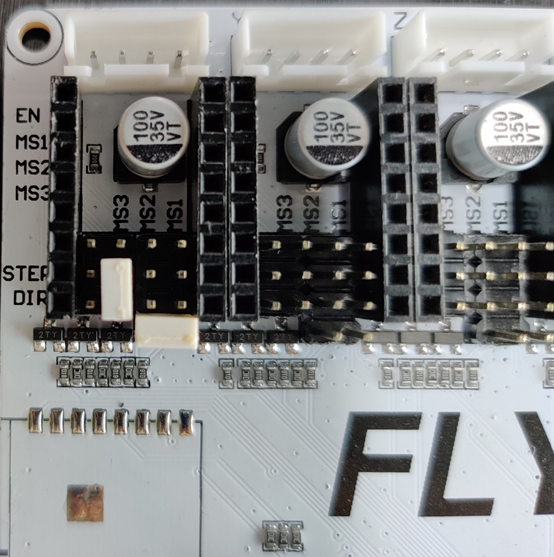
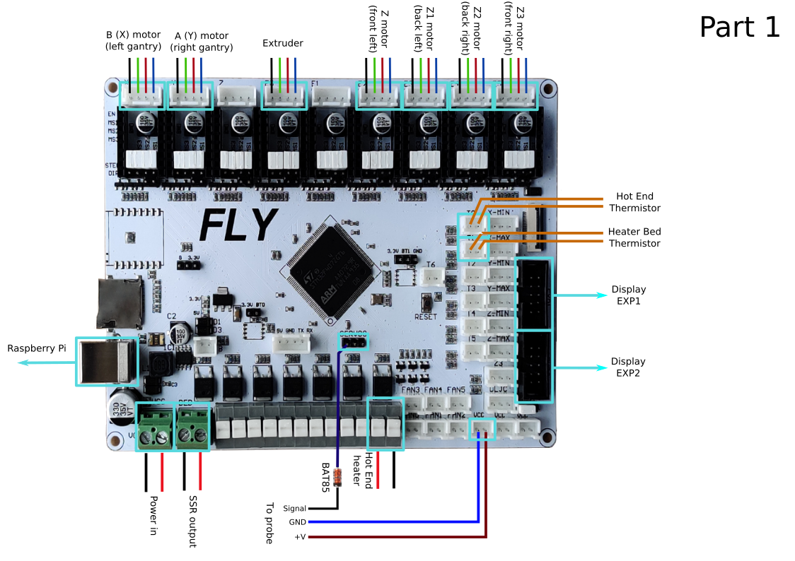
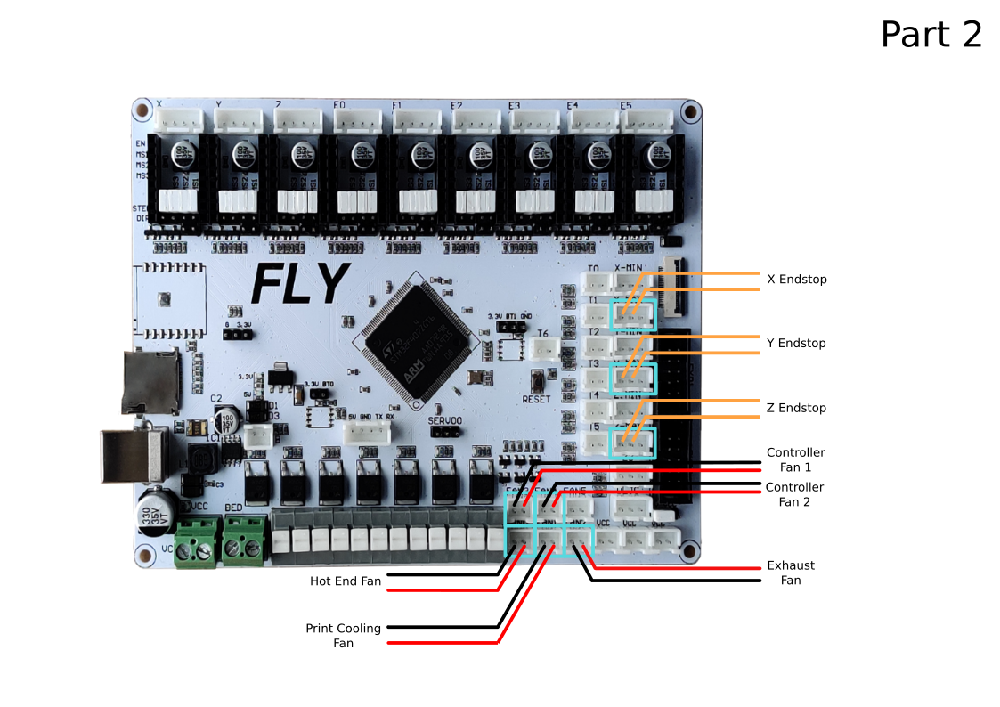
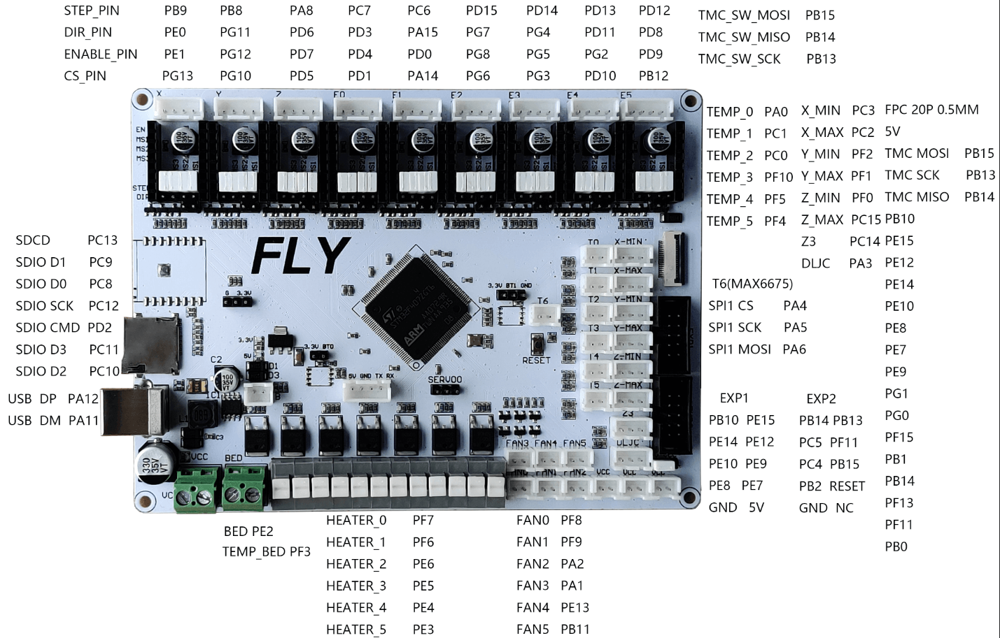
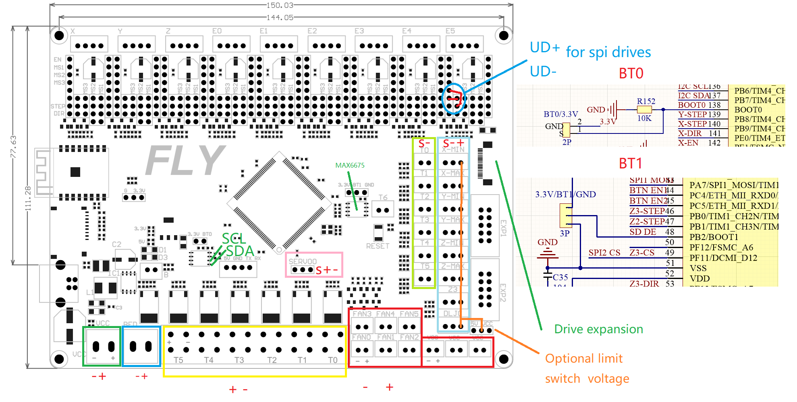

# Voron V2 - FLY FLYF407ZG Wiring

## Initial Preparation

* Remove all jumpers from the board.  Install just the jumpers as shown.

## MCU Part 1

* Place stepper drivers for X, Y, E, Z, Z1, Z2, and Z3 in positions X, Y, E0, E2, E3, E4, E5
* Plug in stepper motors for X, Y, E, Z, Z1, Z2, and Z3 in positions X, Y, E0, E2, E3, E4, E5
* Plug Hot End thermistor to thermistor T0
* Plug Hot End heater in to HEATER T0
* Plug Bed Heater thermistor in to T1
* Plug SSR Control for Heated Bed in to BED
* Plug Probe PWR and GND into VCC
* Plug Probe Signal (with BAT85 diode) in to SERVO0, pin 1 (toward USB)
* Wire 24V and 0V from DC power supply to Power In
* Connect USB Cable to your SKR 1.4, but do not connect it yet to your Raspberry Pi
* 

## MCU Part 2

* Plug Hot End Fan in to FAN0
* Plug Part Cooling Fan in to FAN1
* Connect X end stop to X-MAX connector
* Connect Y end stop to Y-MAX connector
* Plug in Exhaust Fan in to FAN3
* Plug in Controller Fan 1 in to FAN4
* Plug in Controller Fan 2 in to FAN5
* Plug Z Endstop Switch into Z-MAX
* Plug display wires in to EXP1 and EXP2

## Pinout

For reference, here is the pinout of the FLYF407ZG

