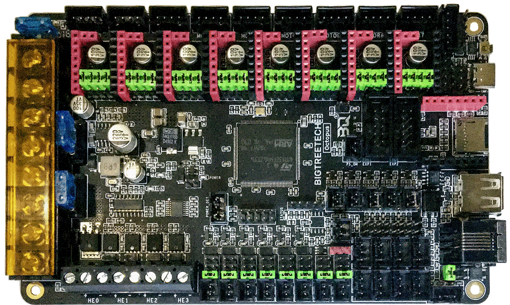
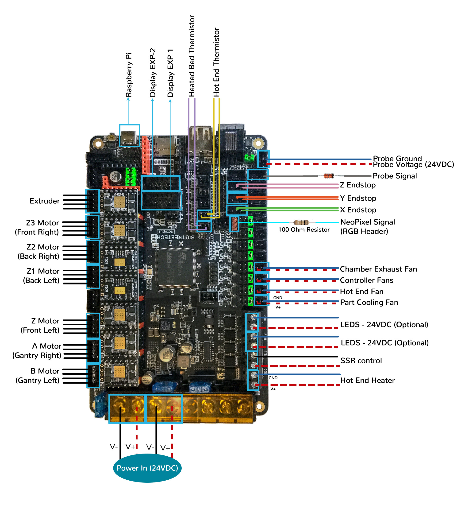

# BTT Octopus V1.0/V1.1 in SPI Mode (TMC2100, TMC2130, TMC5160, TMC5161, TMC5160HV, TMC5160_PRO)

## Initial Removal of Jumpers for SPI Mode

We have no idea what state your board is in when you start this process.  Someone could have moved jumpers around already.  But since we are here, on the SPI end of the site, then I assume that you might want to look at the next section **before** removing **all the jumpers** because if all the jumpers are already set for SPI mode then removing them and placing them right back in would be a waste of your valuable time.

**If one does not understand what I mean by "if the jumpers are set for SPI" then I would recommend that removing all the jumpers would be the place to start.**

* Remove **all YELLOW** on-board jumpers, located at the positions shown below.

######  {#Octopus11_PREP-Removal_SPI}

## Initial Preparation for SPI Mode - Set Jumpers

* Set the on-board jumpers, located at the positions as shown by the **GREEN** jumpers in the diagram below:

######  {#Octopus11_SPI_Mode_for_Prep}

### (FAN & PROBE) Voltage Selection Headers

* As shown in the diagram below, ensure **all of "DIAG Jumpers" (shown in the PURPLE box) are removed** because the Voron printer does not use sensorless homing.

* As shown in the diagram below, ensure the **removal of the USB 5V power supply jumper ("Power Selection Jumper, shown in the RED box")** which avoids the interaction between the USB 5V of Raspberry Pi and the DC-DC 5V of the motherboard.

* In the diagram below, the **BLUE and ORANGE boxes** indicate the headers with **GREEN** jumpers which are set for 24VDC.

* In the diagram below, the **BLUE box** indicates the "fan voltage selection headers" with **GREEN** jumpers which are set for 24VDC.

    * __IMPORTANT:__ **If fans that use 5VDC or 12VDC are used, please take NOTE of these "fan voltage selection headers" and set the jumpers to the appropriate jumper position so that the correct fan voltage will be produced to run the 5VDC or 12VC fan.  If the fan voltage selection jumper is set for 24VDC and a 5VDC/12VDC fan is connected to it, the Octopus board will be damaged.**

* In the diagram below, the **ORANGE box** indicates the "probe voltage selection header" with a **GREEN** jumper which is set for 24VDC. If a PROBE voltage of 5VDC or 12VDC is desired, this jumper needs to be changed.

    * __IMPORTANT:__ **If the voltage required by the PROBE device does not match the voltage selected by the "probe voltage selection Jumper" then the Octopus board could be damaged.**

* __IMPORTANT:__ **Double check all the** __GREEN__ **jumpers are set appropriately, especially the jumpers called out by the _COLORED BOXES_, BEFORE the power supply is connected.**

### (FAN & PROBE) Voltage Selection Diagram

######  {#Octopus11_SPI_VoltageSelect}

## Stepper Motor Drivers
* Inspect the stepper motor drivers for left over rosin, and clean with IPA, if needed
* Install heat sinks on all stepper motor drivers

## MCU Wiring for UART Mode

* Connect 24V and GND (V+ and V-) from the PSU to PWR and MOTOR_POWER
* Connect stepper driver for the B Motor (gantry left) into position DRIVER0
* Plug in stepper motor for the B Motor (gantry left) into position MOTOR0
* Connect stepper driver for the A Motor (gantry right) into position DRIVER1
* Plug in stepper motor for the A Motor (gantry right) into position MOTOR1
* Connect stepper driver for the Z into positions DRIVER2
* Plug in stepper motor for the Z into positions MOTOR2_1
* Connect stepper driver for the Z1 into positions DRIVER3
* Plug in stepper motor for the Z1 into positions MOTOR3
* Connect stepper driver for the Z2 into positions DRIVER4
* Plug in stepper motor for the Z2 into positions MOTOR4
* Connect stepper driver for the Z3 into positions DRIVER5
* Plug in stepper motor for the Z3 into positions MOTOR5
* Connect stepper driver for the extruder motor into position DRIVER6
* Plug in stepper motor for the extruder motor into position MOTOR6
* Connect the hot end heater to HE0 (PA2)
* Connect the bed SSR (DC Control Side) to HE1 (PA3)
* Connect the part cooling fan to FAN0 (PA8)
* Connect the hot end fan to FAN1 (PE5)
* Connect the controller fans to FAN2 (PD12)
* Connect the chamber exhaust fan to FAN3 (PD13)
* Connect the hot end thermistor to T0 (PF4)
* Connect the bed thermistor to TB (PF3)
* Connect the X endstop to STOP_0 (PG6)
* Connect the Y endstop to STOP_1 (PG9)
* Connect the Z endstop to STOP_2 (PG10)
* Connect the signal wire on the PROBE to STOP_7 (PG15)
* Connect the V+ an 0V wires on the probe to PROBE
* if using a mini12864 display, connect to EXP1 & EXP2, only after completing the steps shown [below](#mini-12864-display)

## MCU Wiring Diagram for SPI Mode
   

######  {#Voron2_Wiring_Diagram_Octopus_V11_SPI}

* If you want to open the above diagram, in a new tab of your web browser, and have the ability to zoom and download the diagram in JPG format then [click here](./images/Voron2.4r2_Wiring_Diagram_Octopus_V1.1_in_SPI.jpg){:target="_blank" rel="noopener"}

[Go Back to the Table of Contents](./v2_octopus_wiring#table-of-contents)

## Please Ensure the Heat Sinks are Installed Before Use

### MCU in SPI Mode with Heat Sinks Installed

   

######  {#Octopus11_SPI_Heatsinks}

## Powering the Raspberry Pi & Setting up UART Communications with the Raspberry Pi

* see [the Raspberry Pi Section](./Octopus11_RaspberryPi#raspberry-pi){:target="_blank" rel="noopener"}

## SSR Wiring (Board Shown is in SPI mode)

* Wire colors will vary depending on your locale.

######  {#BTTOctopus11-ssr-SPI-wiring}

* If you want to open the above diagram, in a new tab of your web browser, and have the ability to zoom and download the diagram in PNG format then [click here](./images/BTTOctopus11-ssr-SPI-wiring.png){:target="_blank" rel="noopener"}

[Go Back to the Table of Contents](./v2_octopus_wiring#table-of-contents)

## mini 12864 Display

* See [the mini12864 guide](./mini12864_klipper_guide.md){:target="_blank" rel="noopener"}

## The Klipper Configuration file for BTT Octopus V1.0/V1.1 Board

* The Klipper Configuration file from VoronDesign/Voron-2 GitHub Repo for BTT Octopus 1.0/V1.1 board is [located here; Select "V2 Octopus"](../../build/software/configuration#initial-voron-printer-configuration){:target="_blank" rel="noopener"}

[Go Back to the Table of Contents](./v2_octopus_wiring#table-of-contents)

## URL Resources Links for the Octopus V1.0/V1.1 (PIN Diagrams and Repo)

* see [The Octopus V1.0/V1.1 Resource Section](./Octopus11_Resources#color-pin-diagram-for-btt-octopus-v10v11){:target="_blank" rel="noopener"}

## After I have Wired up the MCU Board, What Comes Next?

1. Once the MCU board is wired up and wire management has been performed, the next step is to install Mainsail/Fluidd or Octoprint, please see [The Build ═► Software Installation](../../build/software/index#software-installation){:target="_blank" rel="noopener"}

2. Once Mainsail/Fluidd or Octoprint has been installed, the next step is to **compile and install** the Klipper Firmware, please see [The Build ═► Software Installation -> Firmware Flashing(Header) -> BTT Octopus](../../build/software/octopus_klipper#octopuspro-klipper-firmware){:target="_blank" rel="noopener"}

3. Once the MCU board has the Klipper Firmware Installed, the next step is to **create/edit** the Klipper Config file (Voron2_Octopus_Config.cfg rename it to printer.cfg) to ensure your Voron build matches your Klipper Config file, please see [the file located here; Select "V2 Octopus"](../../build/software/configuration#initial-voron-printer-configuration){:target="_blank" rel="noopener"};

    * Please use the Color PIN Diagrams, [displayed here](./Octopus11_Resources#color-pin-diagram-for-btt-octopus-v10v11){:target="_blank" rel="noopener"}, as a source of information;

    * Please consult [The Build ═► Software Configuration](../../build/software/configuration#software-configuration){:target="_blank" rel="noopener"} on how to edit the Klipper Config file.

4. After **creating/editing** the Klipper Config file (Voron2_Octopus_Config.cfg renamed to printer.cfg), the next step is to check all the Motors and the mechanics of the Voron printer, please see [The Build ═► Initial Startup Checks](../../build/startup/index#initial-startup-checks){:target="_blank" rel="noopener"}

[Go Back to the Table of Contents](./v2_octopus_wiring#table-of-contents)