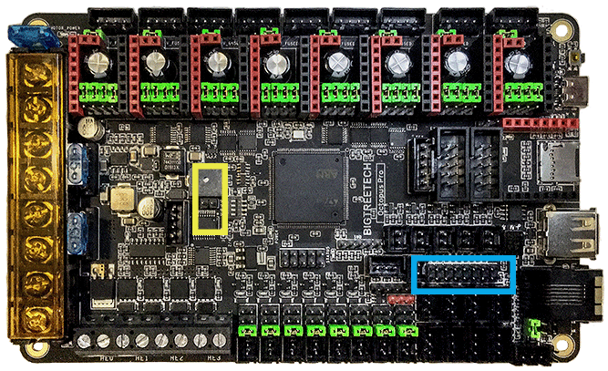
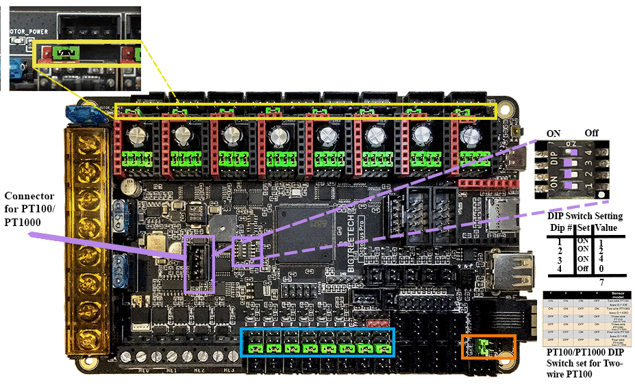
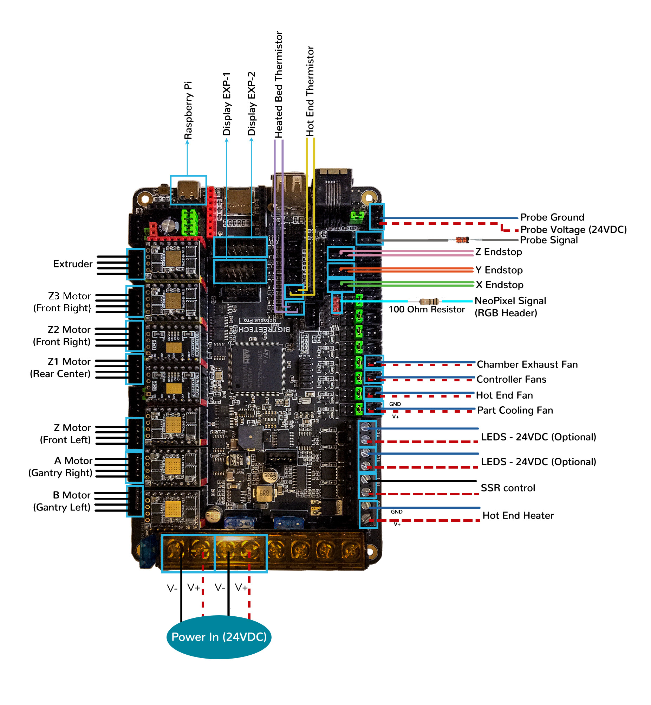
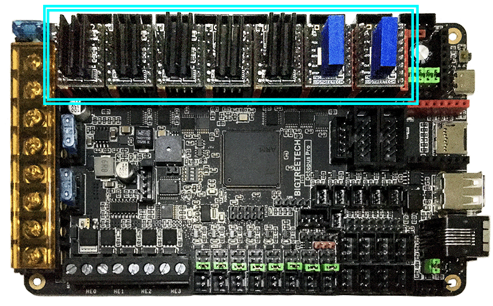
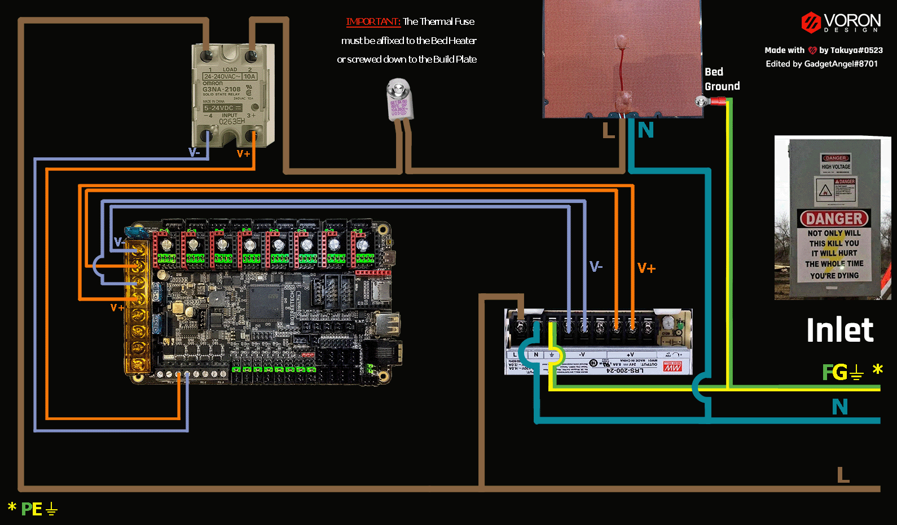

# BTT Octopus Pro V1.0 in SPI Mode (TMC2100, TMC2130, TMC5160, TMC5161, TMC5160HV, TMC5160_PRO)

## Initial Removal of Jumpers for SPI Mode

We have no idea what state your board is in when you start this process.  Someone could have moved jumpers around already.  But since we are here, on the SPI end of the site, then I assume that you might want to look at the next section **before** removing **all the jumpers** because if all the jumpers are already set for SPI mode then removing them and placing them right back in would be a waste of your valuable time.  

**If one does not understand what I mean by "if the jumpers are set for SPI" then I would recommend that removing all the jumpers would be the place to start.**

Remove **all YELLOW** on-board jumpers, located at the positions shown below.

<!--
To be able to supply the Voron user and Voron Helper staff with an easy access LINK for all diagrams, I tested
a couple of different methods.  I found one method that allowed the user to left-click on the diagram
and it would open the diagram up in the web browser. I choose to not use this method because ther would be
a lot of Voron users who probably would activate this by accident and then not beable to get themselves back.

The method I choose was one that will display the LINK symbol to the left of the diagram and without adding
any title text. I ended up using header 6 with a blank title and then I use a Kramdown Syntax for specifying
a Header ID.

If I use the GFM Parser for creating a header anchor with an empty title the static web page produced
DOES NOT show the LINK symbol to the left of the diagram. The Link is setup but only I can use it in the 
web page code. An outside Voron Helper could not access the Link Address.  The GFM Parser syntax for "header anchors" forces you to use a text in the title.  If you use a title text then the LINK symbol will be generated.

But with further reading I found that Kramdown Parser does allow a "title text of empty" which produces the LINK symbol to the left of the diagram and generates the LINK address that Voron Users and Voron Helpers can access by right-clicking on the LINK symbol. The documentation for this can be found at https://kramdown.gettalong.org/syntax.html#headers ; look for "Specifying a Header ID"
-->

######  {#Octopus_Pro_PREP-Removal_SPI}
{:.no_toc}

[Go Back to the Table of Contents](v2_octopus_pro_uartspi_wiring.html#table-of-contents)

## Initial Preparation for SPI Mode - Set Jumpers

* Ensure the jumpers of "DIAG Jumper Block" are all removed to avoid the influence of TMC2209 DIAG on the endstop.

* Ensure the removal of the USB 5V power supply jumper ("Power Selection Jumper") which avoids the interaction between the USB 5V of Raspberry Pi and the DC-DC 5V of the motherboard.

* Set the on-board jumpers, located at the positions as shown by the **GREEN** jumpers in the diagram below:

######  {#Octopus_Pro_F446_SPI_Mode_for_Prep}
{:.no_toc}

[Go Back to the Table of Contents](v2_octopus_pro_uartspi_wiring.html#table-of-contents)

### (FAN & MOTOR POWER & PROBE) Voltage Selection Headers
{:.no_toc}

* In the diagram below, the **COLORED BOXES** indicate the headers with **GREEN** jumpers which are set for 24VDC.

* In the diagram below, the **BLUE box** indicates the "fan voltage selection headers" with **GREEN** jumpers which are set for 24VDC.

    * __IMPORTANT:__ **If fans that use 5VDC or 12VDC are used, please take NOTE of these "fan voltage selection headers" and set the jumpers to the appropriate jumper position so that the correct fan voltage will be produced to run the 5VDC or 12VC fan.  If the fan voltage selection jumper is set for 24VDC and a 5VDC/12VDC fan is connected to it, the Octopus Pro board will be damaged.**

* In the diagram below, the **ORANGE box** indicates the "probe voltage selection header" with a **GREEN** jumper which is set for 24VDC. If a PROBE voltage of 5VDC or 12VDC is desired, this jumper needs to be changed. If the voltage required by the PROBE device does not match the voltage selected by the "probe voltage selection Jumper" then the Octopus Pro board could be damaged.

* In the diagram below, the **ORANGE box made with a dash line** indicates the PT100/PT1000 DIP switches. The default setting of all the DIP switches is set to OFF. This default setting is undefined.  Therefore, **before you install the Octopus Pro board, a valid setting must be chosen.  Choose between a 2-wire or 4-wire arrangement: ([2-wire: 7, 11] or [4-wire: 4, 8])**

* In the diagram below, the **YELLOW box** indicates the motor power selection headers with **GREEN** jumpers which are set for 24VDC.  Each stepper motor driver has this header so that each individual socket can be set to either 24VDC (Vin) or MOTOR_POWER voltage.

    * __IMPORTANT:__ **If the motor power selection headers DO NOT match the voltage being supplied to the stepper driver, the Octopus Pro board will be damaged along with the stepper motor driver.  Set each of the motor power selection jumpers to the appropriate position so that the stepper driver _voltage needed, matches the PSU voltage selected_ by the motor power selection jumper. For example, If the stepper motor driver voltage is set for 48VDC and the actual stepper motor driver runs at 12VDC, the Octopus Pro board and the stepper motor driver will be damaged.**

* __IMPORTANT:__ **Double check all the** __GREEN__ **jumpers are set appropriately, especially the jumpers called out by the _COLORED BOXES_, BEFORE the power supply is connected.**

[Go Back to the Table of Contents](v2_octopus_pro_uartspi_wiring.html#table-of-contents)

### (FAN & MOTOR POWER & PROBE) Voltage Selection Diagram
{:.no_toc}

######  {#Octopus_Pro_F446_SPI_VoltageSelect}
{:.no_toc}

[Go Back to the Table of Contents](v2_octopus_pro_uartspi_wiring.html#table-of-contents)

## Stepper Motor Drivers
{:.no_toc}
* Inspect the stepper motor drivers for left over rosin, and clean with IPA, if needed
* Install heat sinks on all stepper motor drivers

## MCU Wiring for SPI Mode

* Connect 24V and GND (V+ and V-) from the PSU to PWR and MOTOR_POWER
* Connect stepper driver for the B Motor (gantry left) into position DRIVER0
* Plug in stepper motor for the B Motor (gantry left) into position MOTOR0
* Connect stepper driver for the A Motor (gantry right) into position DRIVER1
* Plug in stepper motor for the A Motor (gantry right) into position MOTOR1
* Connect stepper driver for the Z into positions DRIVER2
* Plug in stepper motor for the Z into positions MOTOR2_1
* Connect stepper driver for the Z1 into positions DRIVER3
* Plug in stepper motor for the Z1 into positions MOTOR3
* Connect stepper driver for the Z2 into positions DRIVER4
* Plug in stepper motor for the Z2 into positions MOTOR4
* Connect stepper driver for the Z3 into positions DRIVER5
* Plug in stepper motor for the Z3 into positions MOTOR5
* Connect stepper driver for the extruder motor into position DRIVER6
* Plug in stepper motor for the extruder motor into position MOTOR6
* Connect the hot end heater to HE0 (PA2)
* Connect the bed SSR (DC Control Side) to HE1 (PA3)
* Connect the part cooling fan to FAN0 (PA8)
* Connect the hot end fan to FAN1 (PE5)
* Connect the controller fans to FAN2 (PD12)
* Connect the chamber exhaust fan to FAN3 (PD13)
* Connect the hot end thermistor to T0 (PF4)
* Connect the bed thermistor to TB (PF3)
* Connect the X endstop to STOP_0 (PG6)
* Connect the Y endstop to STOP_1 (PG9)
* Connect the Z endstop to STOP_2 (PG10)
* Connect the signal wire on the PROBE to STOP_7 (PG15)
* Connect the V+ an 0V wires on the probe to PROBE
* if using a mini12864 display, connect to EXP1 & EXP2, only after completing the steps shown [below](#mini-12864-display)

[Go Back to the Table of Contents](v2_octopus_pro_uartspi_wiring.html#table-of-contents)

## MCU Wiring Diagram for SPI Mode
   

######  {#Voron2_Wiring_Diagram_Octopus_ProF446_V1_SPI}
{:.no_toc}

* If you want to open the above diagram, in a new tab of your web browser, and have the ability to zoom and download the diagram in JPG format then [click here](./images/Voron2_Wiring_Diagram_Octopus_ProF446_V1_SPI_150.jpg){:target="_blank" rel="noopener"}

[Go Back to the Table of Contents](v2_octopus_pro_uartspi_wiring.html#table-of-contents)

## Please Ensure the Heat Sinks are Installed Before Use
{:.no_toc}
### MCU in SPI Mode with Heat Sinks Installed
{:.no_toc}
   

######  {#Octopus_Pro_SPI_Heatsinks}
{:.no_toc}

[Go Back to the Table of Contents](v2_octopus_pro_uartspi_wiring.html#table-of-contents)

## Powering the Raspberry Pi & Setting up UART Communications with the Raspberry Pi

* see [the Raspberry Pi Section](OctopusPro_RaspberryPi.html#raspberry-pi)

## SSR Wiring (Board Shown is in SPI mode)

* Wire colors will vary depending on your locale.

######  {#BTTOctopus_Pro-ssr-SPI-wiring}
{:.no_toc}

* If you want to open the above diagram, in a new tab of your web browser, and have the ability to zoom and download the diagram in PNG format then [click here](./images/BTTOctopus_Pro-ssr-SPI-wiring.png){:target="_blank" rel="noopener"}

[Go Back to the Table of Contents](v2_octopus_pro_uartspi_wiring.html#table-of-contents)

## mini 12864 Display
{:.no_toc}
* See [the mini12864 guide](./mini12864_klipper_guide.md)

## URL Resources Links for the Octopus Pro (Klipper Configuration file, PIN Diagrams and Repo)
{:.no_toc}
* see [The Octopus Pro Resource Section](OctopusPro_Resources.html#raspberry-pi)