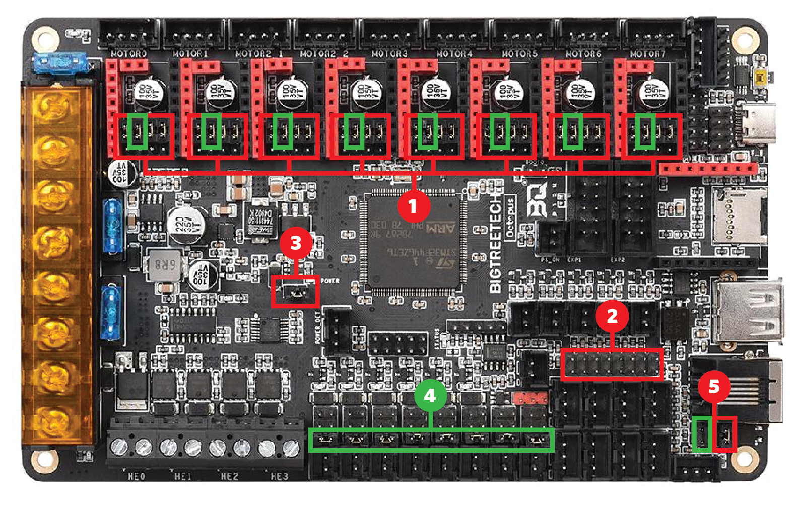
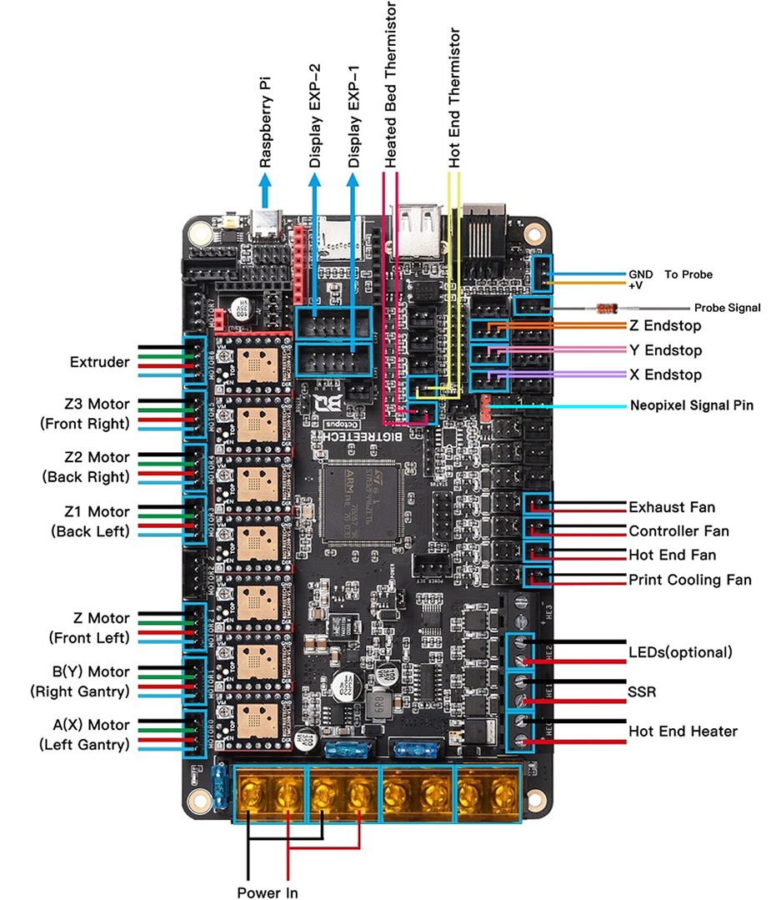
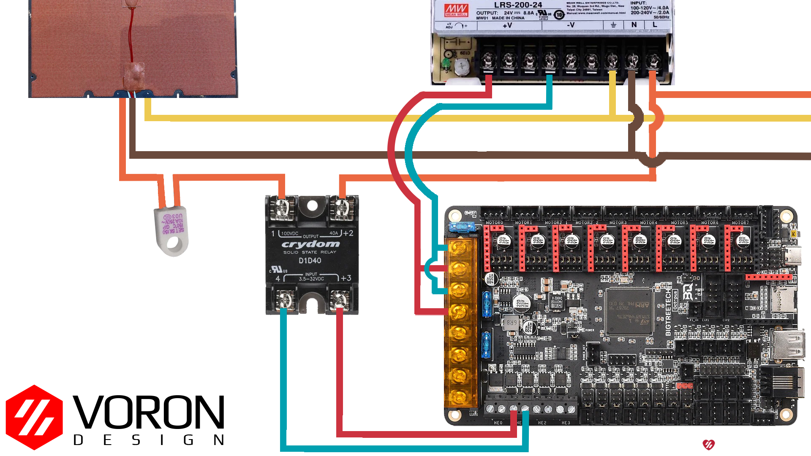

# Voron V2 - BigTreeTech Octopus Wiring

<b>WARNING:</b>  Do not leave HE0 or HE1 connected.
 
There have been reports of Octopus boards coming preloaded with a firmware that turns on all heaters and fans as soon as you power up the board.  As a result, we recommend leaving the heaters disconnected until after loading the klipper firmware

{: .warning }

## Initial Preparation 

Set jumpers as shown:

* Green – Add Jumper
* Red – Remove Jumper 
1. Insert only the jumper in the Green and remove the other three jumpers in the Red in order to use TMC2209 UART mode.
2. Remove all the jumpers of DIAG to avoid the influence of TMC2209 DIAG on the endstop.
3. Remove the USB 5V power supply jumper to avoid the interaction between the USB 5V of raspberry pi and the DC-DC 5V of the motherboard.
4. Insert all the jumpers into V_FUSED to set the fan voltage to the system supply voltage.
5. Insert the jumper into V_FUSED to set the probe voltage to the system supply voltage.

## Wiring

* Connect 24V and GND (V+ and V-) from the PSU to PWR and MOTOR_POWER 
* Connect the B Motor (gantry left) to MOTOR0
* Connect the A Motor (gantry right) to MOTOR1
* Connect the Z (Front Left) motor to MOTOR2_1 
* Connect the Z1 (Rear left) motor to MOTOR3
* Connect the Z2 (Rear right motor to MOTOR4
* Connect the Z3 (Front right) motor to MOTOR5 
* Connect the extruder motor to MOTOR6
* Connect the hot end heater to HE0  ( do not leave connected )
* Connect the bed SSR (DC Control Side) to HE1 ( do not leave connected )
* Connect the part cooling fan to FAN0
* Connect the hot end fan to FAN1
* Connect the controller fans to FAN2
* Connect the chamber exhaust fan to  FAN3
* Connect the hot end thermistor to TE0
* Connect the bed thermistor to TB
* Connect the X endstop to STOP_0
* Connect the Y endstop to STOP_1
* Connect the Z endstop to STOP_2
* Connect the signal wire on the probe to STOP_7
* Connect the V+ and 0V wires on the probe to PROBE
* if using a mini12864 display, connect to EXP1 & EXP2, only after completing the steps shown [below](#mini-12864-Display)

## SSR Wiring

* Wire colors will vary depending on your location.

 
 
## mini 12864 Display
* See [the mini12864 guide](./mini12864_klipper_guide.md)

## Other
* full pinout, and other BigTreeTech documentation is located at [here](https://github.com/bigtreetech/BIGTREETECH-OCTOPUS-V1.0) 
* Octopus v1.1 pinout is located [here](https://github.com/bigtreetech/BIGTREETECH-OCTOPUS-V1.0/blob/master/Hardware/BIGTREETECH%20Octopus%20-%20PIN.pdf)
* Octopus Pro v1.0 pinout is located [here](https://github.com/bigtreetech/BIGTREETECH-OCTOPUS-Pro/blob/master/Hardware/BIGTREETECH%20Octopus%20Pro%20-%20PIN.pdf)
